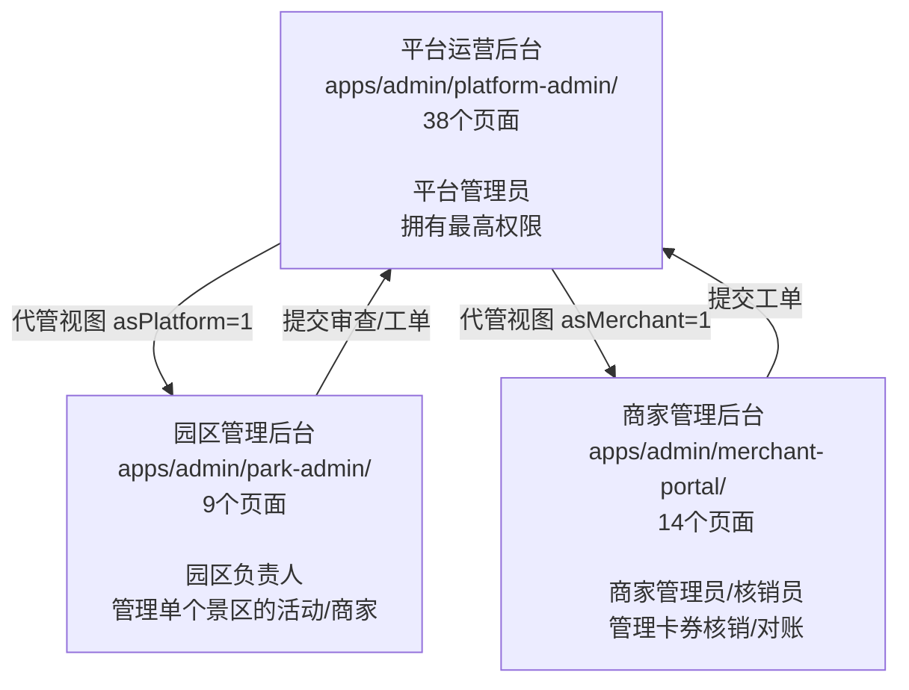

## 可行性审查报告：三后台系统与探索点管理需求

---

### 一、总览：三套后台的分工



---

### 二、当前架构满足程度

#### 已经具备的能力（满足点）

1. **内容生产管线完整**: 平台后台有完整的内容生产菜单结构（`backoffice-shell.js` lines 35-44）:
   - `platform_content_dashboard` -- 生产总览
   - `platform_exploration_points` -- 探索点管理
   - `platform_relics` -- 信物管理
   - `platform_blessing_content` -- 祝福内容
   - `platform_ar_content` -- AR内容
   - `platform_art_requests` -- 美术需求单
   - `platform_generation_tasks` -- 生成任务

2. **CRUD 操作已有基础设施**:
   - `mock-source.js` 定义了完整的探索点数据结构（lines 232-247），含 `id, name, sceneType, locationName, latitude, longitude, checkinType, status, relicId, blessingContentId, arContentId, artRequestId, reviewStatus, publishStatus, runtimeStatus`
   - `content-production-adapter.js` 实现了 5 种生成操作：`generateRelicPlaceholder`, `generateBlessingContent`, `generateARPlaceholder`, `generateArtRequest`, `submitContentReview`
   - `adapter-session.js` 提供了 sessionStorage/localStorage 持久化，数据在刷新后保留

3. **数据绑定链路完整**: 探索点可绑定信物、祝福、AR、美术需求，已设计 `relicId`, `blessingContentId`, `arContentId`, `artRequestId` 字段

4. **审查发布流程完整**: `reviewRecords`, `publishRecords` 有完整的状态机（DRAFT -> PENDING_REVIEW -> APPROVED/BLOCKED -> READY_TO_PUBLISH -> PUBLISHED）

5. **角色权限分离清晰**:
   - 平台管理员 -- 内容生产/审查/发布 全部权限
   - 园区负责人 -- 只能查看/创建活动草稿，不能直接操作探索点
   - 商家管理员 -- 只能卡券核销/对账/工单

#### 缺失的能力（差距分析）

| 需求 | 当前状态 | 差距 |
|---|---|---|
| **AI批量导入景点/AR打卡点内容** | 不存在 | 无批量导入、无AI接口、无数据导入管道 |
| **探索点名称/描述/位置编辑** | 不存在 | `platform_exploration_points/index.html` 只有查看+绑定按钮，无编辑表单 |
| **新探索点新增** | 不存在 | adapter 没有 `createExplorationPoint()` 方法 |
| **探索点删除** | 不存在 | adapter 没有 `deleteExplorationPoint()` 方法 |
| **探索点字段级编辑** | 不存在 | 无任何表单UI（名字、描述、经纬度、场景类型等） |
| **素材内容编辑** | 仅 mock 占位 | 祝福文案/AR配置/美术Prompt 无编辑UI |
| **与小程序数据同步** | 不存在 | 后台数据存在 sessionStorage，小程序数据存在 seed 文件，无关联 |
| **AI Agent 内容生成集成** | Visual Factory 存在但未对接 | 有 `generationTasks` 队列和 `prompt-generator`，但未对接AI+批量写入探索点 |

---

### 三、具体的改造需求清单

要满足你的需求（平台管理员：AI批量导入 + 管理操作），需要以下改造：

#### 改造A：mock-source.js 补充为前端10个探索点 + AI导入字段

当前 `mock-source.js` 只有 2 个探索点（`ep_001`, `ep_002`）。需要补充到 10+ 个，并增加：
- `description` -- 故事描述
- `visualHint` -- 视觉提示
- `arTriggerDescription` -- AR触发描述
- `symbolicMeaning` -- 象征意义
- `emotionalNarrative` -- 情感叙事
- `imageUrl` -- 图片URL (可选)

#### 改造B：content-production-adapter.js 增加 CRUD 方法

新增 3 个操作：

```javascript
// B1. 批量导入探索点
function batchImportExplorationPoints(pointsArray, actor)
// 输入：数组[{name, description, location, sceneType, ...}]
// 输出：新创建的探索点数组 + 操作日志

// B2. 更新探索点字段
function updateExplorationPoint(pointId, fields, actor)
// 输入：pointId, {name, description, locationName, ...}
// 输出：更新后的探索点对象

// B3. 删除探索点
function deleteExplorationPoint(pointId, actor)
// 输出：{ok, message}
```

#### 改造C：platform_exploration_points/index.html 新增编辑/新增/删除UI

将当前只读状态表升级为功能完整的管理页面：
- 每行加"编辑"按钮 -> 打开详情编辑弹窗
- 加"新增探索点"按钮 -> 新建表单
- 加"批量导入"按钮 -> AI导入界面
- 加"删除"按钮 -> 确认删除

#### 改造D：Visual Factory AI 对接

`apps/admin/modules/visual-factory/` 已有：
- `prompt-generator.ts` -- Prompt 生成服务
- `generation-queue.ts` -- 生成任务队列
- `art-requirement-generator.ts` -- 美术需求生成

需要扩展：
- **探索点内容生成器** -- 调用AI生成探索点名称、描述、故事、AR触发文本等
- **批量导入管道** -- "AI 一键生成 10 个探索点"的按钮，自动填充所有字段

#### 改造E：后台 -> 小程序数据同步

当前小程序使用 `data/world_seed_v1.js` 静态种子文件。需要：
- 后台编辑后的数据导出为 JSON 文件
- 或通过 API 接口（如 localStorage 共享）供小程序读取

---

### 四、影响范围

| 文件 | 改造类型 | 复杂度 |
|------|----------|--------|
| `apps/shared/data-adapter/mock-source.js` | 补充数据 + 新字段 | 低 |
| `apps/shared/data-adapter/content-production-adapter.js` | 新增 3 个方法 | 中 |
| `apps/admin/platform-admin/platform_exploration_points/index.html` | 重写UI（编辑/增删/导入） | 高 |
| `apps/admin/modules/visual-factory/` | 扩展探索点内容生成器 | 中 |
| `apps/admin/platform-admin/platform_content_dashboard/index.html` | 微调（展示导入状态） | 低 |
| `apps/miniapp/data/world_seed_v1.js` 或同步管道 | 数据同步机制 | 中 |

---

### 五、结论

**核心回答：是，当前架构可以支撑这个需求，但需要开发改造。**

正面原因：
1. 内容生产管线已经存在（7个页面 + adapter层）
2. 数据模型已经准备（`explorationPoints` 集合 + `adapter-session` 持久化）
3. 角色权限已经分离（只有平台管理员有权管理探索点）
4. Visual Factory 模块提供了 AI 生成的基础设施（prompt generator + task queue）

需要投入的工作：
- 探索点管理页面从"生产状态看板"升级为"完整CRUD编辑器"（约为当前 3-5 倍的工作量）
- Adapter 层补充批量导入/编辑/删除方法
- 与小程序的数据同步机制
- AI 批量导入的 Prompt 模板与执行管道

如果不做改造，当前的后台**只能查看探索点的生产状态**（绑定是否完成、审查状态），不能编辑内容本身。
