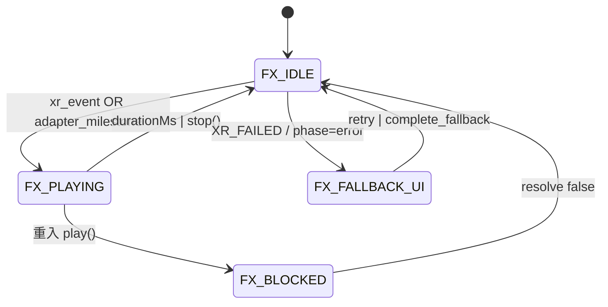

# AR游伴 · 视觉系统 V1

**文档 ID：** `03_visual/visual_system_v1.md`  
**版本：** V1.2-STABLE  
**状态：** ENGINEERING_STANDARD  
**输入：** XR Event Bus 事件、页面 `phase`、`effectId`、adapter 状态  
**输出：** 绑定事件的视觉反馈、动效序列、审查冻结资产  

**闭环链路：** `USER → XR → VISUAL → SPACE → RELIC → CRM → REVENUE`  
**关联：** `event_bus_contract.md`（事件源）· `xr_visual_spec.md` · `spatial_visual_language.md`  
**不重复：** XR 架构见 `02_technical/xr_architecture.md`（仅引用）

---

## 1. Definition（定义）

### 1.1 范围

视觉系统 = **Pilot FX 动效层 + XR 页 UI Overlay + 空间图形语言**；3D 渲染在 `xr-frame` 内，由 `xr_visual_spec.md` 约束。

**硬规则：** 生产环境 **每个 XR 相关用户感知** 必须能追溯到 **Event Bus 事件** 或 **adapter 状态迁移**；禁止无事件绑定的纯装饰动效上主链路。

### 1.2 输入 / 输出

| 方向 | 内容 |
|------|------|
| **输入** | `xr-event-bus` / `ar-event-bus` 事件；`ar-entry` phase；`effectId` |
| **输出** | `pilot-fx-overlay` 状态；`xr-ui-overlay.wxss` 样式；toast 文案 |

### 1.3 与 XR 关系（摘要）

| 层 | 职责 | 视觉不负责 |
|----|------|------------|
| XR Runtime | 管线、Marker、world-engine | 写 CRM |
| Visual | 用户可见反馈 | 改 `XR_STATE` |
| 协作 | 事件触发 → 动效/overlay | 阻塞 bus |

---

## 2. System Design（结构设计）

### 2.1 Design Tokens

| Token | 值 | 用途 |
|-------|-----|------|
| `--ink` | `#263A34` | 主色、标题 |
| `--paper` | `#F4F1EB` | 背景 |
| `--gold` | `#B68A3D` | 点缀、激活节点 |
| `--gray` | `#6B7280` | 辅助文案 |
| `--line` | `#C9B896` | 经纬线、分隔 |

### 2.2 样式与组件

| 文件 | 范围 |
|------|------|
| `styles/user-phase1.wxss` | C 端页面 |
| `styles/xr-ui-overlay.wxss` | ar-entry overlay |
| `components/pilot-fx-overlay/` | 全屏动效 |
| `services/pilot/pilot-visual-registry.js` | effectId 注册 |

### 2.3 动效注册表

| effectId | durationMs | L2 label | toast |
|----------|------------|----------|-------|
| `xr_start_v1` | 1400 | 景区之门开启 | 欢迎进入景区 |
| `space_trail_v1` | 1800 | 沿星点前行 | 探索路径已展开 |
| `relic_emerge_v1` | 1600 | 信物显现 | 信物已回应 |

---

## 3. Flow（流程）

### 3.1 XR 视觉状态机（FX 层）

与 `xr_state_machine.md` L-A/L-B **并行**，仅管 overlay：



| 状态 | data 字段 | 进入条件 |
|------|-----------|----------|
| FX_IDLE | `playing=false` | 默认 |
| FX_PLAYING | `playing=true, effectId set` | §3.2 映射表 |
| FX_BLOCKED | 同 PLAYING | 防重入 |
| FX_FALLBACK_UI | ar-entry `phase=error\|fallback_ready` | `XR_FAILED` 或 scan fail |

### 3.2 XR 事件 → 视觉映射表（强制）

| xr-event-bus / ar-event-bus | 视觉响应 | effectId / UI | 页面 | 并行 CRM |
|-----------------------------|----------|---------------|------|----------|
| `XR_USER_TRIGGER` | 景区门动效 + 可选 toast | `xr_start_v1` | `index` | — |
| `XR_STATE_CHANGE` → INIT | 无全屏 FX（调试可 log） | — | — | — |
| `XR_STATE_CHANGE` → RUNNING | Scene 渲染（3D） | xr-frame 内 | `ar-entry` | — |
| `XR_FAILED` | 无庆祝动效；error overlay | `phase=error`, retry 按钮 | `ar-entry` | — |
| `ar:detected` | Marker 对准提示（subtle） | overlay 文案 | `ar-entry` | — |
| `ar:active` | 扫描中 UI | `phase=scanning_ar` | `ar-entry` | `startARScan` |
| `ar:lost` | 重新对准提示 | overlay 警告色 | `ar-entry` | — |
| `RELIC_CREATED` | 仪式层（world-engine） | 3D + 可选 `relic_emerge_v1` | `lottie` | 不写 CRM |
| `STAR_LIGHTED` | 星图节点（若页打开） | 节点 `lit` | `star-map` | — |
| adapter `CHECKED_IN` | 探索地图路径展开 | `space_trail_v1` | `explore-map` | ✓ |
| adapter `AR_SCANNED*` | 显现完成 → 信物仪式 | `relic_emerge_v1` | `lottie` | ✓ |
| adapter `revealRelic` ok | 信物显现强化 | `relic_emerge_v1` | `lottie` | ✓ |
| `safeNavigate` fail | toast only | 「页面暂未开放」 | 任意 | — |

**登记要求：** 新增主链路事件必须在本表加一行，并更新 `validate_pilot_scene_product.js`（若含 effectId）。

### 3.3 动效触发映射表（可执行）

| 触发源 | 调用链 | effectId |
|--------|--------|----------|
| 用户点「进入景区」 | `index.onEnterScenic` → `trigger` + `runStageEffect(ENTER)` | `xr_start_v1` |
| 进入探索地图 `pilotScene=explore` | `explore-map.onLoad` → `runStageEffect(EXPLORE)` | `space_trail_v1` |
| 显现完成 → 跳转 lottie | `lottie.onLoad` / `onCompleteReveal` 前 | `relic_emerge_v1` |
| 完成页 | `event-complete` | `relic_emerge_v1`（可选） |

源码锚点：`pilot-scene-flow.js` · `pilot-visual-registry.js`

### 3.4 主链路时序（XR + Visual）

```text
T0  USER tap 进入景区
T1  VISUAL play(xr_start_v1)          // 不 await 阻塞 bus
T2  XR    emit XR_USER_TRIGGER
T3  XR    XR_STATE IDLE→RUNNING
T4  USER  navigate explore-map
T5  VISUAL play(space_trail_v1)
T6  SPACE mockCheckIn → CHECKED_IN
T7  XR    startARScan + ar:active
T8  XR    completeARScan | Fallback
T9  VISUAL play(relic_emerge_v1)
T10 RELIC revealRelic → CRM
```

### 3.5 视觉交付流

```text
事件绑定评审 → 美术 brief（含 event_id）→ visual-factory → 审查 → pilot-visual-registry 登记
```

---

## 4. Data Model（数据模型）

### 4.1 事件-视觉绑定 schema

```json
{
  "$schema": "aryouban.visual.event_binding.v1",
  "eventId": "XR_USER_TRIGGER",
  "effectId": "xr_start_v1",
  "page": "index",
  "layer": "L2",
  "blocking": false,
  "fallbackOnXrFailed": null
}
```

### 4.2 EFFECT_CONFIG

```json
{
  "xr_start_v1": { "durationMs": 1400, "label": "景区之门开启", "toast": "欢迎进入景区", "boundEvents": ["XR_USER_TRIGGER"] },
  "space_trail_v1": { "durationMs": 1800, "label": "沿星点前行", "toast": "探索路径已展开", "boundEvents": ["CHECKED_IN", "pilotScene.explore"] },
  "relic_emerge_v1": { "durationMs": 1600, "label": "信物显现", "toast": "信物已回应", "boundEvents": ["reveal_relic", "RELIC_CREATED"] }
}
```

### 4.3 overlay 运行时

```json
{ "playing": false, "visible": false, "effectId": "", "label": "" }
```

### 4.4 ar-entry 视觉相位（L-B 对齐）

| phase | 主色语气 | primaryAction 视觉 |
|-------|----------|-------------------|
| `idle` | 纸墨静 | 「开始显现」 |
| `scanning_ar` | 克制激活 | 「完成显现」 |
| `fallback_ready` | 同 AR，无降级羞耻感 | 「备用显现」 |
| `error` | 灰墨 + 明确 retry | 「重试」 |
| `ar_complete` / `fallback_complete` | 暖金点缀 | 「显现信物」 |

---

## 5. Example（示例）

### 5.1 绑定事件播放

```javascript
const visualRegistry = require('../../services/pilot/pilot-visual-registry');
const controller = require('../../services/ar/ar-entry-controller');

// 进入景区：视觉与 XR 并行
await visualRegistry.playEffectOnPage(this, visualRegistry.EFFECT_IDS.XR_START);
controller.trigger({ source: 'index_enter_scenic' });
```

### 5.2 XR_FAILED 时视觉行为

```text
不播放 xr_start_v1 / relic_emerge_v1
ar-entry phase → error
显示 retry + complete_fallback（若 bridgeMode=FALLBACK）
toast：见 failure_recovery_sop.md
```

### 5.3 验收检查

```bash
node scripts/user_frontend/validate_pilot_scene_product.js
node scripts/user_frontend/validate_xr_ui_decouple.js
```

人工：进入景区 → 地图 → 信物，三步动效均出现，且 `XR_USER_TRIGGER` 可在调试 log 看到。

---

## 6. Execution Notes（执行说明）

### 6.1 新增动效门禁

- [ ] `event_bus_contract.md` 或 adapter 事件已登记  
- [ ] §3.2 映射表已更新  
- [ ] `pilot-visual-registry.js` + WXML 分支  
- [ ] `validate_pilot_scene_product.js`  

### 6.2 禁止

- 无事件绑定的主链路全屏动效  
- xr-scene 内 `view`/`button`  
- 信物与 digital_collectible 同模板  

### 6.3 子规范

- `xr_visual_spec.md` — Scene + Overlay 细节  
- `spatial_visual_language.md` — 探索地图节点语汇  

---

*视觉系统 V1.2-STABLE · Batch 2*
