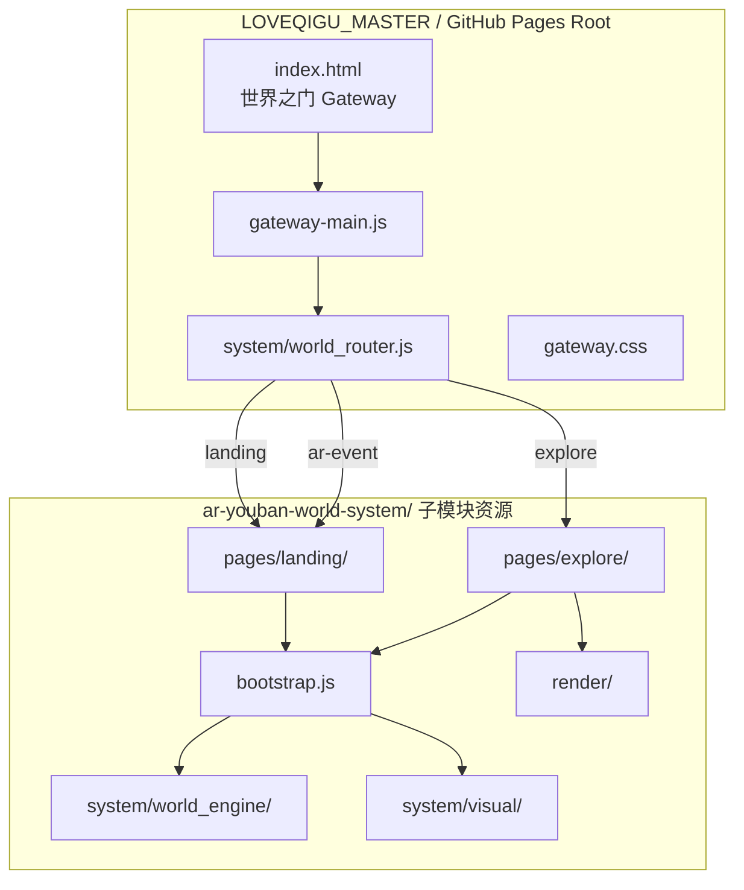

# V0.4_WORLD_GATEWAY_ARCHITECTURE

STATUS: ACTIVE  
VERSION: V0.4  
DATE: 2026-06-16  
OWNER: LOVEQIGU PRODUCT

---

## 一、目标

将 LOVEQIGU 世界系统从**多入口并行**升级为：

```
单入口世界（Gateway） + 多模块世界运行（ar-youban-world-system）
```

- **不删除**任何现有页面
- **不破坏** landing / explore / world_engine / bootstrap
- **统一** GitHub Pages 根路径入口

---

## 二、结构图



---

## 三、目录结构（V0.4）

```
LOVEQIGU_MASTER/
├── index.html                    # 唯一世界入口（Gateway）
├── gateway.css                   # Gateway 主视觉
├── gateway-main.js               # 按钮 → world_router
├── system/
│   └── world_router.js           # 路由：landing | explore | ar-event
├── ar-youban-world-system/       # 子模块（世界运行时，保持原结构）
│   ├── index.html                # 子模块独立入口（仍跳转 landing，不删除）
│   ├── bootstrap.js
│   ├── pages/
│   │   ├── landing/
│   │   └── explore/
│   ├── system/
│   │   ├── world_engine/
│   │   └── visual/
│   └── render/
└── docs/
    └── V04_WORLD_GATEWAY_ARCHITECTURE.md
```

---

## 四、入口行为

### 4.1 根 Gateway（`/`）

| 元素 | 说明 |
|------|------|
| 主视觉 | 蓝金星光之门（gateway-layer + core ring） |
| **进入世界** | 默认 → `ar-youban-world-system/pages/landing/` |
| **进入探索** | → `ar-youban-world-system/pages/explore/` |

### 4.2 world_router 路由表

| 路由名 | 目标 | 用途 |
|--------|------|------|
| `gateway` | `./index.html` | 世界之门 |
| `landing` | `ar-youban-world-system/pages/landing/index.html` | 世界显现入口 |
| `explore` | `ar-youban-world-system/pages/explore/index.html` | 探索流式生成 |
| `ar-event` | landing + `?entry=ar-event` | AR 事件触发预留 |

**Query 扩展：**

- `?route=explore` — Gateway 自动跳转探索
- `?route=landing` — Gateway 自动跳转世界
- `?world_state=...` — 预留 world_state 驱动（V0.5+）

### 4.3 子模块独立部署

`ar-youban-world-system` 仍可单独托管于  
`https://labourxi.github.io/ar-youban-world-system/`  
其 `index.html` 保留，直接跳转 `pages/landing/`（向后兼容）。

---

## 五、运行链路

```
用户访问 /
  → index.html (Gateway)
  → gateway-main.js
  → world_router.navigateTo('landing' | 'explore')
  → ar-youban-world-system/pages/*
  → bootstrap() + world_engine + visual
```

**Explore 链路（不变）：**

```
explore/main.js
  → bootstrap()
  → world_generator → renderStream
```

**Landing 链路（不变）：**

```
landing/main.js
  → bootstrap()
  → CTA → state_machine → explore
```

---

## 六、GitHub Pages 配置

### Monorepo（LOVEQIGU_MASTER）

1. Settings → Pages → Source: **main** branch, folder **/** (root)
2. 根 `index.html` 作为默认页
3. 子模块 `ar-youban-world-system` 需在 CI/Pages 构建时 `git submodule update --init`（若使用 submodule 部署）

### 本地验证

```bash
cd LOVEQIGU_MASTER
python -m http.server 8080
# http://localhost:8080/           → Gateway
# http://localhost:8080/ar-youban-world-system/pages/landing/  → 直达 landing
```

---

## 七、约束（V0.4）

| ✅ 允许 | ❌ 禁止 |
|---------|---------|
| 新增 Gateway + router | 删除 landing / explore |
| 子模块路径引用 | 重写 world_engine 核心 |
| Query 路由扩展 | 新增第四套平行入口页 |
| 保留子模块 index.html | 破坏 bootstrap 单驱动 |

---

## 八、版本演进

| 版本 | 结构 |
|------|------|
| V0.1 | baseline world system |
| V0.3 | world_generator → stream UI |
| V0.3.1 | 视觉还原 |
| **V0.4** | **单入口 Gateway + world_router** |
| V0.5（规划） | world_state 驱动 router 自动分发 |

---

## 状态

```
V04_WORLD_GATEWAY_ARCHITECTURE = ON_DISK
WORLD_GATEWAY_SINGLE_ENTRY = YES
WORLD_MODULE_PRESERVED = YES
```
