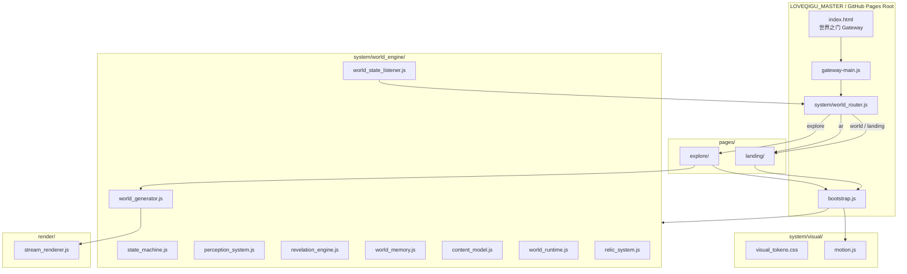

# V0_4_1_WORLD_ENGINE_UNIFICATION

STATUS: ACTIVE  
VERSION: V0.4.1  
DATE: 2026-06-16  
OWNER: LOVEQIGU PRODUCT

---

## 一、目标

消除 LOVEQIGU_MASTER 与 `ar-youban-world-system` 的**双系统结构**，统一为：

```
单入口（Gateway） + 单世界引擎（system/world_engine） + 本地页面（pages/）
```

- GitHub Pages 可**独立运行**完整世界，无需 submodule URL
- **不删除** `ar-youban-world-system/` 目录（历史子仓库保留，不再被路由引用）
- 所有资源**本地化引用**

---

## 二、结构图



---

## 三、目录结构（V0.4.1）

```
LOVEQIGU_MASTER/
├── index.html                      # 唯一入口：「进入世界」
├── gateway.css                     # Gateway 主视觉
├── gateway-main.js                 # world_state 控制 + 路由
├── bootstrap.js                    # 世界运行时单驱动
├── system/
│   ├── world_router.js             # 本地路由：world | landing | explore | ar
│   ├── world_engine/               # 世界引擎（自 ar-youban-world-system 迁入）
│   │   ├── state_machine.js
│   │   ├── world_state_listener.js
│   │   ├── perception_system.js
│   │   ├── revelation_engine.js
│   │   ├── world_memory.js
│   │   ├── memory_gc.js
│   │   ├── content_model.js
│   │   ├── world_generator.js
│   │   ├── generator.js
│   │   ├── world_runtime.js
│   │   └── relic_system.js
│   └── visual/
│       ├── visual_tokens.css
│       └── motion.js
├── pages/
│   ├── landing/                    # 世界显现
│   └── explore/                    # 探索流
├── render/
│   └── stream_renderer.js
└── ar-youban-world-system/         # 保留，不再被路由引用
```

---

## 四、路由表（world_router.js）

| 路由名 | 本地目标 | 说明 |
|--------|----------|------|
| `gateway` | `./index.html` | 世界之门 |
| `world` | `pages/landing/index.html` | **默认世界入口**（Gateway 按钮） |
| `landing` | `pages/landing/index.html` | 世界显现（同 world） |
| `explore` | `pages/explore/index.html` | 探索流式生成 |
| `ar` | `pages/landing/index.html?entry=ar-event` | AR 事件触发 |

**Query 扩展：**

- `?route=world` / `?route=explore` / `?route=ar` — Gateway 自动跳转
- `?world_state=...` — 与 `route` 等价，写入 `sessionStorage`

**导航统一：** `world_state_listener` 在 `TRANSITION` 状态调用 `navigateTo('explore')`，不再硬编码相对路径。

---

## 五、运行链路

### 5.1 Gateway → World

```
用户访问 /
  → index.html
  → gateway-main.js
  → setStoredWorldState('world')
  → world_router.navigateTo('world')
  → pages/landing/
  → bootstrap() + world_engine + visual
```

### 5.2 Landing → Explore（不变）

```
landing CTA
  → state_machine: REST → PERCEPTION → REVELATION → TRANSITION
  → world_state_listener → navigateTo('explore')
  → pages/explore/
  → world_generator → renderStream
```

---

## 六、与 V0.4 的差异

| 项目 | V0.4 | V0.4.1 |
|------|------|--------|
| 世界运行时 | `ar-youban-world-system/` 子路径 | `pages/` + `system/world_engine/` 本地 |
| Gateway 按钮 | 进入世界 + 进入探索 | **仅「进入世界」** |
| world_router | 跨仓库 URL 前缀 | **纯本地路径** |
| 子模块依赖 | 必需（Pages 需 submodule init） | **不必需** |
| 默认路由 | `landing` | `world`（语义入口） |

---

## 七、GitHub Pages

1. Settings → Pages → **main** branch, folder **/** (root)
2. 无需 `git submodule update` 即可运行完整世界
3. `ar-youban-world-system/` 可作为历史归档保留

### 本地验证

```bash
cd LOVEQIGU_MASTER
python -m http.server 8080
# http://localhost:8080/                    → Gateway
# http://localhost:8080/pages/landing/      → 世界显现
# http://localhost:8080/pages/explore/      → 探索
# http://localhost:8080/?route=explore      → 自动跳转探索
```

---

## 八、版本演进

| 版本 | 结构 |
|------|------|
| V0.4 | Gateway + 子模块 URL 路由 |
| **V0.4.1** | **单世界引擎本地化** |
| V0.5（规划） | world_state 驱动 router 自动分发 |

---

## 状态

```
V04_1_WORLD_ENGINE_UNIFICATION = ON_DISK
SINGLE_WORLD_ENGINE = YES
SUBMODULE_ROUTE_DEPENDENCY = REMOVED
GITHUB_PAGES_STANDALONE = YES
```
