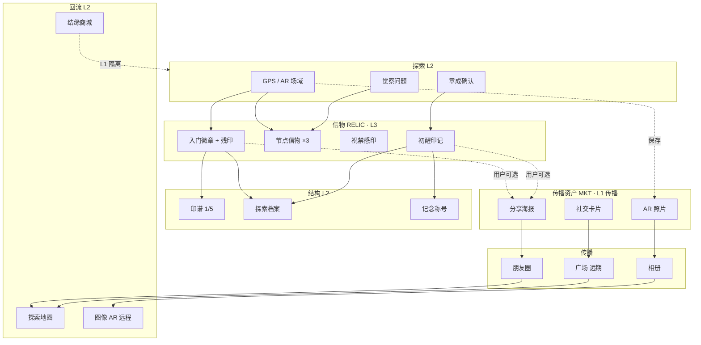

# LOVEQIGU_INFORMATION_ARCHITECTURE_V1

> **爱企谷 · 第一版信息架构（IA）**  
> **文件标识**：`LOVEQIGU_INFORMATION_ARCHITECTURE_V1.md`  
> **版本**：V1.0  
> **日期**：2026-06-04  
> **状态**：Active · 架构基线  
> **性质**：信息架构 · **不修改 Canon · 不修改资产定义 · 不改代码**  
> **依据**：[`LOVEQIGU_LANGUAGE_CONSTITUTION_V1.md`](./LOVEQIGU_LANGUAGE_CONSTITUTION_V1.md) · [`LOVEQIGU_TERMINOLOGY_V1.md`](./LOVEQIGU_TERMINOLOGY_V1.md) · [`LOVEQIGU_ASSET_MODEL_REVIEW_V1.md`](./LOVEQIGU_ASSET_MODEL_REVIEW_V1.md) · [`world/LOVEQIGU_WORLD_BIBLE_V1.md`](./world/LOVEQIGU_WORLD_BIBLE_V1.md) · [`LOVEQIGU_INITIAL_DEVELOPMENT_BRIEF.md`](./LOVEQIGU_INITIAL_DEVELOPMENT_BRIEF.md)

---

## §0 IA 原则

| 原则 | 来源 |
|------|------|
| 仪式无商业 | LANGUAGE_CONSTITUTION §1.2 |
| 信物 ≠ 传播资产 | ASSET_MODEL §0.1 |
| 探索 > 打卡 · 合真之路 > 任务中心 | TERMINOLOGY_V1 |
| 双首页：World Entry + Explorer Dashboard | INITIAL_BRIEF §5.2 |
| 数字藏馆 = 图鉴 · 我的信物 = 持有 | ASSET_MODEL §5.1 |

```text
信息 scent（用户应感知的路径）：

进入世界 → 探索场域 → 仪式回响（信物）→ 记念与印谱 → 可选分享（传播资产）→ 回流探索
商业（结缘商城）只在「我的」或独立 Tab 出现，不插入仪式链
```

---

## §1 核心问题回答

### 1. 首页（Explorer Home）

**应展示什么**

| 区块 | 层级 | 内容 |
|------|------|------|
| Hero | L2+L3 | 品牌「爱企谷」· 标语「留在足迹里收藏世界」· 克制世界观一句（如云门初启） |
| 当前章节入口 | L2 | 《云间初醒》· 继续探索 CTA → 探索地图 |
| 探索进度摘要 | L2 | 章内节点完成度 · 印谱 k/5（无竞争排名） |
| 快捷入口 | L2 | 探索地图 · 我的信物 · 合真之路 |
| 登录引导（未登录） | L2 | 微信登录 · **无**促销主视觉霸屏 |
| 探索数据（可选） | L2 | 探索点数/场域数 · 非积分 |

**不应展示什么**

| 禁止 | 原因 |
|------|------|
| 积分/心愿值数字主视觉 | L1 不得主导 World Entry |
|  / Top10 | 宪法 §7 |
| 「信物」指信物 | 资产模型二分 |
|  / 稀有度 / 隐藏关卡 | 宪法 §7 |
| 结缘商城 Banner 与 Hero 同屏 | 商业与世界观混说 |
| 完整 Lore 扩写 / 章正文 | L3 在仪式 moment 展开，不在首页堆砌 |
| 打卡/签到话术 | TERMINOLOGY 淘汰 |

**结构**：Brief 双首页 — 未登录偏 **World Entry**；已登录偏 **Explorer Dashboard**（同一 `pages/home` 分态，或路由拆分）。

---

### 2. 我的信物

**职责**

> **用户已获得的信物（RELIC）持有库 · L3 博物馆气质 · 故事记念的唯一权威列表。**

- 展示探索回响结果（非战利品仓库）  
- 提供觉察语 / 象征意义 / 获得情境  
- 作为章成、印谱、探索档案的**数据源展示层**  
- 入口：生成信物（MKT）· **不自动发放 MKT**

**包含模块**

| 模块 | 说明 |
|------|------|
| **章分组** | 如「云间初醒」· 未来 CH02+ 并列 |
| **信物卡片列表** | 已获全展示 · 金呼吸光效 · tag：觉察/残印/祝禁/章成 |
| **印谱条** | 本章 meta 进度（1/5）· 点击进入印谱/藏馆视图 |
| **信物详情** | 大图 · 觉察语 · 象征意义 · 获得地点/时间 |
| **空状态** | lore `empty_collectibles` · 引导至探索地图 |
| **首次入库动画** | 博物馆展柜亮起（AR Blueprint P0） |
| **分享入口（次级）** | 「生成分享卡片」→ 传播资产流程 · 非主 CTA |

**不包含**：广场帖 · 积分余额 · 稀有度 · 商城购买 · MKT 列表（另页）

---

### 3. 信物

**职责**

> **传播层资产（MKT）· 用户主动生成的分享物与 AR 影像 · 不参与章成/印谱逻辑。**

| 职责 | 说明 |
|------|------|
| 分享海报 | 章成主海报 · 单信物卡片 |
| AR 合成照片 | 场域体验后保存 |
| 社交卡片 | 朋友圈/好友传播 |
| 广场帖（远期） | Brief F5 · 点赞不回流故事 |

**与信物如何区分**

| 维度 | 信物 RELIC | 传播资产 MKT |
|------|------------|--------------|
| 获得方式 | 探索/任务/章成 **系统 deterministic** | 用户 **主动** 生成/保存/分享 |
| 数据作用 | 驱动印谱/章成/任务 | **零** 故事状态影响 |
| 页面 | 我的信物 · 数字藏馆（图鉴） | **我的分享** / 分享页 / 相册 |
| 视觉气质 | 博物馆 · 克制 | 可更炫酷 · 仍禁 /稀有度 |
| 语言 | L3 觉察/回响 | L2 传播文案 + 品牌 |

**与「数字藏馆」命名**：  
- **数字藏馆** = 信物**图鉴**（全章信物目录 + 印谱结构）· 过渡词 · 非 MKT  
- **传播资产** = 本 § 传播资产专称 · **不得**再指信物

---

### 4. 探索档案

**职责**

> **个人探索史时间线 · 章成记念 · 修习里程碑 · 替代。**

| 模块 | 说明 |
|------|------|
| 探索记念概览 | 章成次数 · 探索天数 · 心愿值记存（弱展示） |
| 章成记录 | 《云间初醒》等 · 记念称号（初醒者） |
| 连续探索 | 天数 streak · 无「断签失败」 |
| 印谱收集度 | 各章 meta k/n · **非**排名 |

**与印谱如何关联**

```text
印谱 = 数据结构（meta_imprint 聚合 · 每章独立 k/n）
探索档案 = 用户「对自己探索史」的 READ 视图

关联方式：
  · 档案页展示「印谱收集 · 云间初醒 1/5」进度条
  · 点击 → 数字藏馆（图鉴）印谱区 或 我的信物 filtered by meta
  · 印谱进度不单独占 Tab · 不触发新信物发放
```

印谱 **写入** 仅在获得 `meta_imprint` 信物时；档案 **只读** 聚合。

---

### 5. 结缘商城 · 与世界观隔离

| 隔离手段 | 说明 |
|----------|------|
| **入口** | 仅 Tab「我的」内 · 或独立 Tab「结缘商城」· **不在** Tab「信物/探索」 |
| **语言** | L1：兑换/购买/领取/卡券 · 禁止云门/觉察语/大分化 |
| **动线** | 章成 post_complete_tip 可 **链接** 商城 · 文案 L1 纯功能 |
| **数据** | 心愿值/订单/卡券 与 `user_collectibles` 信物表逻辑分离 |
| **视觉** | 商城页不用 Hero 云门/印谱主视觉 · 与 UI_SYSTEM 博物馆页区分 |
| **仪式防火墙** | 云门弹窗/信物弹窗/章成弹窗 **无** 商城 CTA |

---

### 6. TabBar 推荐结构

#### 方案对比

| 方案 | Tab | 优点 | 缺点 |
|------|-----|------|------|
| A | 探索 · 信物 · 档案 · 我的 | 清晰 · 符合宪法 · 4 Tab 轻 | 商城/分享需下沉 |
| B | 探索 · 数字藏馆 · 分享 · 我的 | MKT 独立 | 「数字藏馆」易与 MKT 混淆 · 信物持有不直观 |
| C（**推荐**） | 探索 · 信物 · 档案 · 我的（+ 商城在「我的」内） | 平衡叙事与商业 | 5 Tab 商业弱曝光 |

#### **V1 推荐：方案 A（4 Tab）**

```text
┌────────┬────────┬────────┬────────┐
│  探索  │  信物  │  档案  │  我的  │
└────────┴────────┴────────┴────────┘
   │        │        │        │
   │        │        │        └─ 个人中心 · 结缘商城 · 卡券 · 设置
   │        │        └─ 探索档案 · 合真之路入口
   │        └─ 我的信物（默认）· 子 Tab：数字藏馆（图鉴）
   └─ 首页 Dashboard · 探索地图（或地图为探索页默认）
```

| Tab | 默认路由 | 说明 |
|-----|----------|------|
| **探索** | `pages/map/index` 或 home→map | 场域 · 章节 · 节点 |
| **信物** | `pages/collectibles/mine/index` | 持有库；顶栏切换「藏馆图鉴」 |
| **档案** | `pages/achievement-ranking/index` | 探索档案 |
| **我的** | `pages/profile/index` | 账号 · **结缘商城** · 卡券 |

**次级入口（非 Tab）**

- **合真之路**：档案页顶部 · 或探索页浮层  
- **信物（MKT）**：信物详情 · 章成页 · 未来「我的 → 我的分享」  
- **图像识别 AR**：探索页 · 首页快捷（Brief 双通道）

**为何不选「探索 · 数字藏馆 · 分享 · 我的」**  
「数字藏馆」在资产模型中是信物**图鉴**，不是 Tab 一级名；「分享」过早占 Tab 时 MKT 管线未就绪会空页。CH01 P0 优先 **信物持有**。

**商业加强版（5 Tab · P1 可选）**：探索 | 信物 | 档案 | 结缘商城 | 我的

---

### 7. CH01 完成后 · 资产流转

见 **§D 用户旅程图** 与 **§C 资产流转图**（完整版）。

```text
探索（n1–n4 + 章成）
    ↓ deterministic
获得信物（6 RELIC · 印谱 1/5）
    ↓ 入库
我的信物 + 探索档案更新 + 印谱条
    ↓ 用户可选
生成信物（章成海报 / 分享卡 / AR 图）
    ↓
传播（朋友圈 / 保存相册 / 远期广场）
    ↓ 回流（无故事状态变更）
探索地图 / 远程图像 AR / 结缘商城
```

---

## A. 页面树

```text
LOVEQIGU 小程序
│
├── 【Tab · 探索】
│   ├── 首页 / Explorer Dashboard          pages/home/index
│   ├── 探索地图                           pages/map/index
│   │   ├── 章节条《云间初醒》
│   │   ├── 节点卡片 n1–n5
│   │   └── 图像识别 AR 入口               pages/ar/image-scan/index
│   ├── 节点探索流（content-driven）
│   │   ├── 确认探索 / GPS
│   │   ├── AR 场域会话（n1 P0）           pages/ar/gate-session · checkin
│   │   ├── 觉察问题
│   │   └── 信物仪式弹窗
│   ├── 祝禁修习（n4）                     pages/guide/index
│   └── 附近探索点（可选）                 pages/nearby/index
│
├── 【Tab · 信物】
│   ├── 我的信物（默认）                   pages/collectibles/mine/index
│   ├── 数字藏馆（图鉴 · 子视图）          pages/collectibles/index
│   ├── 信物详情                           pages/collectibles/detail/index
│   └── 印谱详情（结构页 · 可合入藏馆）
│
├── 【Tab · 档案】
│   ├── 探索档案                           pages/achievement-ranking/index
│   └── 合真之路（子入口）                 pages/task-center/index
│       ├── 章成确认《云间初醒》
│       ├── 连续探索里程碑（L1 子区）
│       └── 每日修习列表
│
├── 【Tab · 我的】
│   ├── 个人中心                           pages/profile/index
│   ├── 结缘商城                           pages/shop/index
│   ├── 我的卡券 / 结缘礼                  pages/coupons/index
│   ├── 心愿值明细                           pages/points/index
│   ├── 会员中心                           pages/membership/index
│   ├── 足迹                               pages/footprints/index
│   ├── 消息                               pages/message/index
│   └── 设置                               pages/settings/index
│
├── 【传播 · 非 Tab 一级】
│   ├── 章成完成 / 探索收获                 pages/ar/ch01-complete/index
│   ├── 分享海报生成（Modal / 页）
│   └── 我的分享 / 信物（MKT · P1）    pages/shares/index（规划）
│
└── 【B 端 / 超管 · 非 C 端 IA】
    ├── 商家入驻 / 绑点 / 统计
    └── 管理后台（PC）
```

---

## B. 导航树

### B.1 一级导航（TabBar · V1 推荐）

| 序号 | 标签 | 图标语义 | 默认页 |
|------|------|----------|--------|
| 1 | 探索 | map-marker | 探索地图 |
| 2 | 信物 | seal | 我的信物 |
| 3 | 档案 | archive/book | 探索档案 |
| 4 | 我的 | person | 个人中心 |

### B.2 信物 Tab 内二级导航

```text
信物 Tab
├── [持有] 我的信物     ← 默认
└── [图鉴] 数字藏馆     ← 全章 catalog + 印谱
```

### B.3 全局跨页入口

| 从 | 到 | 触发 |
|----|-----|------|
| 探索地图 | 节点仪式 | 开始探索 |
| 仪式弹窗 | 我的信物 | 查看信物 |
| 章成弹窗 | 分享海报 | 生成分享海报 |
| 章成弹窗 | 结缘商城 | 去看看（L1 文案） |
| 档案 | 合真之路 | 章成/里程碑 |
| 我的 | 结缘商城 | 列表入口 |
| 信物详情 | 信物 | 分享此信物 |

### B.4 导航命名对照（TERMINOLOGY 实施后）

| 现工程名 | IA 目标名 |
|----------|-----------|
| 探索地图 | 探索 |
| 信物（Tab） | 信物 |
| 权益中心（Tab） | （移入「我的」· 结缘商城） |
| 任务中心 | 合真之路（档案内） |
| achievement-ranking | 探索档案 |

---

## C. 资产流转图



```text
防火墙：
  MKT ──✕──▶ 章成 / 印谱 / 新信物
  商城 ──✕──▶ 仪式弹窗
```

---

## D. 用户旅程图（CH01 首次完成）

```text
【阶段 0 · 进入】
未登录 World Entry → 登录 → Explorer Home
    │ Hero：留在足迹里收藏世界
    └─ CTA：进入《云间初醒》

【阶段 1 · 探索 n1】
探索地图 → 云门·入门 → GPS 确认 → AR 仪式
    → 觉察问题 → 双信物弹窗（badge + meta）
    → 我的信物首次入库动画

【阶段 2 · 探索 n2–n3】
中央场·照见 → 人间道场 → 信物 + 开放祝禁 / 结缘礼资格

【阶段 3 · 修习 n4】
合真之路 ← 祝禁第一课三屏 → 云间书符·感印

【阶段 4 · 章成 n5】
合真之路 → 五处觉察齐备 → 确认章成
    → L3 章成弹窗（无心愿值/成就混排）
    → 初醒印记入库

【阶段 5 · 传播（可选）】
生成分享海报（MKT）→ 朋友圈
    → 好友图像 AR / 探索地图（回流）

【阶段 6 · 商业（可选 · 隔离）】
我的 → 结缘商城 → 兑换咖啡券（L1）
    ✕ 不影响章成状态
```

| 阶段 | 用户目标 | 主导 IA 页 | 资产 |
|------|----------|------------|------|
| 0 | 理解这是什么 | 首页 | — |
| 1–3 | 走完场域 | 探索地图 | RELIC ×5 |
| 4 | 完成修习 | 合真之路 | RELIC ×1 |
| 5 | 章成记念 | 合真之路 / 章成页 | RELIC 章成印 |
| 6 | 分享 | 海报/MKT | MKT |
| 7 | 权益兑换 | 结缘商城 | 卡券 |

---

## E. CH02–CH05 扩展兼容性

> Bible Skeleton 预留卷章结构；IA 按 **「卷 → 章 → 节点 → 信物 → 印谱」** 复用，不新增世界观。

### E.1 页面树扩展

| 组件 | CH01 | CH02+ 扩展方式 |
|------|------|----------------|
| 探索地图 | 爱企谷卷 · 五节点 | 同页增加章节切换器 · 或分卷 Tab |
| 我的信物 | 章分组「云间初醒」 | +章分组「CH02 标题」· 并列 |
| 数字藏馆 | 印谱 1/5 | 每章独立印谱 k/n · 藏馆多章 catalog |
| 探索档案 | 云间初醒记念 | +章成记录行 · 不合并 |
| 合真之路 | CH01 章成块 | +下一章预告（L2 无 Lore 扩写） |

### E.2 印谱多章策略

```text
CH01  印谱 A  (1/5 … 5/5)   meta_ch01_*
CH02  印谱 B  (1/n … n/n)   meta_ch02_*   ← 独立计数，不跨章合成
CH03–05 同上

探索档案：按章展示「印谱收集 · 章名 k/n」
数字藏馆：章 Tab 切换图鉴
```

### E.3 信物 / MKT 扩展

| 规则 | 说明 |
|------|------|
| 信物模板 | `templates.json` 按 `chapter_id` 追加 · type 枚举不变 |
| MKT 模板 | 每章 1 章成海报 + 可选节点卡片 · 不自动继承 CH01 海报 |
| Tab 结构 | **不变** · 4 Tab 可承载 5+ 章 |
| 结缘商城 | 可增 chapter 限定结缘礼 · 仍 L1 隔离 |

### E.4 不宜在 CH02 做的 IA 变更

- 为每章增加独立 Tab  
- 把印谱跨章合并为「总印谱」  
- 用 MKT 数量下一章  
- 在 World Entry 堆叠多章 Lore 正文  

### E.5 兼容性检查表

- [x] 4 Tab 架构无需改即可增章  
- [x] 信物/MKT 分轨可复用  
- [x] 探索档案可纵向堆叠章成  
- [x] 结缘商城与章节数无关  
- [x] 符合 WORLD_BIBLE 卷章骨架（§3 · §10 · §12）

---

## §2 页面 × 层级 × 资产矩阵

| 页面 | L1 商业 | L2 产品 | L3 世界观 | RELIC | MKT |
|------|---------|---------|-----------|-------|-----|
| Explorer Home | — | ● | ○ | — | — |
| 探索地图 | — | ● | ○ | hint | — |
| 仪式/弹窗 | — | ○ | ● | ● | — |
| 我的信物 | — | ○ | ● | ● | 入口 |
| 数字藏馆 | — | ● | ○ | catalog | — |
| 探索档案 | ○ | ● | ○ | 读 | — |
| 合真之路 | ● | ● | ○ | — | — |
| 结缘商城 | ● | — | — | — | — |
| 分享/MKT 页 | ○ | ● | — | ref | ● |

● 主导 · ○ 次要 · — 不出现

---

## §3 与上游文档索引

| 问题 | 主文档 |
|------|--------|
| 用语分层 | LANGUAGE_CONSTITUTION_V1 |
| 文案替换 | TERMINOLOGY_V1 |
| RELIC vs MKT | ASSET_MODEL_REVIEW_V1 |
| 卷章/印谱/信物槽位 | WORLD_BIBLE_V1 Skeleton |
| 商业模块清单 | INITIAL_DEVELOPMENT_BRIEF F1–F16 |

---

## 附录 · 修订记录

| 版本 | 日期 | 说明 |
|------|------|------|
| V1.0 | 2026-06-04 | 首版 IA · Tab 推荐方案 A |

---

*本 IA 为信息架构基线；路由实现与 TERMINOLOGY 批量替换为后续工程任务。*
