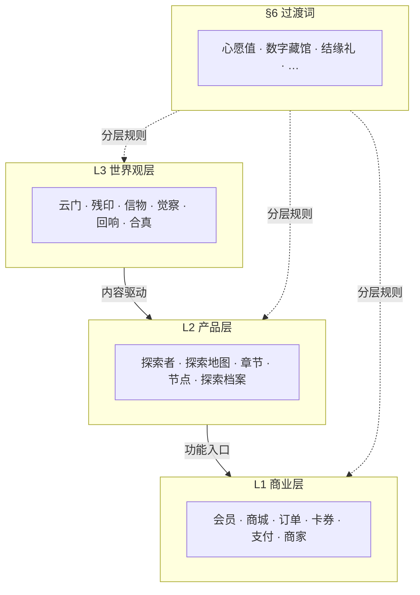

# LOVEQIGU_LANGUAGE_CONSTITUTION_V1

> **《爱企谷 · 三层语言宪法》**  
> **文件标识**：`LOVEQIGU_LANGUAGE_CONSTITUTION_V1.md`  
> **版本**：V1.0  
> **日期**：2026-06-04  
> **状态**：Active · 语言治理基线  
> **性质**：**宪法** — 不替代 L0 Canon · 不替代具体文案 · 为 `LOVEQIGU_TERMINOLOGY_V1` 唯一上位参考  
> **依据**：[`LOVEQIGU_LANGUAGE_AUDIT_V1.md`](./LOVEQIGU_LANGUAGE_AUDIT_V1.md) · [`LOVEQIGU_INITIAL_DEVELOPMENT_BRIEF.md`](./LOVEQIGU_INITIAL_DEVELOPMENT_BRIEF.md) · [`LOVEQIGU_CANON_INDEX.md`](./LOVEQIGU_CANON_INDEX.md)

---

## §0 文件定位

### 0.1 本宪法回答什么

```text
在同一款产品里，
哪些词只能出现在「商城/支付」，
哪些词只能出现在「探索/章节」，
哪些词只能出现在「云门/信物/觉察」，
哪些词必须淘汰，
哪些词可以跨层但必须守规则。
```

### 0.2 权威层级

```text
L0  LOVEQIGU_WORLD_RULES_CANON_V1        世界观哲学（冻结 · 不得改写）
        ↓ 转述边界
L.lang  LOVEQIGU_LANGUAGE_CONSTITUTION_V1  本文件 · 三层语言宪法
        ↓ 具体映射
L.term  LOVEQIGU_TERMINOLOGY_V1（待建）    术语表 · 页面级替换表
        ↓ 实现
L2/L3  JSON 文案 · 前端 UI · 秒哒体验
```

### 0.3 与审计的对应关系

| 审计代号 | 宪法映射 |
|----------|----------|
| A · 商业 MVP | → **商业层**（须规范化，非全部淘汰） |
| B · 爱企谷探索 | → **产品层** |
| C · 合真纪元 Canon | → **世界观层** |
| D · 混合 | → **过渡词** 或 **须拆分/淘汰** |

---

## §1 宪法总则

### 1.1 三层定义

| 层 | 名称 | 职责 | 用户心智 |
|----|------|------|----------|
| **L1** | **商业层** | 变现 · 支付 · 权益 · 商家 · 运营激励的**功能表述** | 「我在这里消费 / 兑换 / 管理权益」 |
| **L2** | **产品层** | 探索动线 · 章节结构 · 导航 · 档案 · 品牌 | 「我在这里探索 / 行走 / 记录进度」 |
| **L3** | **世界观层** | 仪式 · 觉察 · 信物/残印 · 云门 · 合真 | 「我在这里被看见 / 连接 / 回响」 |

### 1.2 三条铁律

1. **分层不混说**：同一屏、同一弹窗、同一句主文案，不得混用两层以上主导语义。  
2. **仪式无商业**：世界观层 moment（云门开启 · 信物回响 · 章成 · 觉察问题）**禁止**出现积分、禁用词、稀有度。  
3. **商业无 Lore 扩写**：商业层 **禁止** 引入 Canon 未述概念（见 `CANON_GAP_REGISTRY`）。

### 1.3 Story Authority 口诀

```text
仪式问 Canon · 动线问产品 · 变现问商业
过渡词查宪法 §6 · 淘汰词查宪法 §7
```

### 1.4 风格口径

| 维度 | 要求 |
|------|------|
| 人称 | 第二人称「你」 |
| 气质 | 东方 · 克制 · 沉浸 · 博物馆感 |
| 可辨识 | 保留「爱企谷」「探索者」「信物」等锚点词 |
| 禁止 | 网络梗 · 促销吼叫 · 游戏大厅式战力/展示 |

---

## §2 三层关系图



```text
用户典型路径：

World Entry（产品+世界观）
    → 探索地图 · 节点（产品）
        → 云门仪式 · 信物回响（世界观）
            → 结缘礼 · 商城兑换（商业）
```

---

## §3 L1 · 商业层词汇

> **使用场景**：权益中心 · 会员中心 · 支付页 · 卡券核销 · 商家后台 · 个人中心「我的权益」区 · 运营 push（非仪式弹窗）  
> **目的**：清晰说明**可购买 / 可兑换 / 可核销**的功能，不承载 Lore。

### 3.1 词汇表

| 词汇 | 简要说明 | 典型场景 |
|------|----------|----------|
| **会员** | 订阅制付费身份 | 会员中心 · 订单类型 `membership` |
| **会员中心** | 会员状态与权益页 | 个人中心入口 |
| **商城** | 积分/心愿值兑换入口（对外统一称「商城」，见 §6 心愿值） | Tab · 列表页标题 |
| **权益中心** | ⚠️ 过渡态工程名；TERMINOLOGY 目标改为「结缘商城」或「商城」 | 现 TabBar · 待重构 |
| **支付** | 微信 JSApi 等收银动作 | 收银台 · 订单确认 |
| **订单** | 交易记录单元 | 订单号 · 支付回调 |
| **卡券** | 商家发放的核销权益 | 打卡礼券 · 兑换券 |
| **优惠券** | 可领取/可使用的折扣凭证 | 咖啡 5 折券等 |
| **核销** | 商家验证到店使用 | 8 位核销码 · 商家端 |
| **核销码** | 唯一到店凭证 | 用户卡券详情 |
| **兑换** | 积分/心愿值换卡券 | 商城列表 CTA |
| **购买** | 法币购积分/特效/会员 | 积分包 · 特效包 |
| **积分** | ⚠️ 工程字段名；**用户可见层** TERMINOLOGY 收敛为「心愿值」或仅商城内说明 | 流水 · 余额（待重构） |
| **积分明细** | 账户流水页 | 个人中心 |
| **积分包** | 付费购点套餐 | 商城 |
| **商家** | B 端入驻主体 | 商家入驻 · 绑点 |
| **入驻** | 商家资质申请 | 商家申请页 |
| **绑点** | 商家关联探索点位 | 商家后台 |
| **结算** | 平台与商家对账 | 管理端 |
| **特效套餐** | AR 特效付费组合 | 订单类型 bundle |
| **隐藏特效** | 付费 AR 内容（商业命名） | 特效页 · **不得**称「隐藏关卡」 |
| **AR 特效** | 可购买/可选的 AR 素材能力 | 特效管理 · 商业说明 |
| **每日任务** | 运营激励任务（结构名） | 后台 `task_definitions` |
| **里程碑** | 连续探索天数奖励节点 | 任务中心 **商业子区** |
| **连续天数** |  streak 统计（中性表述） | 任务中心 · 避免「断签失败」 |
| **已领取** | 奖励发放状态 | 里程碑 · 卡券 |
| **进行中 / 已完成** | 任务 Tab 状态 | 任务列表 |
| **个人中心** | 账户与权益聚合 | profile |
| **我的卡券** | 用户持有券列表 | coupons |
| **足迹** | 历史探索记录（统计向） | footprints · 偏数据 |
| **推荐** | 运营位打卡点推荐 | 首页推荐卡片 |
| **免费 / 付费** | 特效或权益价格说明 | 特效选择 · 商城 |
| **专属奖励** | 登录/活动权益（商业促销语境） | 首页登录引导区 |

### 3.2 商业层书写规则

- 可用：**兑换 · 购买 · 领取 · 核销 · 订阅 · 订单 · 余额 · 明细**  
- 避免在主 CTA 使用：**禁用词**（改「兑换」「开通」）· **福利**（改「结缘礼」「卡券」）  
- **不得**在商业层写：云门 · 大分化 · 归位 · 觉察语

---

## §4 L2 · 产品层词汇

> **使用场景**：首页 · 探索地图 · 章节入口 · 任务/进度页 · 探索档案 · 导航 Tab · 分享标题  
> **目的**：组织**动线、进度、品牌**，衔接世界观与商业，**不**展开 Lore 哲学。

### 4.1 词汇表

| 词汇 | 简要说明 | 典型场景 |
|------|----------|----------|
| **爱企谷** | 品牌与园区名 | 导航栏 · 分享 |
| **LOVEQIGU** | 工程/对外英文名 | 文档 · 技术标识 |
| **城市探索计划** | 第二代品牌副标 | 首页 · World Entry |
| **探索者** | 用户统一称谓（身份层）；哲学定义见 L3 Canon | 全站称呼 · 见 §6 |
| **探索** | 主链行为动词，替代「打卡」 | 开始探索 · 确认探索 · 继续探索 |
| **探索地图** | Tab/页：地理与章节点位 | TabBar · `pages/map` |
| **探索路线** | 章节内推荐动线 | 地图 · 章节引导 |
| **合真之路** | 任务/进度页 **产品化**名称（替代「任务中心」） | 任务中心 Hero · lore keyword |
| **探索点** | 用户可见地点（弱化「节点」时） | 地图卡片 · 列表 |
| **节点** | 工程+内容结构单位 | JSON `node_id` · 对内文档 |
| **章节** | 内容卷容器 | 《云间初醒》· CH01 |
| **卷** | 章节上级区域 | 爱企谷卷 |
| **章成** | 章节完成确认（产品流程名） | n5 · 任务中心 |
| **探索档案** | 个人探索史页（替代「」） | achievement-ranking |
| **探索记录** | 单次到场行为记录 | success_modal · 错误态 |
| **探索数据** | 首页统计区标题 | home stats |
| **探索之旅** | 品牌引导语 | 首页 CTA 区 |
| **探索进度** | 章节/印谱完成度 | 地图 · 任务 |
| **印谱进度** | 1/5 等产品进度（数值可隐藏） | 角标 · 列表 |
| **我的信物** | 用户持有信物列表页（**首选**收藏入口名） | collectibles/mine |
| **信物详情** | 单品详情页标题 | detail 页 |
| **象征意义** | 详情页区块标题（产品结构） | 信物详情 |
| **分享海报** | 章成/探索传播 | n5 · SuccessModal |
| **生成分享海报** | 章成主 CTA | 完成页 |
| **World Entry** | 未登录/世界观首页 | 双首页之一 |
| **Explorer Dashboard** | 登录后工具首页 | 双首页之二 |
| **场域体验** | AR/GPS 能力的产品描述 | 替代「AR打卡体验」权限文案 |
| **图像识别** | 远程 AR 触发通道 | image-scan |
| **线索** | 地图探索提示 keyword | lore `map_keyword` |
| **空状态引导** | 无探索/无信物时的产品引导 | lore empty_* |
| **确认探索** | GPS 围栏内确认 CTA | n*_confirm |
| **今日已探索** | 重复探索提示 | errors duplicate |
| **尚未到达** | GPS 围栏外提示 | errors gps_fail |
| **祝禁第一课** | 任务/修习入口（产品流程名） | n4 · 任务中心 |
| **三屏引导** | n4 修习 UI 结构 | zhuyou guide |
| **初醒者** | 章成 **记念称号**（产品层称谓，非） | 成就/章成 · 见 §6 |
| **持行者** | 连续探索记念称号 | 探索档案 |
| **残印守藏** | 印谱收集记念称号 | 探索档案 |
| **留在足迹里收藏世界** | 跨层品牌标语；产品层主用 | Hero · 分享 |

### 4.2 产品层书写规则

- 主链动词统一：**探索** > 打卡  
- 导航统一：**探索地图** · **我的信物** · **合真之路** · **探索档案**  
- 进度用：**章成 · 印谱 · 探索记录**，不用「通关 ·  · 」  
- 产品层 **可** 出现「觉察」「信物」等词作**标签**，但 Lore 正文归属 L3

---

## §5 L3 · 世界观层词汇

> **使用场景**：Hero 引言 · 仪式弹窗 · 觉察卡片 · 信物/残印正文 · 章成叙事 · quotes/lore/stories JSON  
> **目的**：承载 **Canon 转述**，完成「看见 → 觉察 → 连接 → 回响」闭环。  
> **上位**：[`LOVEQIGU_WORLD_RULES_CANON_V1.md`](world/LOVEQIGU_WORLD_RULES_CANON_V1.md)（只读）

### 5.1 词汇表

| 词汇 | 简要说明 | Canon 依据 |
|------|----------|------------|
| **合真** | 想起 · 归位，非升级 | 序章 · 第十二律 |
| **合真纪元** | 时代/体验框架名 | era.name |
| **探索**（哲学义） | 重新看见 · 与遗忘重逢 | 序章 · 第三律 |
| **探索者**（哲学义） | 愿意重新看见与连接的人 | 关于探索者 |
| **看见** | 开启道路 | 第七律 |
| **照见** | 看见自己与场域同在 | CH01 中央场 |
| **觉察** | 仪式核心状态 | 全篇 |
| **觉察语** | 内省短句 | UI 规范 · JSON |
| **觉察问题** | 无对错内省问句 | AR Blueprint |
| **连接** | 从未断开，暂被遗忘 | 第二律 · 第八律 |
| **连通** | 连接的同义 UI 短词 | lore connectivity |
| **回响** | 世界对真实看见+连接的反馈 | 第十一律 |
| **信物** | 回响的见证，非奖章 | 第十一律 |
| **残印** | 连接曾存在的证据，非收藏品 | 第十律 |
| **印谱** | L2 产品术语：残印拼合之路 | TEXT_FIX 明示 |
| **云门** | 觉察状态；点位为显现之地 | 关于云门 |
| **云门已开** | 状态开启，非造门 | n1 success |
| **归位** | 合真即归位 | 第十二律 |
| **想起** | 合真的本质 | 序章 |
| **场域** | 真实地点中的可感空间 | CH01 文案 |
| **人间道场** | 真实相遇中的修行 | L2 产品术语 |
| **云间道场** | 园区场域代称 | CH01 |
| **祝禁** | 证实合一的方法论 | 关于祝禁 |
| **感印 · 静观 · 书符** | 祝禁第一课结构 | n4 |
| **大分化** | 意识进入分离时代 | 关于大分化 |
| **连接散落** | 残印成因（禁止「天机碎为残印」） | 第十律 |
| **遗忘** | 自然发生，非失败 | 序章 · 第十律 |
| **记念** | 信物/探索的记录语义 | 信物 popup |
| **五处觉察** | 章成仪式总结 | n5 |
| **云间初醒** | 第一章名称 | chapter title |
| **入门徽章** | 信物专名（内容层） | badge_gate |
| **云门残印·甲** | 残印专名 | meta_ch01_01 |
| **初醒印记** | 章成信物专名 | ch01_complete_seal |
| **符者记念** | 祝禁合规表述 | stories · lore |

### 5.2 世界观层书写规则

- 获得信物：**获得觉察信物 / 获得残印 / 云门已回响** — 不用「恭喜获得」  
- 完成探索：**觉察已记录 / 探索记录已留下** — 不用「打卡成功 +N 积分」  
- 章成：**五处觉察已汇成一章** — 不用「通关成功」  
- 遵守 `lore.json` → `forbidden_ui_copy` 黑名单  
- **不得** 新增 Gap 外 Lore（天机 · 昆仑 · 太一纪等）

### 5.3 L2 产品术语（世界观层可用 · 非 Canon 立法）

以下词可在 L3 文案出现，但**不得**当作宇宙规则扩写：

```text
印谱 · 人间道场 · 云间道场 · 爱企谷卷 · 探索点位
```

---

## §6 过渡词与可选词

> **定义**：同形异层，或审计 D 类词；**必须**按场景择层，不得一词通吃。

### 6.1 过渡词总表

| 词汇 | 可属层次 | 分层规则 |
|------|----------|----------|
| **心愿值** | L1 余额 / L3 哲学 | **仪式链**：不显示 `+N`。**商城/明细**：可作账户名。**禁止**：与「购买修行」混说 |
| **数字藏馆** | L2 列表页 / L3 气质 | **列表入口**（collectibles/index）用「数字藏馆」。**个人持有**用「我的信物」。不同页不同名，禁止 Tab 写「信物」 |
| **结缘礼** | L1 权益 / L2 引导 | **领取/核销**语境用「结缘礼」。**后台/订单**可用「卡券」。不在云门弹窗写「免费福利」 |
| **探索者** | L2 称呼 / L3 定义 | UI 称呼用 L2。**哲学文案**引用 Canon「关于探索者」时用 L3 |
| **成就** | L1 激励 / L2 记念 | **禁止**「成就」。**探索档案**内改「探索记念」或「章成记念」。仪式弹窗不写「成就」 |
| **称号** | L2 记念 / ⚠️ L1 竞争 | 仅作**章成/修习记念**（初醒者）。禁止 tier 式「称号」 |
| **任务中心** | L1 结构 / L2 命名 | **对外**改为「合真之路」。内部路由可保留 `task-center` |
| **成长** | L1 运营 / 禁止 L3 | 禁止「觉察成长」与挂钩。可用「探索记录渐丰」 |
| **收藏** | L2 动作 / 禁止 L1 藏品 | 禁止「信物」。可用「收下的记念」「藏馆回顾」 |
| **奖励** | L1 运营 | 仪式链改用「记念」「回响」。里程碑区可用「探索记念」 |
| **禁用词** | L1 付费特效 | **仅**隐藏特效/功能开通。**禁止**仪式/节点/祝禁（改「开启」「开放」「显现」） |
| **打卡** | ⚠️ 淘汰中 | 仅权限说明/工程注释可暂留。**用户主链**一律「探索」 |
| **权益中心** | L1 | TERMINOLOGY 阶段改为「商城」或「结缘商城」，与 Tab 同步 |
| **信物** | ⚠️ 淘汰 | 见 §7；过渡替换为「信物」「藏馆」 |
| **AR 打卡** | L1 工程 | 用户文案改「场域体验」「探索记录」 |
| **留在足迹里收藏世界** | L2 品牌 / L3 情绪 | Hero · 分享可用；不与积分促销同屏 |

### 6.2 过渡词决策流程

```text
该文案出现在哪？
    ├─ 支付/券/会员/订单 → L1 词汇表
    ├─ 导航/进度/章节/地图 → L2 词汇表
    ├─ 弹窗/觉察/信物正文 → L3 词汇表
    └─ 跨层 → 查 §6.1 表 · 拆成两句分属两层
```

---

## §7 淘汰词

> **定义**：审计第一代残留 · Canon 冲突 · 游戏化/竞争化用语；**不得**出现在新文案。  
> **工程字段/历史 PRD** 可暂存，**用户可见层**一律禁用。

### 7.1 淘汰词表

| 淘汰词 | 冲突原因 | 推荐替代（按层） |
|--------|----------|------------------|
| **禁用词** | 抽卡语义 | —（删除） |
| **稀有度** | 信物非证明 | L3 用 tag「觉察/残印/祝禁」 |
| **传奇 / legendary** | 战利品化 | L3 信物专名 |
| **战力** | 游戏化 | — |
| **禁用词** | 探索非竞争 | L2 **探索档案** |
| **Top10 / 榜单** | 同上 | L2 探索记念列表（无排名） |
| **魔力值** | 不存在于现库；防回归 | L1 **心愿值**（商城语境） |
| **信物** | 与信物/残印 Canon 冲突 | L2 **信物** · **数字藏馆** |
| **藏品**（单独作商品类） | 收藏品语义 | **信物** |
| **打卡**（主链动词） | 第一代 MVP | L2 **探索** |
| **打卡成功** | 游戏反馈 | L3 **觉察已记录** |
| **签到** | 运营签到语义 | L2 **今日探索** |
| **连续打卡** | 断签惩罚联想 | L2 **连续探索天数** |
| **断签 / 失败** | 遗忘非失败 | L2 **上次探索在 X 天前** |
| **禁用词**（仪式语境） | 关卡语义 | L2 **开放** · L3 **显现** |
| **恭喜获得** | 抽卡反馈 | L3 **云门已回响** |
| **通关 / 通关成功** | 游戏关卡 | L2 **章成** · L3 **觉察已齐** |
| **胜利 / 失败** | 对抗语义 | — |
| **抽卡 / 掉落 / 爆率** | 随机奖励 | —（确定性发放） |
| **经验 / EXP** | RPG 成长 | — |
| **禁用词**（用户 tier） | 觉察不分高低 | 后台字段可留；UI 不展示 normal/gold/vip |
| **至尊 / 白银 / 黄金** | 证明 | — |
| **福利广场** | 第一代促销 | L1 **结缘礼** · **卡券** |
| **隐藏关卡** | 节点非关卡 | L1 **隐藏特效**（仅商业页） |
| **已**（游戏化） | 通关感 | L2 **已达成** · **记念已留下** |
| **确定 / 取消** | lore forbidden（按钮） | **继续** · **再想想** · **我知道了** |
| **升级** | 合真不是升级 | L3 **想起** · **归位** |
| **天机 / 昆仑 / 太一纪** | Gap FORBIDDEN | —（删除） |

### 7.2 淘汰词扫描范围

新文案提交前须扫描：

```text
frontend/src/pages/**
data/chapters/**
data/collectibles/**
data/world/**
docs/ch01/**（用户可见段）
```

---

## §8 分层适用：页面 × 主导层

| 页面/模块 | 主导层 | 允许次要层 | 禁止 |
|-----------|--------|------------|------|
| World Entry / Hero | L2 + L3 | — | L1 促销语 |
| 探索地图 | L2 | L3 节点副标题 | 打卡/积分 |
| 节点确认弹窗 | L2 | — | /奖励数字 |
| 云门/信物仪式弹窗 | L3 | — | 积分/禁用词/成就 |
| 觉察问题卡片 | L3 | — | 评分/对错 |
| 章成完成页 | L3 | L2 分享 CTA | 通关/ |
| 我的信物 / 信物详情 | L3 | L2 导航 | 稀有度/藏品 |
| 数字藏馆列表 | L2 | L3 tag | 信物 |
| 合真之路（任务） | L2 | L1 里程碑子区 | 关卡叙事 |
| 探索档案 | L2 | L2 记念称号 | /已 |
| 商城 / 卡券 / 会员 | L1 | — | 云门/大分化/觉察语 |
| 商家端 / 管理端 | L1 | L2 点位名 | Lore 扩写 |
| 权限/系统说明 | L1 | L2 | 世界观仪式词 |

---

## §9 审计词汇映射索引

> 确保 LANGUAGE_AUDIT 高冲突项均落入宪法条目。

| 审计术语 | 宪法处置 |
|----------|----------|
| 信物 | §7 淘汰 → 信物/藏馆 |
| 探索地图 | §7 打卡淘汰 → §4 探索地图 |
| 权益中心 | §6 过渡 → §3 商城 |
| 禁用词 | §6 过渡 · §7 仪式语境淘汰 |
| 成就/称号 | §6 过渡 · 探索档案记念化 |
| 禁用词 | §7 淘汰 → 探索档案 |
| 连续打卡 | §7 → 连续探索天数 |
| 成长 | §6 禁止与挂钩 |
| 会员 | §3 商业层 |
| 福利 | §7 → 结缘礼/卡券 |
| 心愿值 +N | §6 仪式链隐藏 |
| 任务中心 vs 合真之路 | §6 → 对外合真之路 |
| 已 | §7 → 已达成 |
| 魔力值 | §7 淘汰 |

---

## §10 质量检查清单（TERMINOLOGY_V1 前置）

- [ ] 每个用户可见词仅在一个**主导层**有定义（过渡词除外且已标注 §6）  
- [ ] §3–§5 词汇表覆盖 AUDIT 第二部分全部页面术语  
- [ ] §7 淘汰词覆盖 AUDIT 第三部分高冲突项  
- [ ] §6 覆盖 AUDIT 全部 D 类混合项  
- [ ] 与 L0 Canon 无冲突 · 无新增世界观  
- [ ] 与 `LOVEQIGU_UI_SYSTEM_V1` prescribed 词（数字藏馆 · 合真之路 · 探索档案）对齐  
- [ ] 可作为 TERMINOLOGY_V1 **唯一上位参考**（术语表只做 id→替换句，不另立法）

---

## §11 后续文档关系

```text
LOVEQIGU_LANGUAGE_CONSTITUTION_V1（本文件 · 宪法）
        ↓
LOVEQIGU_TERMINOLOGY_V1（术语表 · 页面级 old→new）
        ↓
首页 / 探索页 / TabBar 重构 PR
        ↓
JSON 批量替换（须 Story Authority 分文件审查）
```

---

## 附录 A · 修订记录

| 版本 | 日期 | 说明 |
|------|------|------|
| V1.0 | 2026-06-04 | 首版 · 基于 LANGUAGE_AUDIT_V1 · INITIAL_BRIEF |

---

*本宪法为语言治理基线；具体替换句与路由改名见 `LOVEQIGU_TERMINOLOGY_V1`（待建）。*
