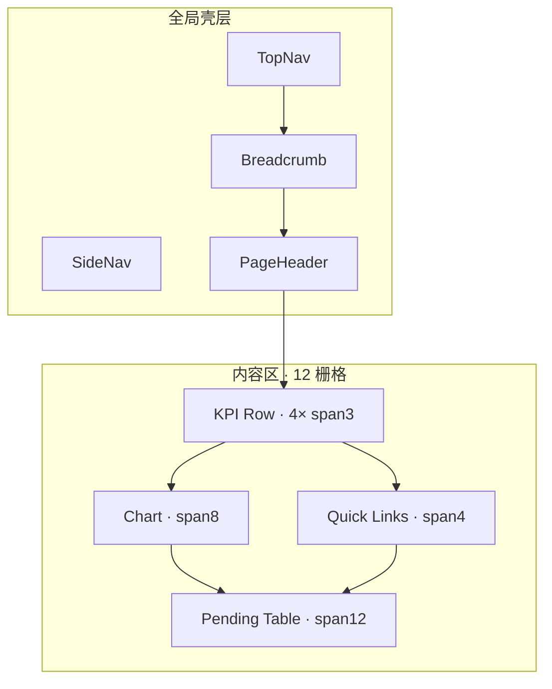
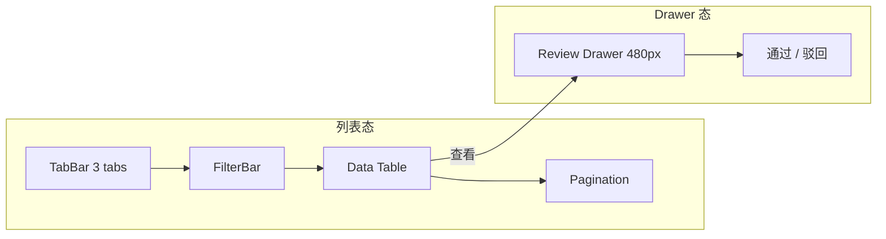

# BACKOFFICE_VISUAL_MOCKUP_V1

# AR游伴 · 后台视觉稿规范 V1

```yaml
project: LOVEQIGU / AR游伴
module: Backoffice Visual Mockup
version: V1
status: APPROVED_FOR_DESIGN
owner: Product / UX / Visual
date: 2026-06-07
type: 视觉设计稿（非代码）
upstream:
  - docs/product/backoffice/BACKOFFICE_DESIGN_SYSTEM_V1.md
  - docs/product/backoffice/ADMIN_COMPONENT_LIBRARY_V1.md
reference_products:
  - 飞书后台
  - 企业微信管理后台
  - 有赞商家后台
  - 微信公众平台
visual_tone: 东方克制 · 企业级 · 高端文旅 · 留白 · 轻量金石感
anti_patterns:
  - 游戏化 · 赛博朋克 · 二次元 · 强渐变 · 电竞风 · 传统政务蓝灰
deliverables: 5 页面视觉稿规范
canvas: 1440 × 900（主稿）· 1920 × 1080（宽屏延展）
```

---

## 0. 全局视觉语言

### 0.1 设计气质一句话

> **纸上行旅，金石为界** —— 像高端文旅品牌的运营手册，而非政府办事大厅或游戏后台。

### 0.2 与参考产品的关系

| 参考 | 借鉴什么 | 不借鉴什么 |
|------|----------|------------|
| **飞书** | 留白节奏、顶侧分栏、表格行高、信息层级 | 偏 SaaS 冷蓝 |
| **企业微信** | 角色分层、审核流、克制弹窗 | 绿作为主色 |
| **有赞** | 商家 KPI、卡券列表、核销路径 | 促销红、满屏 Banner |
| **微信公众平台** | 审核态 Badge、表单克制、状态色语义 | 老旧灰框 |

### 0.3 金石感表达（轻量）

```text
材质隐喻（抽象，非拟物 UI）：
  · 纸 — 页面底 #F7F5F0，微暖、无纹理贴图
  · 墨 — 主文字 #2B2118，标题略重、正文略轻
  · 石 — 边框 #E8E4DE，1px 细线，不用粗框
  · 金 — 赭石 #5C4033 仅用于：主按钮、Active 导航、关键数字点缀
  · 松 — 成功 #2C7A4B，通过/核销完成，低饱和

禁止：金属渐变、浮雕、内阴影、发光描边、粒子动效
```

### 0.4 全局色彩板（视觉稿标注用）

| 角色 | 色值 | 视觉稿标注名 | 使用场景 |
|------|------|--------------|----------|
| 纸白·页 | `#F7F5F0` | Paper/Page | 全页背景 |
| 纸白·卡 | `#FFFFFF` | Paper/Card | 卡片、表格容器、Top Nav |
| 墨·主 | `#2B2118` | Ink/Primary | 标题、表格主列文字 |
| 墨·次 | `#6F5D4D` | Ink/Secondary | 描述、副文案 |
| 墨·辅 | `#9A8B7A` | Ink/Muted | 表头、分组标题、placeholder |
| 石·线 | `#E8E4DE` | Stone/Border | 分割线、卡片边、表格线 |
| 金·主 | `#5C4033` | Gold/Accent | 主 CTA、Active 侧栏、Logo 底 |
| 金·浅 | `#EBE0D4` | Gold/Light | Active 背景、Hover 浅底 |
| 松·成 | `#2C7A4B` | Pine/Success | 已通过、已核销 |
| 松·底 | `#E3F1E9` | Pine/Success-BG | Success Badge 底 |
| 琥珀·警 | `#B26B1B` | Amber/Warning | 待审核、待处理 |
| 琥珀·底 | `#FBEFDE` | Amber/Warning-BG | Warning Badge 底 |
| 朱砂·险 | `#A4412B` | Cinnabar/Danger | 已驳回、失败 |
| 朱砂·底 | `#F6E0DB` | Cinnabar/Danger-BG | Danger Badge 底 |
| 青灰·信 | `#4A6670` | Slate/Info | 处理中、信息提示 |
| 青灰·底 | `#E8EEF0` | Slate/Info-BG | Info Badge 底 |

### 0.5 全局布局框架（五页共用）

```text
┌──────────────────────────────────────────────────────────────────────────┐
│ TOP NAV · 56px · #FFFFFF · border-bottom 1px #E8E4DE                    │
│ [Logo 32×32 赭石底] AR游伴 · {角色名}    {环境/园区}     [动作] [用户]   │
├────────────┬─────────────────────────────────────────────────────────────┤
│ SIDE NAV   │ CONTENT · padding 24px · max-width 内置于 1600 居中        │
│ 240px      │                                                             │
│ #FFFFFF    │  Breadcrumb · 13px #9A8B7A · margin-bottom 16px           │
│            │  ─────────────────────────────────────────────────────────  │
│ 分组标题   │  Page Header · H1 24px + 描述 14px #6F5D4D                  │
│ 12px muted │  margin-bottom 24px · 主操作右对齐                           │
│            │  ─────────────────────────────────────────────────────────  │
│ 菜单 14px  │  {页面主体：KPI / Chart / Filter / Table / Drawer}          │
│            │                                                             │
│ Active:    │  Footer note（可选）12px muted · margin-top 24px            │
│ 金浅底+    │                                                             │
│ 左3px金线  │                                                             │
└────────────┴─────────────────────────────────────────────────────────────┘
```

### 0.6 大量表格的高级感原则（全稿核心）

> **表格是后台的主视觉，不是附属品。** 高级感来自「呼吸感 + 层级 + 克制色彩」，而非装饰。

| 原则 | 做法 | 避免（政务风） |
|------|------|----------------|
| **行距呼吸** | 行高 48px · 单元格 padding 12px 16px | 行高 32px 挤满 |
| **无斑马纹** | 白底 + 1px 分割线 `#E8E4DE` | 蓝灰交替斑马 |
| **表头降权** | 12px · `#9A8B7A` · 不加粗黑底 | 深蓝底白字表头 |
| **列宽语义** | 名称列最宽 · 状态 Badge · 操作列右固定 120px | 等宽十二列 |
| **数字对齐** | 数量/金额右对齐 · 使用 tabular nums | 全部左对齐 |
| **状态不抢戏** | Badge 小标签 · 语义色仅用于状态列 | 整行背景染色 |
| **Hover 轻触** | 行 hover `#FAF9F7` · 无动效 | 高亮蓝条 |
| **密度切换** | 平台端默认「标准」· 可选「紧凑 40px」（平台内部） | 只有一种高密度 |
| **空态留白** | 居中 48px 留白 + 一句中文 + 一个主操作 | 大插画 + 三行说明 |
| **分页克制** | 右下 · 文字「共 N 条」· 页码极简 | 居中巨型分页器 |

**飞书式表格气质：** 像文档里的结构化列表，不是 Excel 截图。  
**有赞式表格气质：** 商家看得懂，列少、字大、操作明确。

---

## 1. Platform Dashboard · 平台运营总览

**角色：** 平台运营管理员  
**画布：** 1440 × 900  
**Top Nav 左：** `AR游伴 · 平台运营` · 副标 `预发环境`  
**Side Nav Active：** 总览 → 运营总览

---

### 1.1 页面结构图

```text
┌─ Top Nav ─────────────────────────────────────────────────────────────┐
├─ Side ─┬─ Breadcrumb: 平台运营 / 运营总览 ─────────────────────────────┤
│ 总览   │  Page Header                                                    │
│  ●运营 │  ┌ 运营总览 ────────────────────────────── [导出报告] 赭石 btn ┐ │
│ 审核   │  │ 全平台商家、卡券、活动与审核状态 · 2026-06-20              │ │
│ 发布   │  └────────────────────────────────────────────────────────────┘ │
│ 配置   │  ┌ KPI ×4 ────────────────────────────────────────────────────┐ │
│ 服务   │  │ 待审核    │ 今日通过  │ 活跃活动  │ 入驻商家              │ │
│ 系统   │  │   4       │    2      │    3      │    8                  │ │
│        │  │ 需尽快处理│ 较昨日 +1 │ 进行中    │ 爱企谷等 2 个景区      │ │
│        │  └────────────────────────────────────────────────────────────┘ │
│        │  gap 24px                                                       │
│        │  ┌ Chart span 8 ──────────────┐ ┌ Quick span 4 ──────────────┐ │
│        │  │ 近 7 日审核趋势             │ │ 快捷入口                    │ │
│        │  │ [折线 200px · 单色赭石]     │ │ [进入审核中心] 主 btn       │ │
│        │  │                             │ │ [进入发布中心]              │ │
│        │  │                             │ │ [查看工单]                  │ │
│        │  └─────────────────────────────┘ └────────────────────────────┘ │
│        │  gap 24px                                                       │
│        │  ┌ Table span 12 ──────────────────────────────────────────────┐ │
│        │  │ 待办提醒                                          [查看全部] │ │
│        │  │ Filter: (无 · 本区为 curated 列表)                          │ │
│        │  │ ┌──────┬────────────┬────────┬──────────┬──────┐           │ │
│        │  │ │ 类型 │ 名称       │ 状态   │ 提交时间 │ 操作 │           │ │
│        │  │ ├──────┼────────────┼────────┼──────────┼──────┤           │ │
│        │  │ │商家审│爱企谷咖啡  │待审核  │06-15 09:00│ 处理 │           │ │
│        │  │ │卡券审│到店核销券  │待审核  │06-15 10:00│ 处理 │           │ │
│        │  │ │活动审│初见寻宝节  │待审核  │06-15 11:00│ 处理 │           │ │
│        │  │ │发布确│activity_001│待确认  │06-15 12:00│ 处理 │           │ │
│        │  │ └──────┴────────────┴────────┴──────────┴──────┘           │ │
│        │  └────────────────────────────────────────────────────────────┘ │
└────────┴────────────────────────────────────────────────────────────────┘
```



---

### 1.2 视觉说明

**第一印象：** 打开页面应看到 **大量留白 + 四个克制的数字**，不是满屏图表。气质接近飞书「工作台」—— 冷静、可扫读、无装饰。

| 区域 | 视觉处理 |
|------|----------|
| 页背景 | `#F7F5F0` 均匀平铺，无渐变 |
| KPI 区 | 四卡等宽，白底 12px 圆角，阴影 `0 1px 3px rgba(43,33,24,0.06)`，卡间距 16px |
| 数字 | 28px Semibold `#2B2118`；「待审核」数字可用 `#B26B1B` 强调（仅数字，非整卡） |
| 图表 | 200px 高虚线占位或单色折线；网格线 `#E8E4DE` 极淡；无面积渐变填充 |
| 待办表 | 嵌入单张 Card，表头 muted；最多展示 4–5 行，超出链「查看全部」 |
| 告警条 | 表格上方可选一条 `alert-warning` 浅琥珀底：「4 条审核待处理」—— 一条即可，不堆 Banner |

**禁止：** 地图大屏、3D 图表、轮播 Banner、勋章进度条

---

### 1.3 组件使用说明

| 组件 | 实例 | 规格 |
|------|------|------|
| TopNav | 平台版 | 右：环境 Badge「预发」+ 用户「运营管理员」+ 退出 |
| SideNav | 平台 5 组 | Active：运营总览 |
| Breadcrumb | 2 级 | `平台运营 / 运营总览` |
| PageHeader | 标题+描述+操作 | 右端「导出报告」Secondary Button |
| KPI Card ×4 | 待审核/今日通过/活跃活动/入驻商家 | span 3/12 · min-h 96px |
| Chart | 折线占位 | span 8/12 · h 200px |
| Card + 按钮组 | 快捷入口 | span 4/12 · 3 个纵向 full-width btn |
| Table | 待办提醒 | span 12 · 5 列 · 无 Filter |
| Status Badge | 待审核/待确认 | Warning 琥珀 |
| Button | 处理 | Text/Outline · 非实心 |

---

### 1.4 颜色说明

| 元素 | 色 |
|------|-----|
| 页面底 | `#F7F5F0` |
| KPI 卡 | `#FFFFFF` + 边 `#E8E4DE` |
| 「待审核」数值 | `#B26B1B`（仅此 KPI） |
| 其余 KPI 数值 | `#2B2118` |
| 折线 | `#5C4033` 1.5px |
| 快捷入口主 btn | 底 `#5C4033` 字 `#FFFFFF` |
| 表格分割线 | `#E8E4DE` |

---

### 1.5 布局说明

| 属性 | 值 |
|------|-----|
| 内容区 max-width | 1600px 居中（1440 画布下左右各 ~24px 页边） |
| KPI 行 | margin-bottom 24px |
| Chart + Quick | 同行，gap 16px，margin-bottom 24px |
| Table Card | padding 20px |
| 栅格 | 12 列 · gap 16px |

---

## 2. Merchant Dashboard · 商家今日概览

**角色：** 门店店长（低技术）  
**画布：** 1440 × 900  
**Top Nav 左：** `AR游伴 · 商家工作台` · 副标 `爱企谷咖啡`  
**Top Nav 右：** **`扫码核销` 主按钮** 44px 高 · 赭石实心  
**Side Nav Active：** 工作台 → 今日概览

---

### 2.1 页面结构图

```text
┌─ Top Nav ─────────────────────────────────── [扫码核销 44px 主btn] ────┐
├─ Side ─┬─ Breadcrumb: 商家工作台 / 今日概览 ────────────────────────────┤
│ 工作台 │  Page Header                                                    │
│  ●概览 │  ┌ 爱企谷咖啡 · 今日概览 ────────────────────────────────────┐  │
│ 核销   │  │ 2026年6月20日 · 轻量工作台                                 │  │
│  ●扫码 │  └────────────────────────────────────────────────────────────┘  │
│  记录  │  ┌ KPI ×4 ────────────────────────────────────────────────────┐ │
│ 卡券   │  │ 今日领取 │ 今日核销 │ 待核销   │ 核销率                     │ │
│ 财务   │  │   65     │   18     │   4      │   38%                      │ │
│ 服务   │  │          │          │ 查看列表→│                              │ │
│ 设置   │  └────────────────────────────────────────────────────────────┘ │
│        │  ┌ Chart span 8 ──────────────┐ ┌ Action span 4 ─────────────┐ │
│        │  │ 近 7 日核销趋势             │ │ 快捷操作                    │ │
│        │  │ [折线 · 领取灰 / 核销赭石]  │ │ [扫码核销] 大主 btn 44px    │ │
│        │  │                             │ │ [核销记录]                  │ │
│        │  │                             │ │ [提交工单]                  │ │
│        │  └─────────────────────────────┘ └────────────────────────────┘ │
│        │  ┌ 卡券概览 span 6 ──────────┐ ┌ 提醒 span 6 ────────────────┐ │
│        │  │ Table 4列 · 1–2行         │ │ alert-warning 账单待付       │ │
│        │  │ 卡券|状态|领取|核销        │ │ 工单一行 muted               │ │
│        │  └───────────────────────────┘ └─────────────────────────────┘ │
└────────┴────────────────────────────────────────────────────────────────┘
```

---

### 2.2 视觉说明

**第一印象：** 像有赞商家首页 —— **少字、大按钮、路径清晰**。店员 3 秒内应找到「扫码核销」。

| 区域 | 视觉处理 |
|------|----------|
| 信息密度 | **低** — 比平台端少 30% 元素；不出现英文码、API 词 |
| 扫码 CTA | Top Nav + 快捷区 **双入口**；按钮 44px · 全宽 · `#5C4033` · 8px 圆角（非胶囊） |
| KPI | 仅 4 个；「待核销」副链「查看列表」14px 赭石链接 |
| 图表 | 可选双色：领取 `#9A8B7A` 细线 + 核销 `#5C4033` 稍粗；仍无渐变填充 |
| 提醒区 | 最多 2 条：账单 amber 条 + 工单一行；禁止滚动公告 |

**禁止：** 游戏等级、今日任务、红包入口、满屏促销色

---

### 2.3 组件使用说明

| 组件 | 实例 | 规格 |
|------|------|------|
| TopNav | 商家版 | **右一：扫码核销 Primary LG** |
| SideNav | 商家 6 组 | 核销组置顶；Active：今日概览 |
| PageHeader | 门店名+日期 | 无右侧操作（CTA 已在 Top Nav） |
| KPI Card ×4 | 领取/核销/待核销/核销率 | 全中文标签 |
| Chart | 双系列折线 | span 8 |
| Button Group | 快捷操作 | span 4 · 纵向 · 首项 Primary LG |
| Table | 卡券概览 | 4 列 · 极简 · 1–2 行 |
| Alert | 账单提醒 | warning 浅底 · 单行 |

---

### 2.4 颜色说明

| 元素 | 色 |
|------|-----|
| 扫码核销 btn | `#5C4033` / 字 `#FFFFFF` |
| 核销率 KPI | `#2B2118`（正常，不用红绿涨跌） |
| 已发布 Badge | Pine `#2C7A4B` / 底 `#E3F1E9` |
| 账单 Alert | 底 `#FBEFDE` / 字 `#B26B1B` |
| 链接「查看列表」 | `#5C4033` underline on hover |

---

### 2.5 布局说明

| 属性 | 值 |
|------|-----|
| 信息密度 | 低 · 区块 gap 24px |
| KPI | 4× span3 |
| 下行 | Chart span8 + Action span4 |
| 底行 | 两卡各 span6 等高 |
| 最低宽度 | 1024px（再窄走 H5 核销模板，不在本稿） |

---

## 3. Park Dashboard · 园区运营总览

**角色：** 园区运营负责人  
**画布：** 1440 × 900  
**Top Nav 左：** `AR游伴 · 园区管理` · 副标 `爱企谷`  
**Side Nav Active：** 总览 → 运营总览

---

### 3.1 页面结构图

```text
┌─ Top Nav ───────────────────────────────────────────── [创建活动 主btn] ┐
├─ Side ─┬─ Breadcrumb: 园区管理 / 运营总览 ────────────────────────────────┤
│ 总览   │  Page Header: 爱企谷 · 运营总览                                    │
│  ●概览 │  描述：园区活动与商家协同                                          │
│ 活动   │  ┌ KPI ×4 ────────────────────────────────────────────────────┐ │
│  列表  │  │ 进行中活动│ 入驻商家 │ 待发布检查│ 待处理工单                 │ │
│  创建  │  │     1     │    8     │     1     │     2                      │ │
│  检查  │  └────────────────────────────────────────────────────────────┘ │
│ 协同   │  ┌ Activity Table span 8 ────────┐ ┌ Quick span 4 ────────────┐ │
│ 服务   │  │ 活动状态                        │ │ [创建活动] 主 btn         │ │
│        │  │ 活动名|审核|发布检查|操作        │ │ [商家管理]                │ │
│        │  │ 初见寻宝节|待审核|已阻断|查看    │ │ [工单]                    │ │
│        │  │ 夏日探索  |已通过|就绪  |检查    │ │                           │ │
│        │  └─────────────────────────────────┘ └───────────────────────────┘ │
│        │  ┌ Merchant Snapshot span 12 ────────────────────────────────────┐ │
│        │  │ 商家协同快照 · 横向 4 个 mini KPI（可选 V1.1）                 │ │
│        │  └─────────────────────────────────────────────────────────────┘ │
└────────┴────────────────────────────────────────────────────────────────────┘
```

---

### 3.2 视觉说明

**第一印象：** 介于平台与商家之间 —— **活动导向**，表格讲「活动生命周期」，不是财务大盘。

| 区域 | 视觉处理 |
|------|----------|
| 气质 | 文旅运营中枢；可联想「景区管理处」但 **不要** 政府蓝、红头、公章风 |
| KPI | 「待发布检查」数字 amber；「进行中活动」数字可用 `#2C7A4B` |
| 活动表 | 核心视觉；状态两列（审核 + 发布检查）均用 Badge，不用文字墙 |
| 「已阻断」 | Neutral 灰棕 Badge，非刺眼红 |
| 快捷区 | 与平台 Dashboard 同构，降低学习成本 |

---

### 3.3 组件使用说明

| 组件 | 实例 | 规格 |
|------|------|------|
| TopNav | 园区版 | 副标显示当前园区名 |
| SideNav | 园区 4 组 | Active：运营总览 |
| PageHeader | 园区名+描述 | 右：「创建活动」Primary |
| KPI Card ×4 | 活动/商家/发布检查/工单 | |
| Table | 活动状态 | span 8 · 4 列 + 操作 |
| Button Group | 快捷入口 | span 4 |
| Status Badge | 待审核/已通过/已阻断/就绪 | 审核规范五色 |

---

### 3.4 颜色说明

| 元素 | 色 |
|------|-----|
| 进行中活动 KPI | 数值 `#2C7A4B` |
| 待发布检查 KPI | 数值 `#B26B1B` |
| 已阻断 Badge | 字 `#6A5848` / 底 `#F3EADF` |
| 就绪 Badge | 同 Success 松绿 |

---

### 3.5 布局说明

| 属性 | 值 |
|------|-----|
| 密度 | 中 — 介于平台与商家 |
| 主表 | span 8 左主视觉 |
| 快捷 | span 4 右对齐按钮栈 |
| 可选底栏 | span 12 商家快照（V1 可省略） |

---

## 4. Review Center · 审核中心

**角色：** 平台运营审核员  
**画布：** 1440 × 900（列表态）· 1440 × 900（Drawer 展开态另帧）  
**Side Nav Active：** 审核发布 → 审核中心

---

### 4.1 页面结构图

```text
┌─ Top Nav ──────────────────────────────────────────────────────────────┐
├─ Side ─┬─ Breadcrumb: 平台运营 / 审核中心 ────────────────────────────────┤
│        │  Page Header: 审核中心                                         │
│        │  描述：商家 · 卡券 · 活动审核                                    │
│        │  ┌ Tab Bar ──────────────────────────────────────────────────┐ │
│        │  │ [商家审核] | 卡券审核 | 活动审核                             │ │
│        │  │  active: 2px 底边 #5C4033 · 字 #5C4033 semibold             │ │
│        │  └────────────────────────────────────────────────────────────┘ │
│        │  ┌ Filter Bar ─────────────────────────────────────────────────┐ │
│        │  │ 状态 [全部|待审核|已通过|已驳回]  提交时间 [日期]  [搜索____] │ │
│        │  └────────────────────────────────────────────────────────────┘ │
│        │  ┌ Table Card span 12 ──────────────────────────────────────────┐ │
│        │  │ 名称          │ 提交方   │ 状态   │ 提交时间    │ 操作      │ │
│        │  │───────────────┼──────────┼────────┼─────────────┼───────────│ │
│        │  │ 爱企谷咖啡    │ 商家     │ 待审核 │ 06-15 09:00 │ 查看      │ │
│        │  │ 爱企谷书店    │ 商家     │ 已通过 │ 06-14 10:30 │ 查看      │ │
│        │  │ ...           │          │        │             │           │ │
│        │  │ (10–20 行/页) │          │        │             │           │ │
│        │  └──────────────────────────────────────────────────────────────┘ │
│        │  Pagination: 共 24 条 · 每页 20 · 右下                           │
│        │                                                                    │
│        │  ┌ Drawer 480px 右滑 ────────────────┐  ← 点击「查看」展开         │
│        │  │ 审核详情                    [×]  │                             │
│        │  │ ───────────────────────────────  │                             │
│        │  │ 字段列表 · 2 列 label/value      │                             │
│        │  │ 审核意见 textarea                │                             │
│        │  │ ───────────────────────────────  │                             │
│        │  │        [驳回]        [通过]      │                             │
│        │  └──────────────────────────────────┘                             │
└────────┴────────────────────────────────────────────────────────────────────┘
```



---

### 4.2 视觉说明

**第一印象：** 微信公众平台审核页 + 飞书审批列表 —— **Tab 切换类型，表格承载主体，Drawer 不跳页**。

| 区域 | 视觉处理 |
|------|----------|
| Tab | 无背景块 · 仅下划线 Active · 间距 24px |
| Filter | 单行白底条 12px 圆角 · 与 Table 同 Card 或紧贴上方 gap 0 |
| 表格 | **本稿重点** — 见 §0.6；名称列 flex 1 · min-width 200px |
| 状态列 | 固定 88px · 居中 Badge |
| 操作列 | 固定 80px · 「查看」文字按钮 `#5C4033` |
| Drawer | 480px · 白底 · 左 shadow · 底 sticky 操作栏；**不用** 全屏 Modal |
| 通过/驳回 | 通过=松绿 outline · 驳回=朱砂 outline；驳回弹窗必填原因 |

**大量数据场景（50+ 行）：**
- 表头 sticky top（Top Nav + Filter 下方）
- 垂直 scroll 在 Table Card 内，max-height calc(100vh - 320px)
- 平台内部可开「紧凑模式」行高 40px —— 仍无斑马纹

**避免政务风：**
- 不用「序号」为第一列（除非批量勾选）
- 不用全表边框 grid
- 不用红头「审核中心」大字

---

### 4.3 组件使用说明

| 组件 | 实例 | 规格 |
|------|------|------|
| TabBar | 3 Tab | 商家/卡券/活动 |
| FilterBar | 状态+日期+搜索 | 单行；「更多筛选」折叠 |
| Table | 审核列表 | 5 列 · sticky header |
| Status Badge | 4 态 | PENDING/APPROVED/REJECTED/BLOCKED |
| Pagination | 标准 | 10/20/50 每页 |
| Drawer | Review Drawer | 480px · P0 |
| Button | 通过/驳回 | Drawer footer 右对齐 |
| Modal | 驳回确认 | 必填原因 · 16px 圆角 |

---

### 4.4 颜色说明

| 状态 | Badge |
|------|-------|
| 待审核 | 字 `#B26B1B` / 底 `#FBEFDE` |
| 已通过 | 字 `#2C7A4B` / 底 `#E3F1E9` |
| 已驳回 | 字 `#A4412B` / 底 `#F6E0DB` |
| 已阻断 | 字 `#6A5848` / 底 `#F3EADF` |
| Tab Active | 线 `#5C4033` |
| Drawer 底栏 | 顶边 `#E8E4DE` · 底 `#FAF9F7` |

---

### 4.5 布局说明

| 属性 | 值 |
|------|-----|
| Tab → Filter | gap 16px |
| Filter → Table | gap 0（同一视觉块）或 16px |
| Table 行高 | 48px 标准 |
| Drawer | overlay 遮罩 `rgba(43,33,24,0.24)` |
| 列表+Drawer 同屏 | 列表左区 blur 不启用 · 仅遮罩 |

---

## 5. Coupon Center · 卡券中心

**角色：** 平台运营（全平台卡券） / 可映射商家「我的卡券」缩版  
**本稿主视觉：** **平台端卡券中心**（List 模板）  
**Side Nav Active：** 配置 → 卡券中心

---

### 5.1 页面结构图

```text
┌─ Top Nav ──────────────────────────────────────────────────────────────┐
├─ Side ─┬─ Breadcrumb: 平台运营 / 卡券中心 ──────────────────────────────┤
│        │  Page Header: 卡券中心                    [+ 新建卡券] 主 btn   │
│        │  描述：全平台卡券配置与审核状态                                    │
│        │  ┌ Filter Bar ─────────────────────────────────────────────────┐ │
│        │  │ [搜索卡券名称________]  商家 [全部▼]  状态 [全部▼]  [重置]  │ │
│        │  └────────────────────────────────────────────────────────────┘ │
│        │  ┌ Table span 12 ──────────────────────────────────────────────┐ │
│        │  │ □ │ 卡券名称      │ 所属商家  │ 类型   │ 库存 │ 审核状态│操作│ │
│        │  │───┼───────────────┼───────────┼────────┼──────┼─────────┼────│ │
│        │  │ □ │ 爱企谷到店核销券│ 爱企谷咖啡│ 兑换券 │ 500  │ 待审核  │审核│ │
│        │  │ □ │ 书店阅读体验券  │ 爱企谷书店│ 礼遇券 │ 200  │ 已通过  │详情│ │
│        │  │ □ │ 手作体验折扣券  │ 爱企谷手作│ 折扣券 │ 100  │ 已驳回  │详情│ │
│        │  │ ... (大数据量场景)  │           │        │      │         │    │ │
│        │  └─────────────────────────────────────────────────────────────┘ │
│        │  ┌ Batch Bar sticky bottom (有勾选时) ──────────────────────────┐ │
│        │  │ 已选 3 项    [批量导出]  [批量提交审核]              [取消]   │ │
│        │  └─────────────────────────────────────────────────────────────┘ │
│        │  Pagination · 右下 · 共 128 条                                    │
└────────┴────────────────────────────────────────────────────────────────────┘
```

---

### 5.2 视觉说明

**第一印象：** 有赞商品列表 + 飞书多维表格 —— **卡券是 rows，不是卡片墙**。

| 区域 | 视觉处理 |
|------|----------|
| 卡券名称列 | 最宽 · 14px `#2B2118` · 可加 16px 圆角缩略图占位（纯色块，无插画） |
| 类型列 | 纯文字「兑换券/礼遇券/折扣券」— 不用 EXCHANGE |
| 库存列 | 右对齐 tabular · `#2B2118` |
| 审核状态 | Badge · 列宽 96px |
| 批量勾选 | 仅平台端；checkbox 16px · 赭石 checked |
| 空态 | 「暂无卡券」+ 「新建卡券」一个 btn |

**大数据量（100+ 行）高级策略：**

| 策略 | 说明 |
|------|------|
| 列冻结 | 左冻结「卡券名称」· 右冻结「操作」 |
| 横向 scroll | 中间列 scroll · scroll bar 细 6px `#E8E4DE` |
| 密度 | 默认 48px；平台可切 40px |
| 库存/状态 | 视觉锚点 · 其余列 muted |
| 不用 | 卡片瀑布流、Kanban、色块矩阵 |

---

### 5.3 组件使用说明

| 组件 | 实例 | 规格 |
|------|------|------|
| PageHeader | + 新建 | 右 Primary |
| FilterBar | 搜索+商家+状态 | 重置文字按钮 |
| Table | 7 列含 checkbox | 冻结列 |
| Status Badge | 审核四态 | |
| Pagination | | 10/20/50 |
| Batch Action Bar | 底部 sticky | 有勾选时出现 |
| Button | 审核/详情 | Text style |

**商家端「我的卡券」差异：**
- 无 checkbox · 无批量 · 无「所属商家」列
- Filter 仅状态 · 列更少（4–5 列）
- 视觉稿可出 1440 缩简版（附录，结构同本页减列）

---

### 5.4 颜色说明

| 元素 | 色 |
|------|-----|
| 新建卡券 btn | `#5C4033` solid |
| 库存数字 | `#2B2118` tabular |
| 类型文字 | `#6F5D4D` |
| Checkbox checked | fill `#5C4033` |
| Batch Bar 底 | `#FAF9F7` · top border `#E8E4DE` |
| 缩略图占位 | `#F5F2EC` 32×32 · 无 icon |

---

### 5.5 布局说明

| 属性 | 值 |
|------|-----|
| Filter | 全宽 · padding 12px 16px |
| Table Card | padding 0（表格贴边）· 圆角 12px overflow hidden |
| 表头 | 背景 `#FAF9F7` · 非深色 |
| Batch Bar | h 56px · sticky bottom · z-index 10 |
| 分页 | margin-top 16px · 右对齐 |

---

## 6. 五页对照总表

| 页面 | 密度 | 主视觉 | 表格角色 | 主色用量 |
|------|------|--------|----------|----------|
| Platform Dashboard | 中 | KPI + 趋势 | 待办 4 行 curated | 低 |
| Merchant Dashboard | **低** | 扫码 CTA | 卡券 1–2 行 | 中（CTA） |
| Park Dashboard | 中 | 活动表 | 活动生命周期 | 低 |
| Review Center | **高** | 审核表 + Drawer | **主视觉 50+ 行** | 低（Badge 点缀） |
| Coupon Center | **高** | 卡券表 | **主视觉 100+ 行** | 低 |

---

## 7. Figma 交付清单（设计执行）

| # | Frame 名称 | 尺寸 | 状态 |
|---|------------|------|------|
| 1 | Platform / Dashboard | 1440×900 | 默认 |
| 2 | Merchant / Dashboard | 1440×900 | 默认 |
| 3 | Park / Dashboard | 1440×900 | 默认 |
| 4 | Platform / Review Center | 1440×900 | 列表 |
| 5 | Platform / Review Center · Drawer | 1440×900 | Drawer 展开 |
| 6 | Platform / Coupon Center | 1440×900 | 默认 |
| 7 | Platform / Coupon Center · Dense | 1440×900 | 100+ 行 + 冻结列 |
| 8 | Shared / Components | 自动 | 引用 ADMIN_COMPONENT_LIBRARY |

**组件库链接：** 视觉稿中 Table、Badge、KPI、Drawer 须引用 `ADMIN_COMPONENT_LIBRARY_V1` 组件，不得单页重画。

---

## 8. 验收标记

```yaml
BACKOFFICE_VISUAL_MOCKUP_V1_COMPLETE: YES
pages: 5
frames_recommended: 8
design_tone: 东方克制 · 企业级 · 高端文旅 · 轻量金石感
table_premium_guidelines: YES
anti_gov_style: YES
code_deliverable: NO
```
