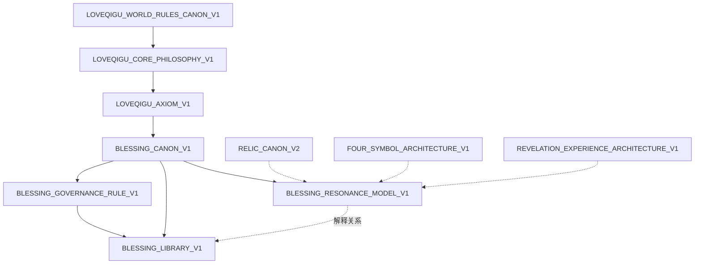

# BLESSING_SYSTEM_INDEX_V1

**Status**：FROZEN  
**Version**：V1.0  
**Date**：2026-06-07  
**Owner**：LOVEQIGU PRODUCT  

**Objective**：建立 LOVEQIGU 祝福子系统的单一入口索引。  
**Scope**：仅索引 · 不修改任何既有 Canon 正文。

---

## Purpose

本索引用于：

* 登记祝福子系统全部顶层 Canon 文件及其职责
* 定义层级、加载顺序与依赖关系
* 统一冲突裁决规则
* 明确祝福的产品语义边界（收藏回响资产 · 非成长 · 非奖励 · 非交易）

祝福子系统在 LOVEQIGU 中的角色：

```text
用户探索与显现过程中，
以「被理解 · 被接住 · 被安慰 · 被鼓励」为目标的
可收藏回响资产体系。
```

---

## Registered Canon Files

| ID | File | Path | Status | Role |
|----|------|------|--------|------|
| BS-01 | `BLESSING_CANON_V1.md` | `docs/product/blessing_system/BLESSING_CANON_V1.md` | FROZEN | 祝福体系立法：分类、语气、禁止项、冻结结论 |
| BS-02 | `BLESSING_LIBRARY_V1.md` | `docs/product/blessing_system/BLESSING_LIBRARY_V1.md` | FROZEN | 正式祝福语资产库：数字藏品 · AR · 分享页统一调用源 |
| BS-03 | `BLESSING_GOVERNANCE_RULE_V1.md` | `docs/product/blessing_system/BLESSING_GOVERNANCE_RULE_V1.md` | FROZEN | 资产治理：准入审查 · 重复度 · 鸡汤化 · 一致性 |
| BS-04 | `BLESSING_RESONANCE_MODEL_V1.md` | `docs/product/blessing_system/BLESSING_RESONANCE_MODEL_V1.md` | FROZEN | 回响机制：感受 · 意义 · 连接确认与跨系统关系 |

---

## Product Semantics（冻结声明）

以下四条为祝福子系统 **不可违背** 的产品语义。任何实现、文案、运营或新增 Canon **不得** 与之冲突。

### 1. Blessing is not a growth system

祝福 **不是** 成长体系。

禁止：祝福升级 · 祝福强化 · 祝福进阶 · 祝福数值成长。

允许：收集 · 展示 · 分享 · 收藏。

（唯一成长体系归属天人合一；祝福本身不随等级变化。）

### 2. Blessing is not a reward system

祝福 **不是** 奖励体系。

禁止：将祝福作为打卡/任务/积分的兑换物或成就奖杯来设计叙事。

祝福是 **回应** 与 **提醒**，不是对行为的 **奖赏**。

回响是 **确认**，不是 **奖励**。（见 `BLESSING_RESONANCE_MODEL_V1`）

### 3. Blessing is not a tradable asset

祝福 **不是** 可交易资产。

禁止：祝福买卖 · 转让 · 流通 · 积分化 · 权益化兑换。

祝福属于用户的 **收藏回响记录**，不属于商业流通品类。

### 4. Blessing is a collectible resonance asset

祝福 **是** 可收藏的回响资产（Collectible Resonance Asset）。

定义：

```text
用户在探索与显现过程中获得的、
承载感受确认 · 意义确认 · 连接确认的正向语句收藏，
用于长期收藏、展示与分享传播。
```

---

## Layer Hierarchy

```text
UPSTREAM（外部 · 本索引引用但不登记正文）
├── docs/canon/LOVEQIGU_WORLD_RULES_CANON_V1.md          L0 世界正典
├── docs/product/world/LOVEQIGU_CORE_PHILOSOPHY_V1.md    产品最高哲学
└── docs/product/world/LOVEQIGU_AXIOM_V1.md              产品公理

BLESSING SUBSYSTEM（本索引管辖）
├── L1  CANON          BLESSING_CANON_V1                  立法层 · 内容与分类规则
├── L2  MECHANISM      BLESSING_RESONANCE_MODEL_V1        机制层 · 回响与跨系统解释
├── L3  GOVERNANCE     BLESSING_GOVERNANCE_RULE_V1        治理层 · 准入与质量审查
└── L4  ASSETS         BLESSING_LIBRARY_V1                资产层 · 正式祝福语实例
```

| 层级 | 文件 | 权限 |
|------|------|------|
| L1 CANON | `BLESSING_CANON_V1` | 定义「祝福是什么 / 不是什么」 |
| L2 MECHANISM | `BLESSING_RESONANCE_MODEL_V1` | 解释「祝福为何产生回响」 |
| L3 GOVERNANCE | `BLESSING_GOVERNANCE_RULE_V1` | 约束「什么能进入资产库」 |
| L4 ASSETS | `BLESSING_LIBRARY_V1` | 承载「已通过审查的正式语句」 |

---

## Load Order

消费方（Cursor · 秒哒 · 内容工厂 · 运营）读取祝福 Canon 时 **必须** 按以下顺序加载：

```text
0. LOVEQIGU_WORLD_RULES_CANON_V1          （若尚未加载世界层）
1. LOVEQIGU_CORE_PHILOSOPHY_V1
2. LOVEQIGU_AXIOM_V1
3. BLESSING_CANON_V1
4. BLESSING_RESONANCE_MODEL_V1
5. BLESSING_GOVERNANCE_RULE_V1
6. BLESSING_LIBRARY_V1
```

说明：

* 步骤 0–2 为 **上位约束**，不在本目录内，但治理与机制层均依赖其原则。
* 步骤 3 必须先于 4–6：无 Canon 立法，不得解释机制、不得审查资产、不得引用库内语句为规范。
* 步骤 6 为 **最后加载**：库内条目为实例，不得反向定义 Canon。

---

## Dependency Graph



| 依赖方 | 依赖项 | 关系 |
|--------|--------|------|
| `BLESSING_CANON_V1` | `LOVEQIGU_CORE_PHILOSOPHY_V1` · `LOVEQIGU_AXIOM_V1` | 语义对齐（哲学一致） |
| `BLESSING_RESONANCE_MODEL_V1` | `BLESSING_CANON_V1` | 机制不得违背立法 |
| `BLESSING_RESONANCE_MODEL_V1` | `RELIC_CANON_V2` · `FOUR_SYMBOL_ARCHITECTURE_V1` · `REVELATION_EXPERIENCE_ARCHITECTURE_V1` | 跨系统解释（只读引用） |
| `BLESSING_GOVERNANCE_RULE_V1` | `BLESSING_CANON_V1` · 上位哲学/公理 | 审查标准来源 |
| `BLESSING_GOVERNANCE_RULE_V1` | `BLESSING_LIBRARY_V1` | 治理目标库（含 V2+ 扩展位） |
| `BLESSING_LIBRARY_V1` | `BLESSING_CANON_V1` | 分类与语气必须服从 Canon |

---

## Conflict Rules

| 优先级 | 规则 |
|--------|------|
| R1 | **L0 世界正典**（`LOVEQIGU_WORLD_RULES_CANON_V1`）高于本索引全部条目 |
| R2 | **产品哲学 / 公理**（`LOVEQIGU_CORE_PHILOSOPHY_V1` · `LOVEQIGU_AXIOM_V1`）高于祝福子系统四层 |
| R3 | **`BLESSING_CANON_V1`** 高于 `BLESSING_LIBRARY_V1` · `BLESSING_GOVERNANCE_RULE_V1` · `BLESSING_RESONANCE_MODEL_V1` 中与内容定义冲突的部分 |
| R4 | **`BLESSING_GOVERNANCE_RULE_V1`** 可拒绝库内新增，但 **不得** 放宽 Canon 禁止项 |
| R5 | **`BLESSING_RESONANCE_MODEL_V1`** 解释体验机制，**不得** 将祝福重新定义为奖励、成长或交易物 |
| R6 | **`BLESSING_LIBRARY_V1`** 为最低层实例；库内单条文案与 Canon 冲突时，以 Canon 为准，该条目不具规范效力 |
| R7 | 本索引 **不修改** 已冻结正文；冲突时走 Canon 变更提案流程，不得在本索引内「补丁立法」 |

---

## Out of Scope（本索引不登记）

以下文件位于同目录，但 **不在** 本次四文件注册范围内；消费方按需单独加载：

* `LOVEQIGU_BLESSING_COLLECTION_CANON_V1.md` — 祝福收藏册产品 Canon（与 UI / 徽章 / 闭环相关）

---

## Output

**Path**：`docs/product/blessing_system/BLESSING_SYSTEM_INDEX_V1.md`

**Success Marker**：

```text
BLESSING_SYSTEM_INDEX_V1_COMPLETE = YES
```
