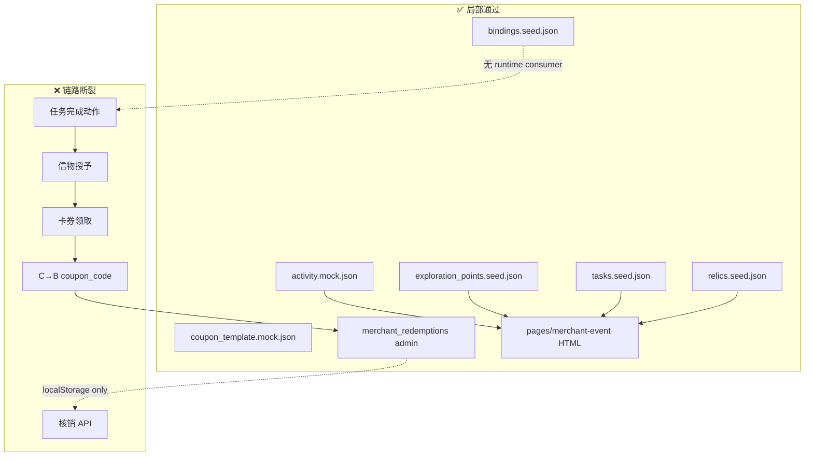

# EVENT_RUNTIME_SMOKE_TEST_V1

# 爱企谷初见寻宝节 · 用户全流程模拟冒烟测试 V1

```yaml
project: LOVEQIGU / AR游伴
event: 爱企谷初见寻宝节
event_code: LOVEQIGU_FIRST_EVENT_CASE_V1
module: Event Runtime Smoke Test
version: V1
status: AUDIT_COMPLETE
owner: TECH
date: 2026-06-07
mode: READ_ONLY_AUDIT
constraints:
  - 禁止修改代码
  - 仅审计
upstream:
  - docs/product/event/FIRST_EVENT_READINESS_REFRESH_V1.md
  - docs/product/event/T4_EVENT_ENTRY_PAGE_V1.md
  - docs/product/merchant/MERCHANT_REDEMPTION_CENTER_V1.md
```

---

## 1. 测试目标

首次模拟 **用户参加活动全流程**，逐步检查：

| 维度 | 说明 |
|------|------|
| 页面 | 各步骤是否有可打开页面 |
| 数据 | Mock / Seed 是否存在且字段完整 |
| 状态流转 | 用户操作能否推动状态前进 |
| Mock 链路 | 上一步输出是否为下一步输入 |

---

## 2. 模拟流程

```text
进入活动页
    ↓
查看探索点
    ↓
完成任务
    ↓
获得信物
    ↓
领取卡券
    ↓
商家核销
```

---

## 3. 测试环境说明

代码库存在 **两条并行轨道**，本次冒烟测试均纳入评估：

| 轨道 | 路径 | 定位 |
|------|------|------|
| **A. 商家活动轨** | `pages/merchant-event/` · `data/merchant_event/` · `server/api/` | 爱企谷初见寻宝节专用 |
| **B. 小程序 Canon 轨** | `apps/miniapp/` | 探索地图 / 故事流 / 权益中心原型 |

**关键发现：** 两轨 **未联通**。小程序 **零** `wx.request` / `/api/` 调用。

---

## 4. 逐步检查结果

### Step 1 — 进入活动页

| 检查项 | 结果 | 证据 |
|--------|------|------|
| 活动入口页存在 | ✅ 通过 | `pages/merchant-event/index.html` |
| 活动 Mock 数据存在 | ✅ 通过 | `data/merchant_event/activity.mock.json` |
| 活动 Seed 数据存在 | ✅ 通过 | `data/merchant_event/activity.seed.json` |
| API 读路由存在 | ✅ 通过 | `GET /api/event/list` · `GET /api/event/detail/{id}` |
| 页面可打开（静态 HTML） | ✅ 通过 | 展示活动名、时间、DRAFT 状态 |
| 页面动态加载 Mock JSON | ❌ 失败 | HTML 内容为生成时硬编码，无 fetch |
| 小程序活动页 | ❌ 失败 | 无 `merchant-event` 页面注册于 `app.json` |
| 活动 ID 跨页传递 | ❌ 失败 | 无 `activity_loveqigu_first_event_v1` 上下文 |
| Admin Hub 入口 | ⚠️ 缺失 | `apps/admin/index.html` 无 merchant-event 链接 |

**Step 1 小结：** 页面与数据 **局部通过**；C 端真实入口与动态数据加载 **未通过**。

---

### Step 2 — 查看探索点

| 检查项 | 结果 | 证据 |
|--------|------|------|
| 探索点列表页存在 | ✅ 通过 | `pages/merchant-event/exploration.html` |
| 探索点 Seed 数据 | ✅ 通过 | `data/merchant_event/exploration_points.seed.json`（5 点） |
| 探索点 ID 与 bindings 一致 | ✅ 通过 | `point_entrance_plaza` 等 5 ID 匹配 `bindings.seed.json` |
| 列表可跳转详情 | ✅ 通过 | `detail.html?point_id=...` 链接存在 |
| 详情页读取 query 参数 | ❌ 失败 | `detail.html` 固定显示「入口广场」，忽略 `point_id` |
| 小程序探索地图 | ⚠️ 部分 | `apps/miniapp/pages/explore-map/` 存在，但加载 **故事节点** 非商家探索点 |
| 探索进度状态更新 | ❌ 失败 | `progress.explored_nodes` 恒为 0，无写入逻辑 |

**Step 2 小结：** 静态列表 **通过**；动态详情与小程序联通 **失败**。

---

### Step 3 — 完成任务

| 检查项 | 结果 | 证据 |
|--------|------|------|
| 任务列表展示 | ✅ 通过 | `index.html` 展示 5 任务（CHECKIN/SCAN/QUIZ） |
| 任务 Mock 数据 | ✅ 通过 | `tasks.seed.json` · `activity_task.mock.json` |
| 任务-探索点绑定 | ✅ 通过 | `bindings.seed.json` → `exploration_point_task_bindings` |
| 完成任务按钮 / 动作 | ❌ 失败 | 全页无「完成」「签到」「扫码」交互 |
| 任务状态流转 | ❌ 失败 | 全部固定「未开始」，无 PENDING→DONE |
| 用户进度持久化 | ❌ 缺失 | 无 localStorage / wx.storage 任务进度键 |
| 小程序故事流替代链 | ⚠️ 部分 | `ar-entry → atom → lottie → echo → digital-collectible` 可 **导航**，无完成记录 |
| API 任务写接口 | ❌ 缺失 | 仅 `GET /api/event/tasks`，无 POST |

**Step 3 小结：** 数据与展示 **通过**；任务完成与状态流转 **全面失败**。

---

### Step 4 — 获得信物

| 检查项 | 结果 | 证据 |
|--------|------|------|
| 信物展示（活动页） | ✅ 通过 | `index.html` 展示 5 枚信物 |
| 信物 Seed 数据 | ✅ 通过 | `data/merchant_event/relics.seed.json` |
| 任务-信物绑定 | ✅ 通过 | `bindings.seed.json` → `task_relic_bindings` |
| 信物库页面（小程序） | ✅ 通过 | `apps/miniapp/pages/relic-archive/` 可展示 Canon 信物 |
| 完成任务后授予信物 | ❌ 失败 | 无 `acquireRelic` / `recordRelic` 函数 |
| 信物状态变更 | ❌ 失败 | Canon 信物 status 静态（`unrecorded` / `placeholder`） |
| ID 命名空间统一 | ❌ 失败 | 商家 `relic_cafe_stamp` ≠ Canon `relic_ch01_gate_badge` |
| API 资产读接口 | ⚠️ 部分 | `GET /api/event/assets` 存在，小程序未消费 |

**Step 4 小结：** 静态展示 **通过**；任务→信物授予链路 **失败**。

---

### Step 5 — 领取卡券

| 检查项 | 结果 | 证据 |
|--------|------|------|
| 权益中心页面 | ✅ 通过 | `apps/miniapp/pages/rights-center/` |
| 卡券 Mock 数据 | ✅ 通过 | `coupon_template.mock.json` · `ch01-rights.js` 等 |
| 商家-卡券绑定 | ✅ 通过 | `bindings.seed.json` → `merchant_coupon_bindings` |
| 卡券列表只读展示 | ✅ 通过 | rights-center 渲染权益列表 |
| 领取按钮 / 动作 | ❌ 失败 | 页面文案：「领取接口尚未接入」 |
| 卡券状态流转 | ❌ 失败 | `locked` / `available` 为静态 Mock，无 claim 触发 |
| 生成 coupon_code | ❌ 缺失 | 无用户实例券码生成逻辑 |
| 领取写 API | ❌ 缺失 | 无 `POST /api/coupon/claim` |
| C 端券码展示页 | ❌ 缺失 | 无 QR / 券码页供商家扫描 |

**Step 5 小结：** 只读预览 **通过**；领取动作与下游联通 **全面失败**。

---

### Step 6 — 商家核销

| 检查项 | 结果 | 证据 |
|--------|------|------|
| 核销列表页 | ✅ 通过 | `apps/admin/merchant-portal/merchant_redemptions/` |
| 核销详情页 | ✅ 通过 | `merchant_redemption_detail/` |
| 核销 Mock 数据 | ✅ 通过 | `merchant_redemption_center.mock.json`（10 条） |
| 状态模拟核销 | ✅ 通过 | `redemption-store.js` · PENDING → VERIFIED |
| 状态模拟失败 | ✅ 通过 | PENDING → FAILED |
| 搜索 / 筛选 / 分页 | ✅ 通过 | 列表页完整 UI |
| loading / empty / success | ✅ 通过 | 三态已实现 |
| 与 C 端领取联通 | ❌ 失败 | 核销记录 `claim_time` 预设，非 C 端触发 |
| 核销写 API | ❌ 缺失 | 无 `POST /api/redemption/verify` |
| C 端核销状态回显 | ❌ 缺失 | 用户看不到「已核销」状态 |

**Step 6 小结：** B 端 Mock 核销 **独立通过**；与 C 端全链路 **失败**。

---

## 5. Mock 链路总览



| 链路段 | 数据定义 | Runtime 消费 | 状态 |
|--------|----------|-------------|------|
| 活动 → 探索点 | ✅ bindings | ⚠️ 静态 HTML | 部分 |
| 探索点 → 任务 | ✅ bindings | ❌ 无 | 失败 |
| 任务 → 信物 | ✅ bindings | ❌ 无 | 失败 |
| 信物 → 卡券资格 | ✅ merchant_coupon_bindings | ❌ 无 | 失败 |
| 卡券领取 → 核销记录 | ⚠️ mock 预设 | ❌ 无 C 端触发 | 失败 |
| 核销状态变更 | ✅ redemption-store | ⚠️ Admin 本地 | 部分 |

---

## 6. 汇总

### 通过项（22）

1. 活动入口静态页 `pages/merchant-event/index.html`
2. 探索点列表页 `exploration.html`
3. 探索点详情页 `detail.html`（可打开）
4. 活动 Mock `activity.mock.json`
5. 探索点 Seed（5 点）
6. 任务 Seed + Mock
7. 信物 Seed（5 枚）
8. 卡券模板 Mock
9. 绑定图 `bindings.seed.json` 完整
10. API 读骨架 11 路由（含 event list/detail/tasks/assets）
11. 小程序探索地图页可打开
12. 小程序故事流导航链可 walk
13. 小程序信物库可展示
14. 小程序权益中心可展示（只读）
15. 商家核销列表页完整
16. 商家核销详情页完整
17. 核销 Mock 10 条记录
18. 模拟核销 PENDING → VERIFIED
19. 模拟失败 PENDING → FAILED
20. 核销搜索 / 筛选 / 分页
21. 核销 loading / empty / success 三态
22. Schema 校验脚本可验证 merchant_event 数据

### 失败项（18）

1. 活动页不动态加载 JSON
2. 小程序无商家活动入口页
3. 活动 ID 不跨页传递
4. 探索点详情忽略 `point_id` 参数
5. 小程序探索地图加载故事节点非商家点
6. 探索进度不更新
7. 无完成任务交互
8. 任务状态恒为「未开始」
9. 故事流完成不写入进度
10. 完成任务不授予信物
11. 信物 status 静态不变
12. 商家 / Canon 信物 ID 不统一
13. 权益中心无领取动作
14. 卡券 status 静态不变
15. 无用户 coupon_code 生成
16. C 端与 B 端核销无 coupon_code 联通
17. 核销记录非 C 端领取触发
18. 小程序零 API 调用，读骨架未消费

### 缺失项（14）

1. 小程序 `merchant-event` 页面
2. Admin Hub → merchant-event 入口
3. 任务完成 Service + 持久化
4. `POST /api/task/complete`
5. 信物授予 Service
6. `POST /api/relic/grant`
7. 卡券领取 UI + Service
8. `POST /api/coupon/claim`
9. C 端券码 / QR 展示页
10. 用户卡券钱包
11. `POST /api/redemption/verify`
12. C 端核销状态回显
13. 统一用户进度 Store（跨步骤）
14. HTTP Server 挂载 API（router 仅 unittest dispatch）

---

## 7. 冒烟结论

| 指标 | 值 |
|------|-----|
| **E2E 全流程** | ❌ **FAIL** |
| **分段通过率** | 22 / 54 ≈ **41%** |
| **B 端核销段** | ✅ **PASS**（Mock 独立） |
| **C 端参与段** | ❌ **FAIL**（Step 1–5 断链） |
| **Mock 链路完整性** | **28%**（数据定义全、Runtime 消费缺） |

```text
EVENT_RUNTIME_SMOKE_TEST_V1_COMPLETE = YES
E2E_USER_FLOW_PASS = NO
RECOMMENDED_NEXT: MINIMUM_EVENT_RUNTIME_PATH Phase-2（C 端联通 + POST API）
```

---

## 8. 参考路径

| 资源 | 路径 |
|------|------|
| 活动入口 | `pages/merchant-event/index.html` |
| 探索列表 | `pages/merchant-event/exploration.html` |
| 绑定图 | `data/merchant_event/bindings.seed.json` |
| API 路由 | `server/api/router.py` |
| 权益中心 | `apps/miniapp/pages/rights-center/index.js` |
| 商家核销 | `apps/admin/merchant-portal/merchant_redemptions/index.html` |
