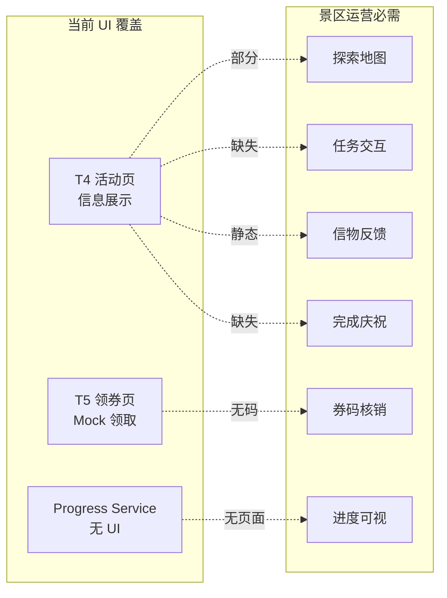

# EVENT_RUNTIME_UI_AUDIT_V1

# 爱企谷初见寻宝节 · 活动 Runtime UI 运营体验审查 V1

```yaml
project: LOVEQIGU / AR游伴
event: 爱企谷初见寻宝节
event_code: LOVEQIGU_FIRST_EVENT_CASE_V1
module: Event Runtime UI Audit
version: V1
status: AUDIT_COMPLETE
owner: TECH / Operation
date: 2026-06-07
mode: READ_ONLY_AUDIT
constraints:
  - 禁止修改代码
  - 仅审查
audit_targets:
  - T4_EVENT_ENTRY_PAGE_V1
  - T5_COUPON_CLAIM_V1
  - USER_PROGRESS_CENTER_V1
upstream:
  - docs/product/event/T4_EVENT_ENTRY_PAGE_V1.md
  - docs/product/event/T5_COUPON_CLAIM_V1.md
  - docs/product/runtime/USER_PROGRESS_CENTER_V1.md
  - docs/product/event/EVENT_RUNTIME_SMOKE_TEST_V1.md
  - docs/product/USER_PROGRESS_STORE_AUDIT_V1.md
```

---

## 1. 审查结论（Executive Summary）

| 问题 | 结论 |
|------|------|
| **是否满足真实景区运营** | ❌ **不满足** |
| **综合体验评级** | **差** |
| **可内部原型演示** | ⚠️ 部分（工程验收级） |
| **可对游客开放** | ❌ 否 |

**一句话：** T4/T5 完成了 **信息展示 + 领券 Mock** 的工程原型，但缺少 **路径引导、进度可视、任务交互、商家实景曝光、完成庆祝** 等景区运营必需体验；USER_PROGRESS_CENTER 仅有 **Service 层、零 UI 面**，游客无法感知「我进行到哪一步」。

---

## 2. 审查对象概览

| 交付物 | 用户可见 UI | 路径 |
|--------|-------------|------|
| **T4** 活动入口 | ✅ 3 页静态 HTML | `pages/merchant-event/` |
| **T5** 领券中心 | ✅ 1 页 HTML | `pages/rights-center/coupon-center.html` |
| **USER_PROGRESS_CENTER** | ❌ **无页面** | `apps/miniapp/services/user-progress/`（Service only） |

**关键断层：** 三者在用户旅程中 **未串联**；小程序 `rights-center` 仍为只读，与 T5 HTML 分裂。

---

## 3. 六维体验评级

| 维度 | 评级 | 说明 |
|------|------|------|
| **用户是否知道下一步做什么** | **差** | 仅有「开始探索」；详情页无 CTA；无进度条/步骤条；领券与探索无引导链 |
| **任务路径是否清晰** | **差** | 5 点平铺列表，无推荐顺序/地图/距离；暴露 `task_*` 技术 ID；任务状态恒「未开始」 |
| **信物展示是否清晰** | **一般** | 有名称+稀有度+文案；无图标/无已获/未获区分；混用「纪念藏品」与 Canon 信物语境 |
| **卡券领取是否清晰** | **一般** | T5 有领取/我的卡券/记录；按钮英文 `CLAIM`；无解锁条件；无券码/核销指引 |
| **商家曝光是否足够** | **差** | 仅文字店名；无门头图/营业时间/位置导航/特色介绍；中心广场误绑咖啡 merchant |
| **活动完成反馈是否足够** | **差** | 无任务完成 Toast/动画；无活动收官页；无「恭喜完成寻宝」反馈 |

---

## 4. 分模块评级

### 4.1 T4_EVENT_ENTRY_PAGE_V1

| 项 | 评级 |
|----|------|
| 综合 | **差** |
| 信息架构 | 一般 |
| 景区运营可用性 | 差 |
| 视觉/品牌 | 一般（有统一色系，缺实景素材） |

**已有优点：**
- 活动名、时间、探索点/任务/信物 **一屏总览**
- 「开始探索」→ 探索列表 → 详情 **三级 drill-down**
- 5 探索点与 seed 数据 ID 一致

**景区运营致命缺口：**
- 页头显示 `merchant-event` / `DRAFT` — 游客可见工程态
- 表头 `point_name` / `task_type` — 开发者语言
- 探索点详情 **不读** `point_id` 参数，始终显示「入口广场」
- **无** 签到/扫码/问答 **完成任务按钮**
- **无** 探索地图、GPS 导航、现场找点指引
- **无** 跳转领券中心的路径

---

### 4.2 T5_COUPON_CLAIM_V1

| 项 | 评级 |
|----|------|
| 综合 | **一般** |
| 领券流程 | 一般 |
| 景区核销衔接 | 差 |
| 与活动链路联通 | 差 |

**已有优点：**
- 「可领取 / 我的卡券 / 领取记录」三区块结构清晰
- 商家名 + 券类型 + 减免额展示
- 领取后状态变 `CLAIMED`，localStorage 持久化
- 侧边链到 merchant-event

**景区运营致命缺口：**
- 领取按钮文案 **「CLAIM」** 非中文产品语言
- Hero 区暴露「脚本 / localStorage / Mock」— 非游客文案
- **无任务解锁门槛** — 未完成探索也可领券，破坏运营规则
- **无 coupon_code / 二维码** — 到店无法核销
- **无**「如何使用 / 去哪核销 / 有效期说明」运营指引
- 与 T4 **无**「完成任务 → 来领券」引导

---

### 4.3 USER_PROGRESS_CENTER_V1

| 项 | 评级 |
|----|------|
| 综合 | **差**（对用户不可见） |
| Service 层完整性 | 优秀 |
| 用户可见 UI | **差**（不存在） |

**已有优点（工程层）：**
- 统一 key `loveqigu_user_progress_v1`
- `enterActivity` / `completeTask` / `grantEventRelic` / `claimCoupon` API 齐全
- 旧 key 迁移方案完整

**景区运营致命缺口：**
- **零用户界面** — 游客看不到进度
- **零页面接入** — T4/T5 未调用 Service
- 无「我的寻宝进度」/dashboard 页
- 无步骤完成百分比、信物墙、下一任务推荐

---

## 5. 真实景区运营判定矩阵

| 运营场景 | T4 | T5 | Progress Center | 判定 |
|----------|----|----|-----------------|------|
| 游客到场知道活动规则 | ⚠️ | — | — | 部分 |
| 游客按图索骥找探索点 | ❌ | — | — | 不满足 |
| 游客完成现场任务 | ❌ | — | — | 不满足 |
| 游客看见已获得信物 | ⚠️ | — | ❌ | 不满足 |
| 游客领取商家礼遇 | — | ⚠️ | ❌ | 部分 |
| 游客持券到店核销 | — | ❌ | — | 不满足 |
| 游客知道活动是否完成 | ❌ | — | ❌ | 不满足 |
| 商家获得曝光与导流 | ⚠️ | ⚠️ | — | 不满足 |
| 运营人员可解释用户进度 | ❌ | ⚠️ | ❌ | 不满足 |

**真实景区运营总判定：❌ 不满足**

---

## 6. TOP 20 体验问题

| # | 问题 | 模块 | 严重度 |
|---|------|------|--------|
| 1 | 无统一用户进度可视页，游客不知「进行到哪一步」 | Progress Center | 🔴 |
| 2 | T4/T5/Progress Service 三轨分裂，旅程断裂 | 全链路 | 🔴 |
| 3 | 探索点详情忽略 URL 参数，点哪都显示入口广场 | T4 | 🔴 |
| 4 | 无完成任务交互（签到/扫码/问答按钮） | T4 | 🔴 |
| 5 | 任务状态恒「未开始」，无动态反馈 | T4 | 🔴 |
| 6 | 无探索地图 / GPS 导航 / 「离我多远」 | T4 | 🔴 |
| 7 | 领券无前置解锁，破坏「先玩后领」运营规则 | T5 | 🔴 |
| 8 | 无 coupon_code / 二维码，无法到店核销 | T5 | 🔴 |
| 9 | 无活动完成页 / 收官庆祝 / 复盘入口 | T4 | 🔴 |
| 10 | 页面暴露 `merchant-event` / `DRAFT` / `point_id` 等工程标识 | T4 | 🟠 |
| 11 | 领券按钮英文 `CLAIM`，不符合 L1 产品语言 | T5 | 🟠 |
| 12 | Hero 文案含 Mock/localStorage/脚本说明 | T5 | 🟠 |
| 13 | 信物无图标/无已收集态，仅有静态列表 | T4 | 🟠 |
| 14 | 「纪念藏品」措辞与 Canon 信物边界易混淆 | T4 | 🟠 |
| 15 | 商家仅文字名，无门头图/营业时间/地址 | T4/T5 | 🟠 |
| 16 | 中心广场探索点绑定咖啡 merchant，曝光逻辑错误 | T4 | 🟠 |
| 17 | 无步骤条 / 推荐路线（先入口→咖啡→书店→手作→中心） | T4 | 🟠 |
| 18 | 小程序 rights-center 仍只读，与 T5 体验分裂 | 小程序 | 🟠 |
| 19 | 无「下一步建议」CTA（如：去领券 / 去下一点） | T4 | 🟠 |
| 20 | 桌面宽屏布局（1280px），非景区移动端优先 | T4/T5 | 🟡 |

---

## 7. TOP 20 运营优化建议

| # | 建议 | 优先级 | 预期效果 |
|---|------|--------|----------|
| 1 | 新增「我的寻宝进度」页，接入 USER_PROGRESS_CENTER 展示 5 步完成度 | P0 | 游客知道下一步 |
| 2 | T4 详情页读取 `point_id`，动态渲染对应探索点/任务/信物/商家 | P0 | 修复导航信任 |
| 3 | 每探索点增加「完成任务」CTA + 成功反馈动画 | P0 | 可现场运营 |
| 4 | 增加景区探索地图（点位标注 + 一键导航） | P0 | 降低找点成本 |
| 5 | 任务完成后自动跳转「领取礼遇」并高亮对应卡券 | P0 | 打通玩→领 |
| 6 | 领券页增加解锁门槛（需 completed_task_ids 匹配） | P0 | 保障运营规则 |
| 7 | 领券成功展示 **coupon_code + 二维码 + 核销说明** | P0 | 可到店核销 |
| 8 | 新增活动完成页「初见寻宝完成」+ 信物墙 + 分享入口 | P0 | 完成感/传播 |
| 9 | 隐藏所有工程态 badge（DRAFT / Mock / 技术 ID） | P1 | 游客友好 |
| 10 | 按钮/文案全面中文化：`领取` / `去使用` / `查看信物` | P1 | L1 语言合规 |
| 11 | 信物卡片增加图标 + 已获/未获/进行中三态 | P1 | 收集动力 |
| 12 | 商家卡片增加门头图、营业时间、步行指引、特色一句话 | P1 | 商家曝光 |
| 13 | 增加推荐路线步骤条：1/5 → 5/5，标注「推荐下一站」 | P1 | 路径清晰 |
| 14 | T4 底部固定「我的进度 · 我的卡券」双入口 | P1 | 旅程串联 |
| 15 | 小程序注册活动页 + rights-center 接 Progress Center | P1 | 微信端可用 |
| 16 | 修正中心广场 merchant 绑定与曝光文案 | P2 | 商家公平 |
| 17 | 领券页增加「适用门店 / 有效期 / 使用规则」折叠说明 | P2 | 减少客诉 |
| 18 | 任务类型用户化：CHECKIN→「到场签到」SCAN→「扫码探索」 | P2 | 降低理解成本 |
| 19 | 移动端单列布局 + 大按钮（≥44px 触控区） | P2 | 现场操作 |
| 20 | 运营侧增加「进度查询」说明卡，便于工作人员协助游客 | P2 | 人工兜底 |

---

## 8. 模块 vs 景区运营对照



---

## 9. 评级汇总

| 模块 | 工程完成 | 景区 UI 体验 | 真实景区运营 |
|------|----------|-------------|-------------|
| T4_EVENT_ENTRY_PAGE_V1 | ✅ | **差** | ❌ |
| T5_COUPON_CLAIM_V1 | ✅ | **一般** | ❌ |
| USER_PROGRESS_CENTER_V1 | ✅ Service | **差**（无 UI） | ❌ |
| **综合** | — | **差** | **❌ 不满足** |

---

## 10. 完成确认

```yaml
EVENT_RUNTIME_UI_AUDIT_V1_COMPLETE: YES
scenic_operation_ready: NO
overall_ui_rating: 差
t4_rating: 差
t5_rating: 一般
user_progress_center_ui_rating: 差
top_experience_issues: 20
top_operation_recommendations: 20
```
