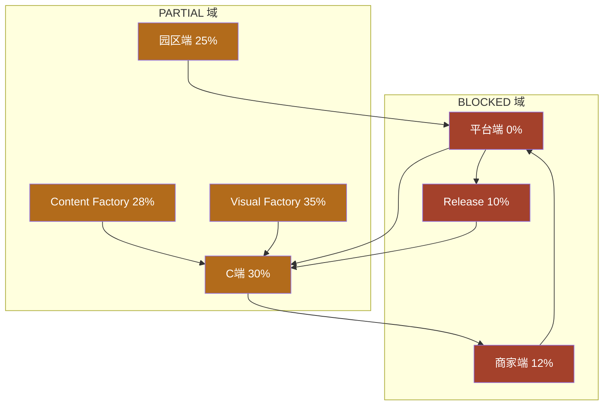

# FIRST_EVENT_RUNTIME_READINESS_AUDIT_V1

# 爱企谷初见寻宝节 · 上线就绪度审计 V1

```yaml
project: LOVEQIGU / AR游伴
event: 爱企谷初见寻宝节
event_code: LOVEQIGU_FIRST_EVENT_CASE_V1
session: B会话｜TECH / 运营审查
version: V1
status: APPROVED_FOR_READINESS_AUDIT
owner: TECH / Operation
date: 2026-06-07
audit_perspective: 真实运营上线条件（非文档完备度）
upstream:
  - docs/product/merchant_event_engine/LOVEQIGU_FIRST_EVENT_CASE_V1.md
  - docs/product/merchant_event_engine/LOVEQIGU_FIRST_EVENT_ADMIN_CONFIG_V1.md
  - docs/product/merchant/MERCHANT_OPERATION_GAP_ANALYSIS_V1.md
  - docs/product/merchant/PARK_ADMIN_OPERATION_GAP_ANALYSIS_V1.md
  - docs/product/platform_admin/PLATFORM_OPERATION_ADMIN_GAP_ANALYSIS_V1.md
audit_scope:
  - 商家端
  - 园区端
  - 平台端
  - C端
  - Visual Factory
  - Content Factory
  - Release
constraints:
  - 本审计不修改代码 / Runtime / Release
```

---

# 1. 审计结论（Executive Summary）

| 项 | 结论 |
|----|------|
| **是否具备上线条件** | **否 — 不具备真实运营上线条件** |
| **上线完成度** | **18%** |
| **总体评级** | **NOT READY** |
| **可演示范围** | 产品文档 + B 端 mock 页面预览 + C 端通用探索/权益壳 |
| **不可演示** | 完整商业闭环（探索 → 信物 → 领券 → 核销 → 数据 → 复盘） |

**一句话：** 「爱企谷初见寻宝节」**产品规格与运营剧本已冻结**，但 **运行时闭环几乎未建**；当前状态适合 **内部评审与招商话术演示**，**不适合对外真实上线**。

---

# 2. 评分标准

| 评级 | 定义 | 对应完成度区间 |
|------|------|----------------|
| **READY** | 真实运营可执行；无需人工兜底即可跑通该域核心路径 | ≥ 80% |
| **PARTIAL** | 有文档/mock/局部能力；关键路径不可闭环或依赖人工 | 20%–79% |
| **BLOCKED** | 该域核心能力缺失；阻塞整场活动 | < 20% |

---

# 3. 七域总览评分

| # | 域 | 评级 | 域完成度 | 权重 | 加权分 |
|---|-----|------|----------|------|--------|
| 1 | 商家端 | **BLOCKED** | 12% | 15% | 1.8 |
| 2 | 园区端 | **PARTIAL** | 25% | 12% | 3.0 |
| 3 | 平台端 | **BLOCKED** | 0% | 18% | 0.0 |
| 4 | C端 | **PARTIAL** | 30% | 20% | 6.0 |
| 5 | Visual Factory | **PARTIAL** | 35% | 10% | 3.5 |
| 6 | Content Factory | **PARTIAL** | 28% | 10% | 2.8 |
| 7 | Release | **BLOCKED** | 10% | 15% | 1.5 |
| | **合计** | | | **100%** | **18.6%** |

**最终上线完成度：18%**（四舍五入；方法论见 §12）

---

# 4. 商家端

**评级：BLOCKED · 域完成度 12%**

## 4.1 现状

| 资产 | 状态 |
|------|------|
| 产品规格 | ✅ `LOVEQIGU_FIRST_EVENT_CASE_V1` · `ADMIN_CONFIG` |
| HTML mock | ✅ 9 页（含 ticket_new / ticket_detail） |
| data schema | ✅ 5 个 schema + mock（`data/merchant_portal/`） |
| 登录 / RBAC | ❌ |
| 卡券创建/提交审核 | ❌ |
| **核销页（扫码/输码）** | ❌ |
| 后端 API | ❌ |
| 真实数据 | ❌ 硬编码 mock |

## 4.2 首场活动运营路径对照

来源：`FIRST_EVENT_CASE_V1` §6 · §11.4 · §19

| 运营动作 | 就绪 | 说明 |
|----------|------|------|
| 商家登录后台 | ❌ | 无 login 页 |
| 提交「爱企谷到店核销券」 | ❌ | 无创建表单 |
| 查看审核结果 | ❌ | 无审核状态 API |
| 店员现场扫码核销 | ❌ | help 仅文字；无核销页 |
| 老板查看今日核销/核销率 | ⚠️ | dashboard mock，非真实 |
| 提交核销异常工单 | ⚠️ | ticket_new mock，无提交 API |
| 查看账单/服务费 | ⚠️ | finance mock 只读 |
| 培训店员（帮助中心） | ⚠️ | 静态 FAQ 可达 |

## 4.3 阻塞原因

```text
无登录 → 无卡券生命周期 → 无核销实操 → 闭环在商家侧断裂
```

---

# 5. 园区端

**评级：PARTIAL · 域完成度 25%**

## 5.1 现状

| 资产 | 状态 |
|------|------|
| HTML mock | ✅ 7 页 |
| 新增页（较早期审查） | ✅ `park_admin_activity_new` · `park_admin_activity_publish_check` |
| data schema | ✅ 5 个 schema + mock |
| 登录 / park_id 隔离 | ❌ |
| 活动创建提交 API | ❌ |
| 提交平台审核 | ❌ |
| 真实 stats | ❌ |

## 5.2 首场活动运营路径对照

| 运营动作 | 就绪 | 说明 |
|----------|------|------|
| 创建「爱企谷初见寻宝节」 | ⚠️ | activity_new 为 mock 表单，无持久化 |
| 绑定 3–5 家商家 | ⚠️ | UI 概念存在，无操作 |
| 绑定卡券 | ⚠️ | mock 链接数据 1 条 |
| 发布前 5 项检查 | ⚠️ | publish_check 页展示规则，无 gate |
| 提交平台审核 | ❌ | 无 API / 无收件方 |
| 查看活动参与/核销数据 | ⚠️ | dashboard mock |
| 向平台提交工单 | ⚠️ | tickets mock |
| 活动复盘报告导出 | ❌ | |

## 5.3 判断

园区端 **mock 骨架最完整**，可支撑 **内部 walkthrough**，但 **无法产生真实待审对象**，故 **PARTIAL 上限**。

---

# 6. 平台端

**评级：BLOCKED · 域完成度 0%**

## 6.1 现状

| 资产 | 状态 |
|------|------|
| EVENT_OPERATION_CENTER 产品规格 | ✅ 完整 |
| `apps/admin/platform-admin/` | ❌ **不存在** |
| `data/platform_admin/` | ❌ **不存在** |
| `/api/admin/*` | ❌ **不存在** |
| 商家/卡券/活动审核 | ❌ |
| 发布/暂停/结束 | ❌ |
| 全平台数据中心 | ❌ |
| 工单中心 / 风控中心 | ❌ |

## 6.2 首场活动必经平台动作

来源：`ADMIN_CONFIG_V1` §12–§13 · `PLATFORM_OPERATION_ADMIN_GAP_ANALYSIS_V1`

| 平台动作 | 就绪 |
|----------|------|
| 审核 3+ 商家资料 | ❌ |
| 审核商家卡券（权益/文案/Canon 红线） | ❌ |
| 审核园区活动申请 | ❌ |
| 13 项发布前检查 | ❌ |
| 正式发布 + 生成二维码 | ❌ |
| 暂停/结束活动 | ❌ |
| 全平台领取/核销统计 | ❌ |
| 高领取低核销风控 | ❌ |
| 代核销兜底 | ❌ |

## 6.3 判断

**三端枢纽完全缺失**；无平台端则园区 mock 与商家 mock **均无法进入上线态**。

---

# 7. C端（miniapp）

**评级：PARTIAL · 域完成度 30%**

## 7.1 现状

| 资产 | 状态 |
|------|------|
| 通用页面 | ✅ 探索地图 · AR 入口 · 权益中心 · 活动记念等 22 页 |
| `pages/merchant-event/*` | ❌ **不存在**（TECH 规划未建） |
| 爱企谷/企谷初见印/纪念藏品 | ❌ 代码库 **零匹配** |
| 卡券领取 API | ❌ |
| 权益中心 | ⚠️ 只读；明确文案：**「领取接口尚未接入」** |
| 卡券核销状态 | ❌ placeholder copy |
| LIVE_OPS campaigns | ⚠️ 5 个模板；**无爱企谷首场活动** |
| `data/merchant_event/` | ❌ **不存在** |

## 7.2 首场活动用户路径对照

来源：`FIRST_EVENT_CASE_V1` §5 · §19

| 用户步骤 | 就绪 | 说明 |
|----------|------|------|
| 扫码进入活动页 | ❌ | 无活动页 · 无二维码 |
| 完成 3 个爱企谷探索点 | ⚠️ | explore-map 有通用 CH 探索；**无爱企谷专属 3 点** |
| 获得「企谷初见印」活动信物 | ❌ | 未配置 activity_asset |
| 领取商家卡券 | ❌ | claim API 未接入 |
| 权益中心查看/出示核销码 | ⚠️ | 列表可读；无真实 code |
| 获得「爱企谷初见纪念藏品」 | ❌ | 无 event DC 配置 |
| 活动数据埋点回传 | ❌ | |

## 7.3 判断

C 端 **主线探索壳可用**，但 **首场活动专层为零**；无法验证 CASE 定义的 6 大商业目标。

---

# 8. Visual Factory

**评级：PARTIAL · 域完成度 35%**

## 8.1 现状

| 资产 | 状态 |
|------|------|
| Visual Autopilot 管道 | ✅ 候选生成 · judge · review 结构 |
| `assets/visual-autopilot/winner/winner.jpg` | ✅ 存在（角宿 jiao_su 任务） |
| 首场活动视觉（海报/信物/DC/活动页） | ❌ **未生产** |
| Gemini Judge | ⚠️ `NETWORK_TIMEOUT` → 人工兜底 |
| `review_status.json` | ⚠️ `PENDING_REVIEW` |
| ART 链 / PROMPT Canon | ✅ 文档完备 |

## 8.2 首场活动视觉需求对照

来源：`FIRST_EVENT_CASE_V1` §10–§11 · `ADMIN_CONFIG` §8

| 物料 | 就绪 |
|------|------|
| 活动主视觉 / 海报 | ❌ `LOVEQIGU_FIRST_EVENT_MATERIALS_V1` 未产出 |
| 企谷初见印 活动信物视觉 | ❌ |
| 爱企谷初见纪念藏品 视觉 | ❌ |
| 商家核销说明卡 | ⚠️ 文案在 CASE；无设计稿 |
| 探索点线下标识 | ❌ |

## 8.3 判断

Visual Factory **基础设施 PARTIAL**（管道可跑、人工审核待决），但 **首场活动专用视觉 BLOCKED**。

---

# 9. Content Factory

**评级：PARTIAL · 域完成度 28%**

## 9.1 现状

| 资产 | 状态 |
|------|------|
| Orchestrator Phase 1 | ✅ task queue · factory registry · state machine |
| Content Dashboard | ✅ `runtime/dashboard/dashboard.json` 可读 |
| Factory Dispatcher 真实绑定 | ❌ |
| Release Manager 完整链路 | ❌ |
| 首场活动内容对象 | ❌ |

## 9.2 首场活动内容需求对照

| 内容对象 | 就绪 | 存储域 |
|----------|------|--------|
| 活动信物「企谷初见印」 | ❌ | `activity_asset`（未建） |
| 活动数字藏品「爱企谷初见纪念藏品」 | ❌ | `activity_asset`（未建） |
| 活动任务链（3 探索点 + 完成条件） | ❌ | `activity_task`（未建） |
| 活动页面文案/规则 | ✅ | 产品 doc 已冻结 |
| 商家卡券模板 ×3+ | ❌ | `coupon_template`（未建） |
| 探索点绑定爱企谷实体 | ❌ | 无 SCENIC/MERCHANT 节点 seed |

## 9.3 域边界

```text
Content Factory / Visual Factory → Canon 内容生产（主线信物/故事/视觉）
Merchant Event Engine            → 活动运营平行域（activity_asset / coupon_template）
二者不可混用；首场活动需独立 merchant_event 内容 seed，当前为零。
```

## 9.4 判断

Orchestrator **框架 PARTIAL**；首场活动 **内容对象 BLOCKED**。

---

# 10. Release

**评级：BLOCKED · 域完成度 10%**

## 10.1 现状

| 指标 | 值 | 来源 |
|------|-----|------|
| `runtime_publish_status` | **BLOCKED** | `runtime/dashboard/dashboard.json` |
| `release_allowed` | **false** | 同上 |
| `manual_review_required` | **true** | 同上 |
| `fallback_state` | MANUAL_REVIEW_REQUIRED | 同上 |
| Visual review | PENDING_REVIEW | `assets/visual-autopilot/review/review_status.json` |
| `release_manifest.json` | 1 条 visual release（角宿） | 非活动域 |
| 活动发布 Release 路径 | ❌ 未定义 | merchant_event 与 runtime release 隔离 |

## 10.2 首场活动 Release 需求

| Release 类型 | 就绪 |
|--------------|------|
| 活动正式发布（operation_admin publish） | ❌ |
| C 端活动页可见性切换 | ❌ |
| 活动信物/DC 发放门禁 | ❌ |
| 内容工厂 visual release（主线） | ❌ BLOCKED |
| 活动域独立 release（建议） | ❌ 未建 |

## 10.3 判断

**双 BLOCKED：** 内容工厂 Release 门禁未过 + 活动运营 Release 路径不存在。

---

# 11. 闭环验收清单（CASE §19）

来源：`LOVEQIGU_FIRST_EVENT_CASE_V1` §19 执行前检查

| # | 检查项 | 状态 | 阻塞域 |
|---|--------|------|--------|
| 1 | 活动页是否可打开 | ❌ | C端 · 平台 |
| 2 | 活动二维码是否可扫码 | ❌ | 平台 · C端 |
| 3 | 3 个探索点是否可完成 | ⚠️ | C端（通用有，专属无） |
| 4 | 活动信物是否可发放 | ❌ | Content · C端 |
| 5 | 卡券是否可领取 | ❌ | C端 · API |
| 6 | 卡券是否可核销 | ❌ | 商家端 · API |
| 7 | 商家是否知道如何核销 | ⚠️ | 商家端（文档/mock） |
| 8 | 线下海报是否摆放 | ❌ | Visual · Materials |
| 9 | 工作人员是否知道活动说明 | ⚠️ | 产品 doc |
| 10 | 后台是否能看到基础数据 | ❌ | 三端 B + API |
| 11 | 活动审核可通过 | ❌ | 平台 |
| 12 | 活动可正式发布 | ❌ | 平台 |
| 13 | 数据可复盘 | ❌ | 平台 · stats |

**闭环通过率：0 / 13 全绿 · 3 项 ⚠️ 部分 · 10 项 ❌**

---

# 12. 上线完成度计算说明

## 12.1 方法一：七域加权（主结论）

```text
Σ(域完成度 × 权重) = 18.6% → 报告值 18%
```

权重依据：平台端 + C端 + 商家端构成闭环主干（53%）；Release 为上线门禁（15%）；双 Factory 为资产供给（20%）。

## 12.2 方法二：CASE §19 清单

```text
READY=100 · PARTIAL=40 · BLOCKED=0
(0×10 + 40×3 + 0×0) / 13 ≈ 9%  （偏保守）
```

## 12.3 方法三：ADMIN_CONFIG §13 发布检查（13 项）

```text
全部 BLOCKED → 0%
```

**取方法一加权结果 18% 作为最终值**（兼顾 mock 演示价值与真实运营差距）。

---

# 13. TOP10_BLOCKERS

按 **阻塞严重程度 × 跨域影响 × 首场不可替代性** 排序：

| 排名 | Blocker | 影响域 | 说明 |
|------|---------|--------|------|
| **B1** | **零 HTTP API / 零 `data/merchant_event/` 持久化** | 全端 | TECH T1/T2 未启动；所有 B/C 端无法联通 |
| **B2** | **平台 operation_admin 完全不存在** | 平台 · 园区 · 商家 | 审核/发布/数据/风控/工单无入口；三端枢纽断裂 |
| **B3** | **C 端无首场活动专页 + 无 claim/redemption API** | C端 · 商家 · 平台 | `merchant-event` 路由未建；权益中心明确未接入领取 |
| **B4** | **商家端无登录 + 无核销页 + 无卡券创建** | 商家 | 店员无法现场核销；招商卡券无法提交 |
| **B5** | **爱企谷 3 探索点 / 任务 / 活动信物 / 纪念藏品 未配置进 runtime** | C端 · Content | 代码库零「企谷初见」匹配；ADMIN_CONFIG §6–§8 未落地 |
| **B6** | **活动发布链路不存在（园区提交 → 平台审核 → publish → 二维码）** | 园区 · 平台 · C端 | publish_check 仅为 mock 展示 |
| **B7** | **Visual Factory 活动物料未生产 + 主线 Visual 仍 MANUAL_REVIEW_REQUIRED** | Visual · 线下 | MATERIALS_V1 未产出；review PENDING |
| **B8** | **Release 双 BLOCKED（content runtime + 活动域 release 未建）** | Release · C端 | `release_allowed: false`；活动无独立 release 路径 |
| **B9** | **stats_daily / 埋点 / 复盘数据链路为零** | 平台 · 园区 · 商家 | CASE 核心验收「商家是否续费」依赖数据证据 |
| **B10** | **线下运营包缺失（海报/二维码/核销说明卡/培训包）** | 运营 · Visual | INDEX 下一优先 `LOVEQIGU_FIRST_EVENT_MATERIALS_V1` 未建 |

---

# 14. 可上线路径建议（仅建议，本次未执行）

## 14.1 最小可上线路径（MVP 真实闭环）

```text
Phase 1  T1 schema + T2 API + 爱企谷 seed JSON
Phase 2  T5 平台 6 中心最小集（审核 + 发布）
Phase 3  T3/T4 商家核销 + 园区活动提交
Phase 4  T6 C端活动页 + claim + 权益中心对接
Phase 5  3 探索点绑定 + 活动信物/DC seed（人工视觉可先占位）
Phase 6  线下物料 + 人工复盘兜底（CASE §12 半自动模式）
```

## 14.2 半自动兜底模式（CASE §12 允许）

若 Phase 1–4 未完成，**不可对外上线**；若仅缺自动化报表，可考虑：

```text
人工登记商家 · 简单核销码 · 运营导出 CSV · 人工复盘
```

但 **当前连人工核销码生成与活动页入口均不存在**，半自动模式 **尚不可启动**。

---

# 15. 域间依赖图



---

# 16. 与既有缺口分析衔接

| 文档 | 结论 | 本审计印证 |
|------|------|-----------|
| `MERCHANT_OPERATION_GAP_ANALYSIS_V1` | 商家 mock 可见不可运营 | ✅ BLOCKED |
| `PARK_ADMIN_OPERATION_GAP_ANALYSIS_V1` | 园区无法组织真活动 | ✅ PARTIAL |
| `PLATFORM_OPERATION_ADMIN_GAP_ANALYSIS_V1` | 平台零实现 | ✅ BLOCKED |
| `MERCHANT_PORTAL_AND_PARK_ADMIN_V1` | T1–T7 未启动 | ✅ 全链阻塞 |

---

# 17. 最终判定

```yaml
event: 爱企谷初见寻宝节
go_live_ready: NO
readiness_percent: 18
overall_rating: NOT_READY
domain_ratings:
  merchant: BLOCKED
  park_admin: PARTIAL
  platform_admin: BLOCKED
  c端_miniapp: PARTIAL
  visual_factory: PARTIAL
  content_factory: PARTIAL
  release: BLOCKED
FIRST_EVENT_RUNTIME_READINESS_AUDIT_V1_COMPLETE: YES
```

**运营建议：** 在 **B1–B6** 解除前，不建议对外宣布「爱企谷初见寻宝节」上线；可继续使用产品 doc + mock 进行 **招商与内部对齐**。
