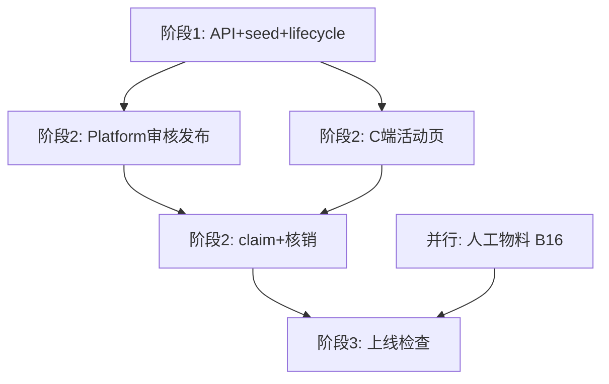

# MINIMUM_EVENT_RUNTIME_PATH_V1

# 爱企谷初见寻宝节 · 最小上线路线图 V1

```yaml
project: LOVEQIGU / AR游伴
event: 爱企谷初见寻宝节
event_code: LOVEQIGU_FIRST_EVENT_CASE_V1
session: B会话｜TECH / 运营规划
version: V1
status: APPROVED_FOR_PATH_PLANNING
owner: TECH / Operation
date: 2026-06-07
baseline_readiness: 20%
upstream:
  - docs/product/event/FIRST_EVENT_OPERATION_FLOW_AUDIT_V1.md
  - docs/product/merchant_event_engine/LOVEQIGU_FIRST_EVENT_CASE_V1.md
  - docs/tech/merchant_event/MERCHANT_PORTAL_AND_PARK_ADMIN_V1.md
constraints:
  - 不修改代码 / Runtime / Release
  - 仅分析与路线规划
```

---

# 1. 路线目标

在 **不更换工具栈、不碰 Content/Visual Factory Release 链** 的前提下，用 **最小开发量** 跑通 CASE 定义的 **一次真实闭环**：

```text
平台配置/审核/发布 → 用户进入活动 → 完成任务 → 领取卡券 → 到店核销 → 基础数据可查 → 人工复盘
```

**最小上线版本代号：** `FIRST_EVENT_MVP_RUNTIME_V1`

**当前准备度：** 20%  
**完成本路线后目标准备度：** **78%**（真实可运营 MVP；非全自动完美态）

---

# 2. 模块三分法（A / B / C）

## 2.1 A — 必须开发

| 模块 | 最小交付 | 解除 Blocker |
|------|----------|--------------|
| **API 骨架 + 文件 DB** | `/api/admin|merchant|park|c/*` | B01 |
| **merchant_event runtime 加载** | services 读 seed + 写 claim/redemption | B08 |
| **Event Lifecycle 最小状态机** | DRAFT→PENDING→APPROVED→PUBLISHED→ACTIVE→ENDED | B09 |
| **Platform Admin UI（最小 4 页）** | 审核列表 + 审核操作 + 发布 + dashboard | B02 · B13 |
| **发布执行** | publish + 活动可见开关 + 静态二维码 URL | B03 |
| **C 端活动页** | `pages/merchant-event/index` + 进度/领券入口 | B04 |
| **卡券领取 API** | claim → user_coupon → 权益中心展示 | B05 |
| **商家核销页** | 扫码/输码 + 校验 + 记录 | B06 |
| **seed 补全** | 4 task · event_relic · 3 merchant_binding | B10 · B11 · B17 |
| **ID 统一** | merchant_event 为唯一 ID 源 | B20 |
| **最小 RBAC** | operation_admin / merchant_staff / park_admin 各 1 账号 | B07 部分 |
| **基础埋点写入** | claim/redemption/task_complete 写 JSON log | B14 部分 |

## 2.2 B — 可人工兜底

| 模块 | 人工方式 | 对应 Blocker |
|------|----------|--------------|
| **商家卡券创建/提交** | 运营在 platform 代录 seed 或 JSON 编辑 | B07 |
| **园区活动创建** | 运营用 merchant_event seed 预配，园区只读 | B12 |
| **多商家招商** | 首场 1–3 家，人工登记 binding | B17 |
| **活动视觉/海报/二维码物料** | 设计师出图 + 静态 URL，不走 Visual Factory | B16 |
| **活动信物视觉** | 占位图 + 文案，不跑 Visual Autopilot | B11 视觉层 |
| **探索点 AR** | 先用扫码跳转 + 简化任务确认，不绑完整 AR 链 | B10 部分 |
| **stats_daily 聚合** | 运营导出 JSON/CSV，Excel 复盘 | B14 |
| **复盘报告** | CASE §20 模板 + 人工填数 | B14 |
| **活动结束/归档** | operation_admin 手动改 status=ENDED | B18 |
| **工单/风控** | 企微群 + 运营代核销 | B19 |
| **商家登录** | 首场固定账号密码分发 | B07 |
| **财务/账单** | 线下结算，merchant_finance 只读 mock | — |
| **Content Factory Orchestrator** | 首场活动 content 手填 seed | — |
| **活动域 Release** | 不用 runtime release 链；用 activity.status=PUBLISHED | B15 活动侧 |

## 2.3 C — 暂时忽略

| 模块 | 原因 |
|------|------|
| **Content Factory Release 链** | 与 merchant_event 平行域；首场不阻塞 |
| **Visual Factory 活动管线** | B 类人工物料即可 |
| **复杂 RBAC / 多门店** | TECH §10.2 暂缓 |
| **自动分账 / POS** | Out of Scope |
| **平台风控规则引擎** | B19 人工替代 |
| **stats 实时大屏** | 非首场验收 |
| **活动模板一键复制** | 第二场再做 |
| **微信授权登录** | 预留即可 |
| **CRM / 用户画像** | Out of Scope |
| **PDF 精美复盘** | CSV + Markdown 够用 |
| **灰度/定时发布** | 人工 publish 即可 |
| **Orchestrator 全自动调度** | 首场人工驱动 |

---

# 3. 六核心阻塞专项分析（B01–B06）

## B01 — 零 HTTP API / B-C 端无法联通

| 项 | 内容 |
|----|------|
| **现状** | miniapp 纯 `require()`；三端 HTML mock 无后端 |
| **最小解法** | `apps/api/` 文件 DB（JSON 读写）+ RBAC middleware |
| **必做 API** | `POST /api/c/coupons/:id/claim` · `POST /api/merchant/redemptions/verify` · `GET/POST /api/admin/*/review` · `POST /api/admin/activities/:id/publish` · `GET /api/c/activities/:code` |
| **分类** | **A** |
| **阶段** | 阶段 1 |
| **工时** | 3–4 人日 |
| **解除后** | 全链路从 BLOCKED → 可联通 |

---

## B02 — 平台 operation_admin UI 不存在

| 项 | 内容 |
|----|------|
| **现状** | `data/platform_admin/` schema+mock ✅；`apps/admin/platform-admin/` ❌ |
| **最小解法** | 4 页静态 HTML + fetch API（对齐现有 merchant/park mock 风格） |
| **必做页面** | `/admin/dashboard` · `/admin/reviews`（商家/卡券/活动三 tab）· `/admin/publish` · `/admin/login` |
| **分类** | **A** |
| **阶段** | 阶段 2 |
| **工时** | 2 人日 |
| **解除后** | 平台环节 PARTIAL → READY（最小集） |

---

## B03 — 活动发布执行链路不存在

| 项 | 内容 |
|----|------|
| **现状** | `platform_release` mock；activity.status=DRAFT |
| **最小解法** | publish API：校验 5 项（名称/时间/商家/卡券/平台检查）→ status=PUBLISHED → 生成 `qr_url` |
| **人工兜底** | 发布前探索点/信物/DC 由运营确认 checklist 打勾（ADMIN_CONFIG §13 简化为 5 项） |
| **分类** | **A**（执行）+ **B**（13 项全检人工） |
| **阶段** | 阶段 2 |
| **工时** | 1.5 人日（含 QR URL 生成） |
| **解除后** | B03 · B09（发布态）· 用户参与入口解锁 |

---

## B04 — C 端无 merchant-event 活动专页

| 项 | 内容 |
|----|------|
| **现状** | `app.json` 无 merchant-event；无「爱企谷初见寻宝节」入口 |
| **最小解法** | 2 页：`merchant-event/index`（活动首页）· `merchant-event/progress`（任务/领券入口） |
| **简化** | 探索任务先用「确认到达」按钮，不强制完整 AR 链 |
| **分类** | **A** |
| **阶段** | 阶段 2 |
| **工时** | 2 人日 |
| **解除后** | 用户参与 BLOCKED → PARTIAL→READY（最小路径） |

---

## B05 — 权益中心领取接口未接入

| 项 | 内容 |
|----|------|
| **现状** | `rights-center/index.js` — 「领取接口尚未接入」 |
| **最小解法** | `POST /api/c/coupons/:templateId/claim` → 写 `user_coupon` → rights-center 读 user_coupon |
| **边界** | 卡券进权益中心 L1；不进 relic 链 |
| **分类** | **A** |
| **阶段** | 阶段 2 |
| **工时** | 1.5 人日 |
| **解除后** | 卡券领取 BLOCKED → READY |

---

## B06 — 商家端无核销页

| 项 | 内容 |
|----|------|
| **现状** | merchant_help 有文字；无 redemption 页 |
| **最小解法** | `merchant_redemptions/index.html` + `POST /api/merchant/redemptions/verify` |
| **功能** | 输码核销（首场优先）· 扫码可选 · 成功/失败反馈 · 今日列表 |
| **人工兜底** | 平台代核销 API 预留；首场企微兜底 |
| **分类** | **A** |
| **阶段** | 阶段 2 |
| **工时** | 1.5 人日 |
| **解除后** | 卡券核销 BLOCKED → READY |

---

# 4. 阶段 1 — 基础联通层

## 4.1 必须完成

| # | 任务 | 分类 | 工时 |
|---|------|------|------|
| 1 | 统一 `data/merchant_event/` seed（4 task · event_relic · 3 binding · ID 规范） | A | 1d |
| 2 | API 骨架 + 文件 DB + 最小 RBAC | A | 3d |
| 3 | merchant_event loader（admin/c/merchant 共用读层） | A | 1d |
| 4 | Event Lifecycle 状态机（6 态最小集） | A | 1d |
| 5 | 基础 event_log（claim/redeem/task JSON 追加写） | A | 0.5d |
| 6 | validate 脚本扩展（merchant_event + platform_admin 联通检查） | A | 0.5d |

## 4.2 预计工时

**7 人日**（1 人 × 7 天，或 2 人 × 4 天）

## 4.3 阻塞解除情况

| Blocker | 阶段 1 后状态 |
|---------|---------------|
| B01 | ✅ **解除** |
| B08 | ✅ **解除** |
| B09 | ⚠️ **部分解除**（状态机可转，publish 在阶段 2） |
| B20 | ✅ **解除** |
| B14 | ⚠️ **部分解除**（有 log，无聚合） |
| B02–B06 | ❌ 未解除 |
| B07 | ⚠️ 可用固定账号 |

**阶段 1 后准备度：45%**

---

# 5. 阶段 2 — 核心闭环层

## 5.1 必须完成

| # | 任务 | 分类 | 工时 |
|---|------|------|------|
| 1 | Platform Admin 4 页 + 审核三队列 API | A | 2d |
| 2 | publish API + qr_url + C 端可见 gate | A | 1.5d |
| 3 | C 端 merchant-event 2 页 + app.json 注册 | A | 2d |
| 4 | claim API + rights-center 对接 | A | 1.5d |
| 5 | merchant_redemptions 页 + verify API | A | 1.5d |
| 6 | merchant login 页（固定账号） | A | 0.5d |
| 7 | platform dashboard 读真实 stats（from event_log） | A | 1d |
| 8 | 人工物料就位（海报/二维码静态图） | B | 0.5d（并行） |

## 5.2 预计工时

**10.5 人日**（可与阶段 1 部分并行物料）

## 5.3 阻塞解除情况

| Blocker | 阶段 2 后状态 |
|---------|---------------|
| B02 | ✅ **解除** |
| B03 | ✅ **解除** |
| B04 | ✅ **解除** |
| B05 | ✅ **解除** |
| B06 | ✅ **解除** |
| B07 | ⚠️ **人工兜底**（代录卡券 + 固定登录） |
| B10 | ⚠️ **简化解除**（按钮确认任务，非完整 AR） |
| B11 | ⚠️ **seed 解除** + B 类占位视觉 |
| B12 | ⚠️ **人工兜底**（platform 代提交） |
| B13 | ✅ **解除** |
| B16 | ⚠️ **人工兜底** |
| B17 | ⚠️ **人工兜底**（1–3 家） |
| B18 | ⚠️ **人工兜底** |
| B19 | ⚠️ **人工兜底** |
| B15 | ⚠️ **活动侧绕过**（不用 content release） |

**阶段 2 后准备度：78%**

---

# 6. 阶段 3 — 上线前检查

## 6.1 必须完成（CHECKLIST）

来源：`FIRST_EVENT_CASE_V1` §19 + 本路线验收

| # | 检查项 | 方式 | 通过标准 |
|---|--------|------|----------|
| 1 | 活动页可打开 | 自动化 smoke | C 端 URL 200 + 活动名正确 |
| 2 | 二维码可扫码 | 人工 | 扫码进入活动页 |
| 3 | 3 个探索点可完成 | 人工 + 简化按钮 | 3/3 task_complete 写入 log |
| 4 | 活动信物可发放 | API | event_relic 写入用户记录 |
| 5 | 卡券可领取 | API smoke | user_coupon 生成 |
| 6 | 卡券可核销 | API smoke | redemption 记录 + status=redeemed |
| 7 | 商家核销培训 | 人工 | help + 现场 15min 培训 |
| 8 | 线下海报 | 人工 | B 类物料就位 |
| 9 | 工作人员说明 | 人工 | MERCHANT_SCRIPT 分发 |
| 10 | 后台可看数据 | 人工 | platform dashboard 非 mock 零值 |
| 11 | 端到端演练 | 人工 | 1 人完整走通 CASE 路径 |
| 12 | Canon 红线检查 | 人工 | 无优惠券商城/金融暗示/信物混用 |

## 6.2 预计工时

**2 人日**（联调 1d + 演练/物料 1d）

## 6.3 阻塞解除情况

| 项 | 状态 |
|----|------|
| CASE §19 | **10/12 可绿**（2 项依赖 B 类人工物料/培训） |
| 对外最小上线 | **可批准** |
| 全自动完美态 | **未达成**（C 类模块仍缺） |

**阶段 3 后准备度：78%**（MVP 达标线；剩余 22% 为 P1 自动化与体验增强）

---

# 7. 最小上线版本定义

## 7.1 FIRST_EVENT_MVP_RUNTIME_V1 范围

```text
包含：
  ✅ 文件 DB API + 最小 RBAC
  ✅ Platform 审核 + 发布 + dashboard
  ✅ C 端活动页 + 简化任务 + 领券
  ✅ 权益中心展示 user_coupon
  ✅ 商家输码核销
  ✅ event_log 基础数据
  ✅ merchant_event 完整 seed（1 活动 · 3 商家 · 1+ 卡券）

不包含：
  ❌ Content/Visual Factory Release 自动化
  ❌ 完整 AR 探索链
  ❌ 商家自助卡券创建
  ❌ 园区自助提交审核
  ❌ stats_daily 自动聚合 / PDF 复盘
  ❌ 风控规则引擎 / 工单系统
  ❌ 在线支付 / 分账
```

## 7.2 准备度演进

| 里程碑 | 准备度 | 可对外？ |
|--------|--------|----------|
| 当前 | 20% | ❌ |
| 阶段 1 完成 | 45% | ❌ 仅内部 API 演示 |
| 阶段 2 完成 | 78% | ⚠️ 需阶段 3 检查 |
| 阶段 3 通过 | **78%** | ✅ **最小 MVP 可上线** |
| 全自动目标 | 95%+ | 6–12 个月路线 |

---

# 8. 总工时汇总

| 阶段 | 工时 | 累计 |
|------|------|------|
| 阶段 1 | 7 人日 | 7 |
| 阶段 2 | 10.5 人日 | 17.5 |
| 阶段 3 | 2 人日 | **19.5 人日** |

**约 4 周**（1 人全职）或 **2 周**（2 人并行）

---

# 9. 实施顺序（依赖）



---

# 10. 成功标记

```text
MINIMUM_EVENT_RUNTIME_PATH_V1_COMPLETE = YES
```
