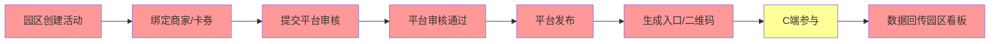

# PARK_ADMIN_OPERATION_GAP_ANALYSIS_V1_REPORT

# 景区/园区负责人端运营缺口分析执行报告 V1

```yaml
task_id: PARK_ADMIN_OPERATION_GAP_ANALYSIS_V1
executor: Cursor
date: 2026-06-07
status: COMPLETE
output: docs/product/merchant/PARK_ADMIN_OPERATION_GAP_ANALYSIS_V1.md
constraints:
  - 不修改代码
  - 不修改页面
  - 不修改 Runtime
  - 不修改 Release
```

---

# 1. 任务执行摘要

| 项 | 结果 |
|----|------|
| 审查范围 | `docs/product/merchant/` · `apps/admin/park-admin/` · `data/park_admin/` |
| 分析维度 | 8 模块（商家/活动/发布/审核/效果/商家统计/平台统计/工单） |
| 优先级框架 | P0 上线必须 · P1 3 个月内 · P2 后续优化 |
| 输出文档 | `PARK_ADMIN_OPERATION_GAP_ANALYSIS_V1.md` |
| 成功标记 | `PARK_ADMIN_OPERATION_GAP_ANALYSIS_V1_COMPLETE = YES` |

---

# 2. 审查方法

1. **产品规格对照** — `MERCHANT_AND_PARK_ADMIN_MVP_SCOPE_REFINEMENT_V1.md` §4–§7（园区模块、活动状态、Review Gates）
2. **首场活动配置对照** — `LOVEQIGU_FIRST_EVENT_ADMIN_CONFIG_V1.md`（探索点/任务/发布检查）
3. **实现对照** — 枚举 `apps/admin/park-admin/` 5 页 HTML 与导航
4. **数据对照** — `data/park_admin/` 5 schema + mock
5. **职责边界** — 区分园区端 vs 平台 operation_admin 能力归属

---

# 3. 关键发现

## 3.1 已有资产（可复用）

- 5 页园区端静态 mock（dashboard · merchants · activities · activity_detail · tickets）
- 5 个 JSON schema + mock（activity · merchant_link · coupon_link · dashboard_summary · optimization_suggestion）
- 活动状态机、发布前检查规则、规则化优化建议已在产品 spec 定义

## 3.2 核心缺口（P0 汇总）

| # | 缺口 | 影响 |
|---|------|------|
| 1 | 无登录 / 无 park_id 隔离 | 多园区无法部署 |
| 2 | **无活动创建/需求页** | 无法组织首场活动 |
| 3 | 无商家/卡券绑定 UI | 活动配置不完整 |
| 4 | 无提交审核 + 状态查看 | 发布流程断裂 |
| 5 | 无探索点/任务配置入口 | ADMIN_CONFIG 要求无法满足 |
| 6 | 零 API，dashboard 为 mock | 向领导汇报无真实数据 |
| 7 | **平台审核发布未建**（依赖项） | 园区提交后无法上线 |

## 3.3 模块缺口统计

| 模块 | P0 项 | P1 项 | P2 项 | 当前可用度 |
|------|-------|-------|-------|-----------|
| 商家管理 | 5 | 4 | 0 | ~20% |
| 活动管理 | 7 | 3 | 0 | ~15% |
| 活动发布 | 4 | 2 | 0 | ~5% |
| 活动审核 | 3 | 2 | 0 | ~0%（平台侧） |
| 活动效果分析 | 4 | 3 | 2 | ~25% |
| 商家数据统计 | 3 | 2 | 0 | ~30% |
| 平台运营统计 | — | — | 2 | 非园区职责 |
| 工单管理 | 1 | 4 | 0 | ~10% |

---

# 4. 平台运营统计说明

用户要求分析「平台运营统计」。审查结论：

- **跨园区总览、全平台活动/商家/核销汇总** 属于 **平台 operation_admin** 职责
- **园区端 P0 等价能力** = 本园区完整运营快照（dashboard + 活动效果 + 商家排行）
- 当前 **平台 admin**（`apps/admin/index.html`）亦无 EVENT_OPERATION_CENTER 实现
- 详见缺口文档 §3.7 与 §9

---

# 5. 与 TECH 方案差异说明

`MERCHANT_PORTAL_AND_PARK_ADMIN_V1.md` §3.1 称园区后台「不存在」。**本次审查更新：**

- 已存在 **5 页 mock + 5 schema**
- **活动创建、审核、发布、探索点配置** 仍全部缺失
- 园区 P0 **强依赖** 平台审核发布 API（TECH 方案 §5.3 已规划，未实现）

---

# 6. 首场活动阻塞链



**红色节点：** 当前全部缺失或 mock-only  
**黄色节点：** C 端部分能力存在，卡券领取/核销 API 未通

---

# 7. 建议下一步（仅建议，本次未执行）

```text
Phase A  park-admin API + 登录 + dashboard 真实数据
Phase B  活动创建/申请 + 商家卡券绑定
Phase C  平台 operation_admin 审核 + 发布（园区 P0 依赖）
Phase D  探索点/任务配置（或平台代配首场）
Phase E  报告导出 + 优化建议规则引擎
```

---

# 8. 风险与依赖

| 风险 | 说明 |
|------|------|
| 探索点配置复杂 | ADMIN_CONFIG 要求绑定节点/任务；MVP 可平台代配，但需流程定义 |
| 商家端未就绪 | 园区绑定卡券依赖商家先提交卡券 |
| 双端 + 平台三端联调 | 首场活动需 merchant + park + platform 同步上线 |
| 规则建议仅 mock | `rule_based_optimization_suggestion` 无计算引擎 |

---

# 9. 双端 P0 交叉依赖

| 依赖 | 商家端 | 园区端 |
|------|--------|--------|
| 卡券审核通过 | 提交卡券 P0 | 绑定卡券 P0 |
| 活动发布 | 申请参与 P0 | 创建+提交 P0 |
| 核销数据 | 核销页 P0 | 效果分析 P0 |
| 平台审核 | 卡券状态只读 | 活动状态只读 |

---

# 10. 完成确认

```yaml
PARK_ADMIN_OPERATION_GAP_ANALYSIS_V1_COMPLETE: YES
report_generated: 2026-06-07
artifacts:
  - docs/product/merchant/PARK_ADMIN_OPERATION_GAP_ANALYSIS_V1.md
  - docs/product/merchant/PARK_ADMIN_OPERATION_GAP_ANALYSIS_V1_REPORT.md
code_changes: NONE
page_changes: NONE
runtime_changes: NONE
release_changes: NONE
```

---

# 11. 联合结论（商家 + 园区）

```text
当前 MVP 后台 = 文档完整 + mock 骨架 + 零运行时

首场「爱企谷初见寻宝节」上线前，三端 P0 最小集：
  商家：登录 · 卡券提交 · 核销 · 数据看板
  园区：登录 · 活动创建 · 商家/卡券绑定 · 提交审核 · 看板
  平台：审核 · 发布 · 代配探索点（可选）· 全平台统计

估算：mock → 可运营 MVP，核心路径约 7 个 TECH 任务（T1–T7）
```
