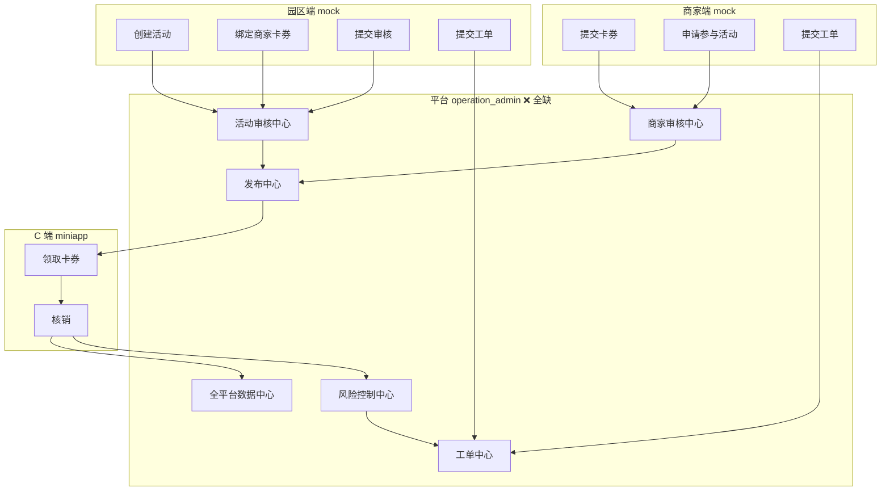

# PLATFORM_OPERATION_ADMIN_GAP_ANALYSIS_V1

# 平台运营后台（operation_admin）缺口分析 V1

```yaml
project: LOVEQIGU / AR游伴
session: B会话｜TECH / 运营审查
module: Platform Operation Admin / EVENT_OPERATION_CENTER
version: V1
status: APPROVED_FOR_GAP_ANALYSIS
owner: TECH / Operation
date: 2026-06-07
audit_scope:
  - apps/admin/
  - docs/product/
  - docs/content-engine/
  - runtime/
upstream:
  - docs/product/merchant_event_engine/MERCHANT_EVENT_ENGINE_V1.md
  - docs/product/merchant_event_engine/LOVEQIGU_FIRST_EVENT_ADMIN_CONFIG_V1.md
  - docs/tech/merchant_event/MERCHANT_PORTAL_AND_PARK_ADMIN_V1.md
  - docs/product/merchant/MERCHANT_OPERATION_GAP_ANALYSIS_V1.md
  - docs/product/merchant/PARK_ADMIN_OPERATION_GAP_ANALYSIS_V1.md
perspective: 真实平台运营人员（审核、发布、监控、风控、工单处理、向内部汇报）
role_id: operation_admin
```

---

# 1. 审查结论摘要

| 维度 | 现状 | 缺口等级 |
|------|------|----------|
| 平台后台页面 | ❌ **零页面** | **P0 全模块阻塞** |
| 平台数据 schema | ❌ 无 `data/platform_admin/` | **P0** |
| 后端 / API | ❌ TECH 已规划，未实现 | **P0** |
| 登录 / RBAC | ❌ `operation_admin` 未落地 | **P0** |
| 产品规格 | ✅ EVENT_OPERATION_CENTER 完整定义 | 可复用 |
| 商家/园区 mock | ⚠️ 已有双端 mock，待审核对象来源 | 依赖上游提交 |
| content-engine / runtime | ⚠️ **内容工厂域**，非活动运营域 | 不可混用 |

**一句话：** 平台运营后台 **在产品文档中已完整设计，在代码中完全不存在**；商家端与园区端均已 mock 骨架，但 **审核—发布—监控—风控—工单** 全链路无执行入口，是爱企谷首场活动上线的 **最大阻塞项**。

---

# 2. 审查范围说明

## 2.1 `apps/admin/` 现状

| 路径 | 内容 | 平台运营相关 |
|------|------|-------------|
| `index.html` | 商家 + 园区 mock 导航 hub | ❌ 无 EVENT_OPERATION_CENTER 入口 |
| `merchant-portal/` | 9 页商家 mock | 产生待审核卡券/工单（mock） |
| `park-admin/` | 7 页园区 mock | 产生待审核活动/工单（mock） |
| `platform-admin/` 或 `operation-admin/` | **不存在** | — |

## 2.2 `docs/product/` 相关规格

| 文档 | 平台运营定义 |
|------|-------------|
| `MERCHANT_EVENT_ENGINE_V1.md` §12 | EVENT_OPERATION_CENTER 12 子模块树 |
| `LOVEQIGU_FIRST_EVENT_ADMIN_CONFIG_V1.md` §12–§15 | 审核对象/规则/发布检查/数据看板 |
| `MERCHANT_PORTAL_AND_PARK_ADMIN_V1.md` §5.3 · §7.3 · §8.3 | 角色权限 · 路由 · API |
| `MERCHANT/PARK *_GAP_ANALYSIS_V1` | 双端 P0 强依赖平台审核发布 |

## 2.3 `docs/content-engine/` 与 `runtime/`（域边界）

| 资产 | 用途 | 与 operation_admin 关系 |
|------|------|------------------------|
| `CONTENT_FACTORY_DASHBOARD_V1` | 视觉/故事/信物工厂指标 | **不同域**；不可当活动运营看板 |
| `APPROVAL_CONSOLE_V1` | 视觉 autopilot 人工审核 | **不同域**；模式可参考，不可复用 |
| `runtime/dashboard/dashboard.json` | 内容工厂 release 状态 | **不同域**；`runtime_publish_status: BLOCKED` 与活动发布无关 |
| `HUMAN_REVIEW_GATE` | 内容资产发布门禁 | 治理模式类似，对象不同 |

**结论：** content-engine / runtime 解决 **Canon 内容生产与 Release**；operation_admin 解决 **商家活动运营与 B 端审核发布**。两者须独立建设，仅共享「审核状态机 + audit_log」设计模式。

---

# 3. 模块树对照（产品 vs 实现）

来源：`MERCHANT_EVENT_ENGINE_V1.md` §12

```text
活动运营中心 EVENT_OPERATION_CENTER          实现状态
├── 活动管理                                  ❌
├── 活动模板                                  ❌
├── 活动任务                                  ❌
├── 活动资产                                  ❌
├── 参与商家                                  ❌
├── 活动卡券                                  ❌
├── 活动页面                                  ❌
├── 活动审核          ← 用户重点 §3.2         ❌
├── 活动发布          ← 用户重点 §3.3         ❌
├── 活动数据          ← 用户重点 §3.4         ❌
├── 活动结算                                  ❌ P2
└── 活动复盘                                  ❌ P1
```

用户要求的 6 大中心映射：

| 用户模块 | EVENT_OPERATION_CENTER 映射 |
|----------|----------------------------|
| 商家审核中心 | 参与商家 + 活动卡券 + activity_application |
| 活动审核中心 | 活动审核 |
| 发布中心 | 活动发布 |
| 全平台数据中心 | 活动数据 |
| 工单中心 | 跨模块（schema 在 merchant/park ticket） |
| 风险控制中心 | 活动数据 + rule_based_optimization（无平台 UI） |

---

# 4. 分模块缺口分析

## 4.1 商家审核中心

**职责：** 审核商家资料 · 审核卡券 · 审核活动参与申请

| 能力 | 现状 | 优先级 | 说明 |
|------|------|--------|------|
| 商家资料待审列表 | ❌ | **P0** | `GET /api/admin/merchants?review_status=pending` |
| 商家资料详情 + 审核操作 | ❌ | **P0** | approve / reject / needs_revision |
| 驳回原因 + 分类 | ❌ | **P0** | ADMIN_CONFIG §12.3：文案/权益/核销/商家信息不完整等 |
| 卡券待审列表 | ❌ | **P0** | 商家提交后进入队列 |
| 卡券内容审核（权益/文案/库存） | ❌ | **P0** | 须拦截「优惠券商城」「秒杀」等禁用文案 |
| 卡券审核：信物/DC 混用检查 | ❌ | **P0** | Canon 红线；ADMIN_CONFIG §12.2 |
| 活动参与申请待审列表 | ❌ | **P0** | `activity_application` type=merchant_participation |
| 参与申请详情（商家/活动/卡券） | ❌ | **P0** | |
| 批量审核 | ❌ | P1 | 多场活动并行时 |
| 审核历史 / audit_log | ❌ schema 仅 TECH 建议 | P1 | 写操作需 audit_log |
| 商家合作状态变更 | ❌ | P1 | 待邀约/进行中/待续费 |
| 园区代提交商家资料 | ❌ | P2 | |

**TECH 规划路由（均未实现）：**

```text
/admin/merchants
/admin/merchants/review
/admin/coupons/review
```

---

## 4.2 活动审核中心

**职责：** 活动审核 · 驳回原因 · 重新提交

| 能力 | 现状 | 优先级 | 说明 |
|------|------|--------|------|
| 活动申请待审列表 | ❌ | **P0** | 园区 `park_admin_activity_new` mock 产出，平台无收件箱 |
| 活动详情审核视图 | ❌ | **P0** | 名称/时间/商家/卡券/探索点/任务 |
| 审核通过 | ❌ | **P0** | `approved` |
| 退回修改 + 驳回原因 | ❌ | **P0** | `needs_revision` + `review_note` |
| 禁止发布 | ❌ | **P0** | ADMIN_CONFIG：资产混用/不可履约 |
| 驳回原因分类 | ❌ | **P0** | 文案/权益/资产混用/核销/任务复杂/数据缺失 |
| 商家重新提交后再次进入队列 | ❌ | **P0** | 状态机：needs_revision → pending_review |
| 活动资产审核（信物/DC/页面） | ❌ | **P0** | ADMIN_CONFIG §12.1 九类对象 |
| 用户端页面预览 | ❌ | P1 | 审核前必看 |
| 线下物料文案审核 | ❌ | P1 | |
| 审核 SLA / 超时提醒 | ❌ | P2 | |
| 多人审核 / 二审 | ❌ | P2 | |

**统一审核状态（TECH §5.3）：**

```text
pending_review → approved | rejected | needs_revision
```

**当前：** 状态机仅存在于文档，零 UI/API。

---

## 4.3 发布中心

**职责：** 发布 · 暂停 · 下线 · 回滚

| 能力 | 现状 | 优先级 | 说明 |
|------|------|--------|------|
| 发布前检查清单（13 项） | ❌ | **P0** | ADMIN_CONFIG §13：探索点/信物/DC/商家/卡券/埋点 |
| 预发布 | ❌ | **P0** | 内测/白名单 |
| 正式发布 | ❌ | **P0** | `POST /api/admin/activities/:id/publish` |
| 活动二维码生成 | ❌ | **P0** | 线下物料依赖 |
| 暂停 | ❌ | **P0** | `POST .../pause` |
| 结束 | ❌ | **P0** | `POST .../end` |
| 下线 / 归档 | ❌ | P1 | ADMIN_CONFIG：归档状态 |
| **回滚** | ❌ 规格未定义 | P1 | 用户要求；需定义「回滚到上一发布快照」策略 |
| 发布权限校验（仅 operation_admin） | ❌ | **P0** | 园区 `publish_activity` 须拦截 |
| 发布后 C 端可见性开关 | ❌ | **P0** | 与 miniapp 活动页联动 |
| 发布 audit_log | ❌ | P1 | |
| 定时发布 | ❌ | P2 | |
| 灰度发布 | ❌ | P2 | |

**与 runtime Release 区别：**

```text
runtime/releases/     → 内容资产（visual/story/relic）Release 门禁
活动发布              → merchant_event 平行域；不得写入 runtime release 链
```

---

## 4.4 全平台数据中心

**职责：** 商家数量 · 活动数量 · 卡券数量 · 领取量 · 核销量

| 能力 | 现状 | 优先级 | 说明 |
|------|------|--------|------|
| 平台总览 dashboard | ❌ | **P0** | TECH：`GET /api/admin/stats` |
| 商家总数 / 活跃 / 待审 | ❌ | **P0** | |
| 活动总数 / 进行中 / 待审 | ❌ | **P0** | |
| 卡券总数 / 已发布 / 待审 | ❌ | **P0** | |
| 全平台领取量 | ❌ | **P0** | 依赖 C 端 claim API |
| 全平台核销量 | ❌ | **P0** | 依赖 redemption API |
| 按园区维度 drill-down | ❌ | P1 | |
| 按活动维度 drill-down | ❌ | P1 | |
| 按商家维度 drill-down | ❌ | P1 | |
| 7 日 / 30 日趋势 | ❌ | P1 | `stats_daily` 聚合 |
| ADMIN_CONFIG §14 游客侧指标 | ❌ | P1 | 访问/任务完成/分享 |
| 导出 CSV / 内部运营版报告 | ❌ | P1 | ADMIN_CONFIG §15 |
| 实时大屏 | ❌ | P2 | |

**数据对象缺口：**

```text
缺失：platform_admin_dashboard_summary.schema
缺失：stats_daily 聚合 job
缺失：C 端埋点 → stats_daily 回写
```

---

## 4.5 工单中心

**职责：** 商家工单 · 园区工单 · 平台处理流程

| 能力 | 现状 | 优先级 | 说明 |
|------|------|--------|------|
| 商家工单收件箱 | ❌ | **P0** | schema 在 `data/merchant_portal/merchant_ticket` |
| 园区工单收件箱 | ❌ | **P0** | park ticket mock 存在，平台无聚合 |
| 统一工单列表（来源筛选） | ❌ | **P0** | merchant / park / platform |
| 工单详情 | ❌ | **P0** | |
| 分配处理人 | ❌ | P1 | |
| 回复 + 状态更新 | ❌ | **P0** | OPEN → IN_PROGRESS → RESOLVED |
| 关联商家/活动/卡券 | ❌ | P1 | scope §3.5 已定义 |
| 工单优先级 / 升级 | ❌ | P1 | 活动发布阻塞类优先 |
| SLA 计时 | ❌ | P2 | |
| 工单统计（响应时长/解决率） | ❌ | P2 | |

**双端已有 mock 来源：**

- `merchant_ticket_new` · `merchant_ticket_detail` · `merchant_tickets`
- `park_admin_tickets`

**平台端：** 零页面、零 API、零 `platform_ticket` schema。

---

## 4.6 风险控制中心

**职责：** 高领取低核销 · 异常活动 · 异常商家

| 能力 | 现状 | 优先级 | 说明 |
|------|------|--------|------|
| 规则：HIGH_CLAIM_LOW_REDEEM | ⚠️ schema 在 park_admin | **P0** | 无平台 UI/API 计算 |
| 规则：LOW_MERCHANT_PARTICIPATION | ⚠️ scope 已定义 | P1 | |
| 规则：LOW_ACTIVITY_CLAIM | ⚠️ scope 已定义 | P1 | |
| 规则：COUPON_EXPIRING_UNUSED | ⚠️ scope 已定义 | P1 | |
| 异常活动列表（领取/核销异常比） | ❌ | **P0** | 运营每日巡检 |
| 异常商家列表 | ❌ | **P0** | 低核销/零核销/投诉多 |
| 风险告警通知 | ❌ | P1 | 邮件/企微 |
| 一键创建跟进工单 | ❌ | P1 | 与工单中心联动 |
| 自动暂停高风险活动 | ❌ | P2 | 需人工确认 |
| 重复核销 / 刷单检测 | ❌ | P1 | TECH 风险表：重复核销 |
| 代核销兜底入口 | ❌ | P1 | TECH §5.3 · `POST .../redemptions/override` |
| 金融暗示文案拦截 | ❌ | **P0** | 审核中心子能力；风控二次扫描 |

**规则引擎缺口：**

```text
rule_based_optimization_suggestion — 仅 park mock 1 条
需：platform 侧跨园区规则计算 + 告警队列 + 处理记录
```

---

# 5. 跨模块 P0 缺口（上线必须）

```text
1.  operation_admin 登录 + RBAC + audit_log 写操作
2.  商家审核中心：资料 / 卡券 / 参与申请 三个待审队列 + 驳回原因
3.  活动审核中心：待审列表 + 详情 + 通过/退回/禁止 + needs_revision 回流
4.  发布中心：13 项发布检查 + 正式发布 + 暂停 + 结束 + 二维码
5.  全平台数据中心：5 核心指标（商家/活动/卡券/领取/核销）真实 API
6.  工单中心：商家+园区工单聚合 + 回复 + 状态流转
7.  风险控制：HIGH_CLAIM_LOW_REDEEM 至少 1 条规则可运行 + 异常列表
8.  后端 API 全套（§8.3 TECH 规划）+ data/merchant_event/ 持久化
9.  C 端 claim/redemption 打通（否则平台数据永远为 0）
10. 平台后台 UI：至少 EVENT_OPERATION_CENTER 6 中心入口页
```

---

# 6. P1（3 个月内）

```text
- 回滚发布策略 + UI（定义 snapshot 模型）
- 审核 audit_log 全链路 · 批量审核
- stats_daily 趋势 · 园区/活动/商家 drill-down
- 工单分配 · 关联对象 · 优先级
- 完整 5 条 optimization 规则 + 告警通知
- 代核销兜底 · 重复核销检测
- 活动复盘报告（内部运营版）· CSV 导出
- 用户端页面/物料审核预览
- 发布 audit · 归档/下线
```

---

# 7. P2（后续优化）

```text
- 活动结算模块 · 自动分账
- 灰度/定时发布 · 二审工作流
- 实时大屏 · AI 异常检测
- 跨系统对接（景区票务/客流）
- 复杂 CRM · 商家画像
- 自动化营销干预（暂停+通知+工单）
```

---

# 8. 三端依赖链（平台为枢纽）



**阻塞结论：** 无平台后台 → 商家卡券无法过审 → 活动无法发布 → C 端无法领取 → 全平台数据为零。

---

# 9. 真实平台运营场景对照

| 场景 | 当前能否完成 | 缺口 |
|------|-------------|------|
| 运营收到园区「爱企谷初见寻宝节」审核申请 | ❌ | 活动审核中心 |
| 审核 3 家商家卡券文案与权益 | ❌ | 商家审核中心 · 卡券队列 |
| 发现卡券含「秒杀」文案并驳回 | ❌ | 驳回原因分类 |
| 检查 13 项发布清单后正式发布 | ❌ | 发布中心 |
| 活动进行中核销率过低，发告警 | ❌ | 风险控制中心 |
| 处理商家「核销失败」工单 | ❌ | 工单中心 |
| 向内部汇报全平台领取/核销 | ❌ | 全平台数据中心 |
| 活动突发问题，暂停活动 | ❌ | 发布中心 · pause |
| 误发布后回滚 | ❌ | 发布中心 · rollback（P1 待定义） |
| 代商家完成异常核销 | ❌ | 代核销兜底 |

---

# 10. TECH 任务对齐

来源：`MERCHANT_PORTAL_AND_PARK_ADMIN_V1.md` §14

| 任务 | 平台相关产出 | 状态 |
|------|-------------|------|
| T1 MERCHANT_EVENT_DATA_SCHEMA_V1 | audit_log · activity_application · stats_daily | ❌ |
| T2 API_SKELETON | `/api/admin/*` 全套 | ❌ |
| **T5 PLATFORM_EVENT_ADMIN_MVP_V1** | 平台审核 + 发布 | ❌ **未启动** |

**建议 T5 最小页面集：**

```text
/admin/login
/admin/dashboard                    — 全平台数据中心
/admin/merchants/review             — 商家审核中心
/admin/coupons/review               — 商家审核中心（卡券）
/admin/activity-applications/review — 活动审核中心 + 参与申请
/admin/activities/:id/publish       — 发布中心
/admin/tickets                      — 工单中心
/admin/risk                         — 风险控制中心
/admin/redemptions/override         — 代核销兜底
```

---

# 11. 与 content-engine / runtime 协作边界

| 问题 | 平台 operation_admin | content-engine / runtime |
|------|---------------------|--------------------------|
| 审核什么 | 商家/卡券/活动/参与申请 | visual/story/relic 资产 |
| 发布什么 | 商家活动（merchant_event 域） | Canon 内容 Release |
| 看板指标 | 商家/活动/卡券/领取/核销 | asset/release/factory |
| 可否复用 APPROVAL_CONSOLE | 模式参考 | 对象不同，不可直接复用 |
| 可否共用 runtime/dashboard | **否** | 须独立 `platform_admin` stats |

---

# 12. 建议实施顺序

```text
Phase A（P0 · 阻塞三端）
  T1 schema → T2 API + RBAC → T5 平台 6 中心最小 UI

Phase B（P0 · 首场活动）
  商家/卡券/活动审核流 → 发布检查 → 正式发布 → 工单收件

Phase C（P0 · 数据闭环）
  C 端 claim/redemption → stats 聚合 → 风控规则 1 条

Phase D（P1）
  回滚 · drill-down · 完整规则集 · 复盘报告 · 代核销
```

---

# 13. 当前结论

```text
PLATFORM_OPERATION_ADMIN_GAP_ANALYSIS_V1_COMPLETE = YES
```

**核心判断：** 平台运营后台是 **三端 B 端架构的枢纽**，产品规格（EVENT_OPERATION_CENTER）完整，但 **apps/admin 零实现、零 schema、零 API**。商家端与园区端 mock 已就绪，**全部待审对象无处落地**。首场活动上线前，须优先启动 **T5 PLATFORM_EVENT_ADMIN_MVP_V1**，并同步 T1/T2 与 C 端 claim/redemption。
